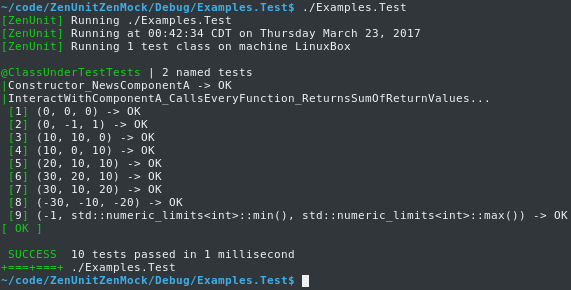

### Introduction to ZenMock

Consider classes ComponentA and ClassUnderTest:

```Cpp
class ComponentA
{
public:
   virtual void VirtualVoid() {}
   virtual void VirtualVoidConstTwoArgs(int, int) const {}
   virtual int VirtualNonVoid() { return 0; }
   virtual int VirtualNonVoidConst() const { return 0; }
};
```
```Cpp
class ClassUnderTest
{
   friend class ClassUnderTestTests;
private:
   std::unique_ptr<ComponentA> _componentA;
public:
   ClassUnderTest()
      : _componentA(new ComponentA)
   {
   }

   int InteractWithComponentA()
   {
      _componentA->VirtualVoid();
      _componentA->VirtualVoidConstTwoArgs(333, 107);
      int returnValueA = _componentA->VirtualNonVoid();
      int returnValueB = _componentA->VirtualNonVoidConst();
      int sum = returnValueA + returnValueB;
      return sum;
   }
};
```

How would you confirm the correctness of ClassUnderTest's interactions with ComponentA?

One possible answer is by using ZenUnit and ZenMock.

#### Syntax for mocking ComponentA with ZenMock:

```Cpp
#include "ZenUnit/ZenMock.h"

struct ComponentAMock : public Zen::Mock<ComponentA>
{
   ZENMOCK_VOID0(VirtualVoid)
   ZENMOCK_VOID2_CONST(VirtualVoidConstTwoArgs, int, int)
   ZENMOCK_NONVOID0(int, VirtualNonVoid)
   ZENMOCK_NONVOID0_CONST(int, VirtualNonVoidConst)
};
```

#### Syntax for writing a ZenMock-enhanced ZenUnit test class for ClassUnderTest:

```Cpp
#include "ZenUnit/ZenUnit.h"

TESTS(ClassUnderTestTests)
SPEC(Constructor_NewsComponentA)
SPECX(InteractWithComponentA_CallsEveryFunction_ReturnsSumOfReturnValues)
SPECEND

ClassUnderTest _classUnderTest;
ComponentAMock* _componentAMock;

STARTUP
{
   // Post-construction dependency injection of ZenMock object _componentAMock
   _classUnderTest._componentA.reset(_componentAMock = new ComponentAMock);
}

TEST(Constructor_NewsComponentA)
{
   ClassUnderTest classUnderTest;
   WAS_NEWED(classUnderTest._componentA);
}

TEST3X3(InteractWithComponentA_CallsEveryFunction_ReturnsSumOfReturnValues,
   int expectedReturnValue, int returnValueA, int returnValueB,
   0, 0, 0,
   10, 10, 0,
   10, 0, 10,
   20, 10, 10,
   30, 20, 10,
   30, 10, 20,
   -30, -10, -20,
   0, -10, 10,
   -1, std::numeric_limits<int>::min(), std::numeric_limits<int>::max())
{
   // For imperviousness to extraneous-call code mutations
   // capable of being automatically introduced by future LLVM-powered
   // mutation testing frameworks, ZenMock is a strict mocking framework.
   // Because of this strict mocking design, ZenMock mock objects must be
   // explicitly expected before being called by calling
   // Expect(), ExpectAndReturn(), ExpectAndReturnValues(), or ExpectAndThrow<T>().
   _componentAMock->VirtualVoidMock.Expect();
   _componentAMock->VirtualVoidConstTwoArgsMock.Expect();
   _componentAMock->VirtualNonVoidMock.ExpectAndReturn(returnValueA);
   _componentAMock->VirtualNonVoidConstMock.ExpectAndReturn(returnValueB);
   //
   int returnValue = _classUnderTest.InteractWithComponentA();
   //
   // In the Assert section of this Arrange-Act-Assert style of unit test,
   // ZenMock function call assertions are made and are wrapped with the ZEN macro.
   // The ZEN macro provides __FILE__ and __LINE__ information in
   // error messages for the case when a ZenMocked function is called differently
   // from how it is asserted to have been called.
   ZEN(_componentAMock->VirtualVoidMock.AssertCalledOnce());
   ZEN(_componentAMock->VirtualVoidConstTwoArgsMock.AssertCalledOnceWith(333, 107));
   ZEN(_componentAMock->VirtualNonVoidMock.AssertCalledOnce());
   ZEN(_componentAMock->VirtualNonVoidConstMock.AssertCalledOnce());
   ARE_EQUAL(expectedReturnValue, returnValue);
}

}; RUN(ClassUnderTestTests)

int main(int argc, char* argv[])
{
   return ZenUnit::RunTests(argc, argv);
}
```

#### Test run output



### ZenMock Function Mocking Macros

|Virtual Void Functions|
|----------------------|
|`ZENMOCK_VOID0(functionName)`|
|`ZENMOCK_VOID1(functionName, arg1Type, ...)` // The ... is for mocking overloaded functions. Specify ... as an overload-disambiguating arbitrary suffix such as "_int" and "_string" without the quotes when mocking virtual void Function(int) and virtual void Function(const std::string&) to yield ZenMock mock objects named FunctionMock_int and FunctionMock_string.|
|...|
|`ZENMOCK_VOID10(functionName, arg1Type, arg2Type, arg3Type, arg4Type, arg5Type, arg6Type, arg7Type, arg8Type, arg9Type, arg10Type, ...)`|

|Virtual Const Void Functions|
|----------------------------|
|`ZENMOCK_VOID0_CONST(functionName)`|
|`ZENMOCK_VOID1_CONST(functionName, arg1Type, ...)`|
|...|
|`ZENMOCK_VOID10_CONST(functionName, arg1Type, arg2Type, arg3Type, arg4Type, arg5Type, arg6Type, arg7Type, arg8Type, arg9Type, arg10Type, ...)`|

|Virtual Non-Void Functions|
|--------------------------|
|`ZENMOCK_NONVOID0(returnType, functionName)`|
|`ZENMOCK_NONVOID1(returnType, functionName, arg1Type, ...)`|
|...|
|`ZENMOCK_VOID10_NONVIRTUAL(functionName, arg1Type, arg2Type, arg3Type, arg4Type, arg5Type, arg6Type, arg7Type, arg8Type, arg9Type, arg10Type, ...)`|

|Virtual Const Non-Void Functions|
|--------------------------------|
|`ZENMOCK_NONVOID0_CONST(returnType, functionName)`|
|`ZENMOCK_NONVOID1_CONST(returnType, functionName, arg1Type, ...)`|
|...|
|`ZENMOCK_NONVOID10(returnType, functionName, arg1Type, arg2Type, arg3Type, arg4Type, arg5Type, arg6Type, arg7Type, arg8Type, arg9Type, arg10Type, ...)`|

|Non-Virtual Void Functions|
|--------------------------|
|`ZENMOCK_VOID0_NONVIRTUAL(functionName)`|
|`ZENMOCK_VOID1_NONVIRTUAL(functionName, arg1Type, ...)`|
|`ZENMOCK_VOID2_NONVIRTUAL(functionName, arg1Type, arg2Type, ...)`|
|...|
|`ZENMOCK_NONVOID10_NONVIRTUAL(returnType, functionName, arg1Type, arg2Type, arg3Type, arg4Type, arg5Type, arg6Type, arg7Type, arg8Type, arg9Type, arg10Type, ...)`|

|Non-Virtual Const Void Functions|
|--------------------------------|
|`ZENMOCK_VOID0_CONST_NONVIRTUAL(functionName)`|
|`ZENMOCK_VOID1_CONST_NONVIRTUAL(functionName, arg1Type, ...)`|
|...|
|`ZENMOCK_VOID10_CONST_NONVIRTUAL(functionName, arg1Type, arg2Type, arg3Type, arg4Type, arg5Type, arg6Type, arg7Type, arg8Type, arg9Type, arg10Type, ...)`|

|Non-Virtual Non-Void Functions|
|------------------------------|
|`ZENMOCK_NONVOID0_NONVIRTUAL(returnType, functionName)`|
|`ZENMOCK_NONVOID1_NONVIRTUAL(returnType, functionName, arg1Type, ...)`|
|...|
|`ZENMOCK_NONVOID10_NONVIRTUAL(returnType, functionName, arg1Type, arg2Type, arg3Type, arg4Type, arg5Type, arg6Type, arg7Type, arg8Type, arg9Type, arg10Type, ...)`|

|Non-Virtual Const Non-Void Functions|
|------------------------------------|
|`ZENMOCK_NONVOID0_CONST_NONVIRTUAL(returnType, functionName)`|
|`ZENMOCK_NONVOID1_CONST_NONVIRTUAL(returnType, functionName, arg1Type, ...)`|
|...|
|`ZENMOCK_NONVOID10_CONST_NONVIRTUAL(returnType, functionName, arg1Type, arg2Type, arg3Type, arg4Type, arg5Type, arg6Type, arg7Type, arg8Type, arg9Type, arg10Type, ...)`|

|Global Void Functions|
|---------------------|
|`ZENMOCK_VOID0_GLOBAL(functionName)`|
|`ZENMOCK_VOID1_GLOBAL(functionName, arg1Type, ...)`|
|...|
|`ZENMOCK_VOID10_GLOBAL(globalFunctionName, arg1Type, arg2Type, arg3Type, arg4Type, arg5Type, arg6Type, arg7Type, arg8Type, arg9Type, arg10Type, ...)`|

|Global Non-Void Functions|
|-------------------------|
|`ZENMOCK_NONVOID0_GLOBAL(returnType, functionName)`|
|`ZENMOCK_NONVOID1_GLOBAL(returnType, functionName, arg1Type, ...)`|
|...|
|`ZENMOCK_NONVOID10_GLOBAL(returnType, functionName, arg1Type, arg2Type, arg3Type, arg4Type, arg5Type, arg6Type, arg7Type, arg8Type, arg9Type, arg10Type, ...)`|

|Static and Namespaced Void Functions|
|------------------------------------|
|`ZENMOCK_VOID0_STATIC(qualifiedClassNameOrNamespace, functionName, ...)`|
|`ZENMOCK_VOID1_STATIC(qualifiedClassNameOrNamespace, functionName, arg1Type, ...)`|
|...|
|`ZENMOCK_VOID10_STATIC(qualifiedClassNameOrNamespace, functionName, arg1Type, arg2Type, arg3Type, arg4Type, arg5Type, arg6Type, arg7Type, arg8Type, arg9Type, arg10Type, ...)`|

|Static and Namespaced Non-Void Functions|
|----------------------------------------|
|`ZENMOCK_NONVOID0_STATIC(returnType, qualifiedClassNameOrNamespace, functionName, ...)`|
|`ZENMOCK_NONVOID1_STATIC(returnType, qualifiedClassNameOrNamespace, functionName, arg1Type, ...)`|
|...|
|`ZENMOCK_NONVOID10_STATIC(returnType, qualifiedClassNameOrNamespace, functionName, arg1Type, arg2Type, arg3Type, arg4Type, arg5Type, arg6Type, arg7Type, arg8Type, arg9Type, arg10Type, ...)`|

|ZENBIND For Mocking Global And Static Functions|
|-----------------------------------------------|
|`ZENBIND0(FunctionName_ZenMock)`|
|`ZENBIND1(FunctionName_ZenMock)`|
|...|
|`ZENBIND10(FunctionName_ZenMock)`|

|ZenMock Object Expectation Functions|
|-----------------------------|
|`FunctionMock.Expect()`|
|`FunctionMock.ExpectAndReturn(returnValue)`|
|`FunctionMock.ExpectAndReturnValues(returnValues...)`|
|`FunctionMock.ExpectAndReturnValues(const vector<T>& returnValues)`|
|`FunctionMock.ExpectAndThrow<ExceptionTypes>(ExceptionArgs&&...)`|

|ZenMock Object Assertion Functions|
|---------------------------|
|`FunctionMock.AssertCalledOnce()`|
|`FunctionMock.AssertCalledOnceWith(expectedArguments...)`|
|`FunctionMock.AssertCalledNTimes(n)`|
|`FunctionMock.AssertCalledNTimesWith(n, expectedArguments...)`|
|`FunctionMock.AssertCalls(expectedCallsVectors)`|

|ZEN|
|-------------|
|`ZEN(ZenMockAssertion)` // ZEN adorns error messages with \_\_FILE\_\_ and \_\_LINE\_\_ information.|
