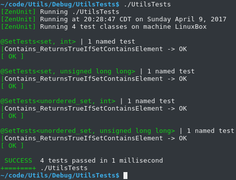

### ZenUnit Testing Macros

|Test Classes|
|----------------|
|`TESTCLASS(HighQualityTestClassName)`|
|`TEMPLATETESTCLASS(HighQualityTestClassName, TemplateParameterNames...)` // Precede with template\<parameter-list\>|
|`SPEC(HighQualityTestName)` // Standard-issue void test|
|`SPECX(HighQualityTestName)` // N-by-N value-parameterized test|
|`SKIPSPEC(HighQualityTestName, Reason)`|
|`SKIPSPECX(HighQualityTestName, Reason)`|
|`SPECEND` // Ends the SPEC section and begins the TEST section|
|`STARTUP` // Function run before each test|
|`CLEANUP` // Function run after each test|
|`TEST(HighQualityTestName)` // Standard-issue void test|
|`TEST1X1(HighQualityTestName, Arg1Type, ...)` // 1-by-1 value-parameterized test|
|`TEST2X2(HighQualityTestName, Arg1Type, Arg2Type, ...)` // 2-by-2 value-parameterized test|
|...|
|`TEST10X10(HighQualityTestName, Arg1Type, Arg2Type, Arg3Type, Arg4Type, Arg5Type, Arg6Type, Arg7Type, Arg8Type, Arg9Type, Arg10Type, ...)`|
|`RUNTESTS(HighQualityTestClassName)`|
|`RUNTEMPLATETESTS(HighQualityTestClassName, TemplateArguments...)`|
|`SKIPRUNTESTS(HighQualityTestClassName, Reason)`|
|`SKIPRUNTEMPLATETESTS(HighQualityTestClassName, Reason)`|

|Values|
|------|
|`ARE_EQUAL(expectedValue, actualValue, messages...)` // messages... are variables of any type writable with operator<<(ostream&, const T&) or ZenUnitPrinter\<T\>::Print(ostream&, const T&)|
|`ARE_SAME(expectedObject, actualObject, messages...)`|
|`ARE_NOT_SAME(notExpectedObject, actualObject, messages...)`|
|`ARE_COPIES(expectedObject, actualObject, messages...)` // Asserts that objects ARE_NOT_SAME and ARE_EQUAL|
|`IS_TRUE(value, messages...)`|
|`IS_FALSE(value, messages...)`|
|`IS_ZERO(value, messages...)`|

|Values Road Map|
|---------------|
|`ARE_WITHIN(expectedValue, actualValue, maxDifference, messages...)`|
|`ARE_WITHIN_PERCENT(expectedValue, actualValue, maxPercentDifference, messages...)`|
|`DOUBLES_CLOSE(expectedCloseDouble, actualDouble, messages...)`|
|`FLOATS_CLOSE(expectedCloseFloat, actualFloat, messages...)`|

|Data Structures|
|---------------|
|`IS_EMPTY(dataStructure, messages...)`|
|`CONTAINS(expectedElement, dataStructure, messages...)`|
|`VECTORS_EQUAL(expectedVector, actualVector, messages...)`|
|`MAPS_EQUAL(expectedMap, actualMap, messages...)`|
|`PAIRS_EQUAL(expectedPair, actualPair, messages...)`|
|`SETS_EQUAL(expectedSet, actualSet, messages...)`|

|Data Structures Road Map|
|------------------------|
|`ARRAYS_EQUAL(expectedArray, actualArray, messages...)`|
|`ARRAYS_EQUAL_N(expectedArray, actualArray, count, messages...)`|
|`BYTES_EQUAL(expectedBytes, actualBytes, length, messages...)`|
|`TUPLES_EQUAL(expectedTuple, actualTuple, messages...)`|

|Exceptions|
|----------|
|`THROWS(expression, expectedExactExceptionType, expectedWhat, messages...)`|
|`NOTHROWS(expression, messages...)`|

|The Test Itself|
|---------------|
|`FAIL(testFailureReason, messages...)`|

|Pointers|
|------- |
|`IS_NULL(pointer, messages...)`|
|`IS_NOT_NULL(pointer, messages...)`|
|`POINTEES_EQUAL(expectedPointer, actualPointer, messages...)` // Asserts that pointers are either both nullptr or their pointees ARE_EQUAL|
|`WAS_NEWED(smartOrRawPointer, messages...)` // Asserts not null then resets or operator deletes the pointer to confirm it was make_uniqued / make_shared / operator newed|
|`WAS_ARRAY_NEWED(smartOrRawArrayPointer, messages...)` // Asserts not null then resets or operator array deletes the pointer to confirm it was array make_uniqued / array operator newed|

|Regular Expressions|
|-------------------|
|`REGEX_MATCHES(expectedPattern, str, messages...)`|

|Functions|
|---------|
|`FUNCTION_TARGETS(expectedStdFunctionTarget, stdFunction, messages...)` // For use prior to ZenMocking a std::function targeting a global or static function|

|ZenUnitEqualizers // Allow for field-by-field equality assertions on arbitrary types|
|------------------|
|`EQUALIZER_THROWS_INIT(typeName)`|
|`EQUALIZER_THROWS(typeName, fieldName, nonDefaultFieldValue)`|

### Type-Parameterized Test Classes

If your code-under-test is templated, ZenUnit provides macros TEMPLATETESTS and RUNTEMPLATE for writing type-parameterized test classes to test various template arguments.

Here is how the correctness of a function that returns whether a generic set contains an element can be confirmed using TEMPLATETESTS and RUNTEMPLATE:

```cpp
#include "ZenUnit/ZenUnit.h"
#include <set>
#include <unordered_set>

class Set
{
public:
   template<typename SetType, typename T>
   static bool Contains(const SetType& s, const T& element)
   {
      const bool setContainsElement = s.find(element) != s.end();
      return setContainsElement;
   }
};

template<
   template<typename...>
   class SetType, typename T>
TEMPLATETESTS(SetTests, SetType, T)
SPEC(Contains_ReturnsTrueIfSetContainsElement)
SPECEND

TEST(Contains_ReturnsTrueIfSetContainsElement)
{
   SetType<T> s;
   const T element10 = 10;
   const T element20 = 20;

   IS_FALSE(Set::Contains(s, element10));
   IS_FALSE(Set::Contains(s, element20));

   s.insert(element10);
   IS_TRUE(Set::Contains(s, element10));
   IS_FALSE(Set::Contains(s, element20));

   s.insert(element20);
   IS_TRUE(Set::Contains(s, element10));
   IS_TRUE(Set::Contains(s, element20));
}

};
RUNTEMPLATE(SetTests, std::set, int)
RUNTEMPLATE(SetTests, std::set, unsigned long long)
RUNTEMPLATE(SetTests, std::unordered_set, int)
RUNTEMPLATE(SetTests, std::unordered_set, unsigned long long)

int main(int argc, char* argv[])
{
   return ZenUnit::RunTests(argc, argv);
}
```



### Command Line Arguments

```
ZenUnit and ZenMock v0.1.1
Usage: <TestsBinaryName> [Options...]

Options:

None
   Run all non-skipped tests.
-exit0
   Always exit 0 regardless of test run outcome.
-failskips
   Exit 1 regardless of test run outcome if any tests are skipped.
-testruns=<N>
   Repeat the running of all non-skipped tests N times.
-help or --help
   Display this help.
```

|Command Line Arguments Road Map|
|-------------------------------------|
|-verbosity=\<0\|1\|2\|3\>|
|-run=\<TestClassName\>[.TestName][/TestCaseIndex]\>|
|-random[=Seed]|
|-failfast|
|-breakfast|
|-maxtestms=\<Milliseconds\>|
|-maxtotalseconds=\<Seconds\>|
|-junitxml=\<FilePath\>|
|-parallel|

### [Work In Progress Guide to ZenMock](ZenMock.md)

