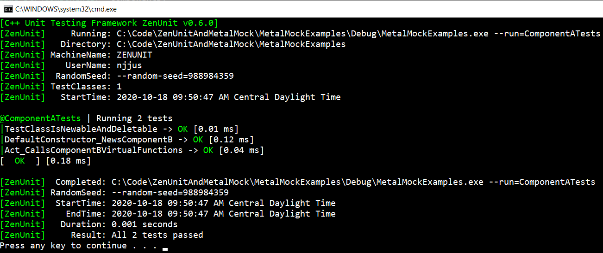
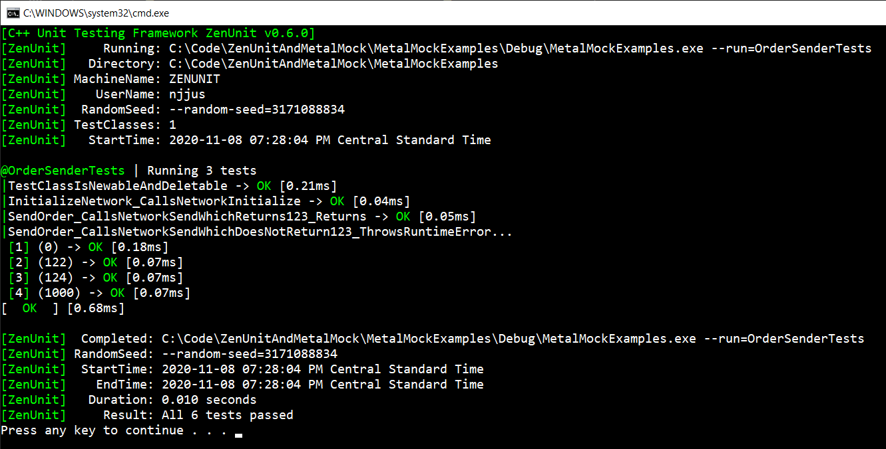
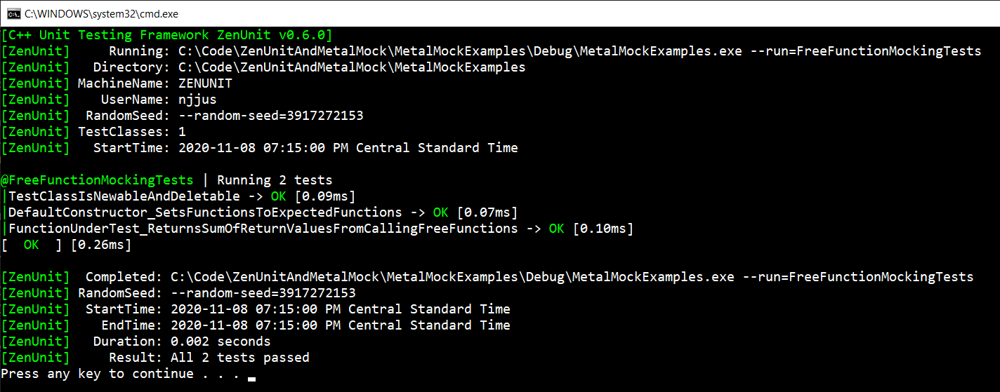

# Guide To MetalMock

* [How To MetalMock Virtual Functions](#how-to-metalmock-virtual-functions)
  * [Console Output From Running The Above Virtual Function MetalMock Example](#console-output-from-running-the-above-virtual-function-metalmock-example)
* [How To MetalMock Non-Virtual Functions](#how-to-metalmock-non-virtual-functions)
  * [Console Output From Running The Above Non-Virtual Function MetalMock Example](#console-output-from-running-the-above-non-virtual-function-metalmock-example)
* [How To MetalMock Static Functions](#how-to-metalmock-static-functions)
  * [Console Output From Running The Above Static Function MetalMock Example](#console-output-from-running-the-above-static-function-metalmock-example)
* [How To MetalMock Free Functions](#how-to-metalmock-free-functions)
  * [Console Output From Running The Above Free Function MetalMock Example](#console-output-from-running-the-above-free-function-metalmock-example)
* [MetalMock Function-Mocking Macros](#metalmock-function-mocking-macros)
  * [Void Virtual Functions](#void-virtual-functions)
  * [Non-Void Virtual Functions](#non-void-virtual-functions)
  * [Void Non-Virtual Functions](#void-non-virtual-functions)
  * [Non-Void Non-Virtual Functions](#non-void-non-virtual-functions)
  * [Void Static Functions](#void-static-functions)
  * [Non-Void Static Functions](#non-void-static-functions)
  * [Void Global Free Functions](#void-global-free-functions)
  * [Non-Void Global Free Functions](#non-void-global-free-functions)
  * [Void Namespaced Free Functions](#void-namespaced-free-functions)
  * [Non-Void Namespaced Free Functions](#non-void-namespaced-free-functions)

### How To MetalMock Virtual Functions

```cpp
// This is the contents of file MetalMockExamples/VirtualFunctionMockingTests.cpp

#include "pch.h"

// Component To Be MetalMocked
class ComponentB
{
public:
   virtual void ConstVirtualFunction() const {}
   virtual void NonConstVirtualFunction() {}
   virtual ~ComponentB() = default;
};

// Class Under Test
class ComponentA
{
   // Friend for the ability to perform dependency injection of a MetalMock mock object
   friend class ComponentATests;
private:
   std::unique_ptr<ComponentB> _componentB;
public:
   ComponentA()
      : _componentB(std::make_unique<ComponentB>())
   {
   }

   // Function Under Test
   void Act()
   {
      _componentB->ConstVirtualFunction();
      _componentB->NonConstVirtualFunction();
   }
};

// MetalMock class definition by way of inheritance from Metal::Mock<T>
class ComponentBMock : public Metal::Mock<ComponentB>
{
public:
   METALMOCK_VOID0_CONST(ConstVirtualFunction)
   METALMOCK_VOID0(NonConstVirtualFunction)
};

// ZenUnit Test Class
TESTS(ComponentATests)
AFACT(DefaultConstructor_NewsComponentB)
AFACT(Act_CallsComponentBVirtualFunctions)
EVIDENCE

ComponentA _componentA;
ComponentBMock* _componentBMock = nullptr;

STARTUP
{
   // Post-construction dependency injection of MetalMock mock object _componentBMock
   _componentA._componentB.reset(_componentBMock = new ComponentBMock);
}

TEST(DefaultConstructor_NewsComponentB)
{
   // Asserts that _componentA._componentB was make_unique'd so as to render
   // ComponentA's unit tests immune to the swap-make-unique-with-nullptr code mutation,
   // thereby maximizing mutation coverage.
   DELETE_TO_ASSERT_NEWED(_componentA._componentB);
}

TEST(Act_CallsComponentBVirtualFunctions)
{
   _componentBMock->ConstVirtualFunctionMock.Expect();
   _componentBMock->NonConstVirtualFunctionMock.Expect();
   //
   _componentA.Act();
   //
   METALMOCK(_componentBMock->ConstVirtualFunctionMock.CalledOnce());
   METALMOCK(_componentBMock->NonConstVirtualFunctionMock.CalledOnce());
}

RUN_TESTS(ComponentATests)
```

#### Console Output From Running The Above Virtual Function MetalMock Example



### How To MetalMock Non-Virtual Functions

```cpp
// This is the contents of file MetalMockExamples/NonVirtualFunctionMockingTests.cpp

#include "pch.h"

class KernelBypassNetwork
{
public:
   // Non-virtual function for slightly increased performance in a high-frequency trading environment
   void Initialize()
   {
   }

   // Non-virtual function for slightly increased performance in a high-frequency trading environment
   size_t Send(size_t numberOfBytes)
   {
      return numberOfBytes;
   }
};

class KernelBypassNetworkMock : Metal::Mock<KernelBypassNetwork>
{
public:
   METALMOCK_VOID0_NONVIRTUAL(Initialize)
   METALMOCK_NONVOID1_NONVIRTUAL(size_t, Send, size_t)
};

// Default NetworkType to KernelBypassNetwork for production trading,
// with OrderSender unit tests to set NetworkType to KernelBypassNetworkMock
template<typename NetworkType = KernelBypassNetwork>
class OrderSender
{
   friend class OrderSenderTests;
private:
   NetworkType _network;
public:
   void InitializeNetwork()
   {
      _network.Initialize();
   }

   void SendOrder()
   {
      constexpr size_t numberOfBytesForOneOrder = 123;
      const size_t numberOfBytesSent = _network.Send(numberOfBytesForOneOrder);
      if (numberOfBytesSent != numberOfBytesForOneOrder)
      {
         throw std::runtime_error("Failed to send complete order to the exchange");
      }
   }
};

TESTS(OrderSenderTests)
AFACT(InitializeNetwork_CallsNetworkInitialize)
AFACT(SendOrder_CallsNetworkSendWhichReturns123_Returns)
FACTS(SendOrder_CallsNetworkSendWhichDoesNotReturn123_ThrowsRuntimeError)
EVIDENCE

// Template parameter dependency injection of MetalMock class KernelBypassNetworkMock
OrderSender<KernelBypassNetworkMock> _orderSender;

TEST(InitializeNetwork_CallsNetworkInitialize)
{
   _orderSender._network.InitializeMock.Expect();
   //
   _orderSender.InitializeNetwork();
   //
   METALMOCK(_orderSender._network.InitializeMock.CalledOnce());
}

TEST(SendOrder_CallsNetworkSendWhichReturns123_Returns)
{
   _orderSender._network.SendMock.Return(123);
   //
   _orderSender.SendOrder();
   //
   METALMOCK(_orderSender._network.SendMock.CalledOnceWith(123));
}

TEST1X1(SendOrder_CallsNetworkSendWhichDoesNotReturn123_ThrowsRuntimeError,
   size_t sendReturnValue,
   0ull,
   122ull,
   124ull,
   1000ull)
{
   _orderSender._network.SendMock.Return(sendReturnValue);
   //
   THROWS_EXCEPTION(_orderSender.SendOrder(),
      std::runtime_error, "Failed to send complete order to the exchange");
   //
   METALMOCK(_orderSender._network.SendMock.CalledOnceWith(123));
}

RUN_TESTS(OrderSenderTests)
```

#### Console Output From Running The Above Non-Virtual Function MetalMock Example



### How To MetalMock Static Functions

```cpp
// This is the contents of file MetalMockExamples/StaticFunctionMockingTests.cpp

#include "pch.h"

class Utilities
{
public:
   static void VoidStaticFunction()
   {
   }

   static int NonVoidStaticFunction(int input)
   {
      const int inputPlus100 = input + 100;
      return inputPlus100;
   }

   Utilities() = delete;
};

TESTS(UtilitiesTests)
AFACT(VoidStaticFunction_DoesNothing)
FACTS(NonVoidStaticFunction_RetursnInputPlus100)
EVIDENCE

TEST(VoidStaticFunction_DoesNothing)
{
   Utilities::VoidStaticFunction();
}

TEST2X2(NonVoidStaticFunction_RetursnInputPlus100,
   int input, int expectedReturnValue,
   -101, -1,
   -100, 0,
   -99, 1,
   -1, 99,
   0, 100,
   1, 101)
{
   const int inputPlus100 = Utilities::NonVoidStaticFunction(input);
   ARE_EQUAL(expectedReturnValue, inputPlus100);
}

RUN_TESTS(UtilitiesTests)

class StaticFunctionMockingExample
{
   friend class StaticFunctionMockingExampleTests;
private:
   // MetalMockable std::functions
   std::function<void()> _call_VoidStaticFunction = Utilities::VoidStaticFunction;
   std::function<int(int)> _call_NonVoidStaticFunction = Utilities::NonVoidStaticFunction;
public:
   int FunctionUnderTest(int input)
   {
      _call_VoidStaticFunction();
      const int returnValue = _call_NonVoidStaticFunction(input);
      return returnValue;
   }
};

TESTS(StaticFunctionMockingExampleTests)
AFACT(DefaultConstructor_SetsFunctionsToExpectedFunctions)
AFACT(FunctionUnderTest_CallsVoidStaticFunction_ReturnsResultOfCallingNonVoidStaticFunction)
EVIDENCE

StaticFunctionMockingExample _classUnderTest;

// Creates a MetalMock object named VoidStaticFunctionMock
// for mocking void 0-arguments static function Utilities::VoidStaticFunction()
METALMOCK_VOID0_STATIC(Utilities, VoidStaticFunction)

// Creates a MetalMock object named NonVoidStaticFunctionMock
// for mocking non-void 1-argument static function Utilities::NonVoidStaticFunction(int)
METALMOCK_NONVOID1_STATIC(int, Utilities, NonVoidStaticFunction, int)

STARTUP
{
   _classUnderTest._call_VoidStaticFunction =
      BIND_0ARG_METALMOCK_OBJECT(VoidStaticFunctionMock);

   _classUnderTest._call_NonVoidStaticFunction =
      BIND_1ARG_METALMOCK_OBJECT(NonVoidStaticFunctionMock);
}

TEST(DefaultConstructor_SetsFunctionsToExpectedFunctions)
{
   const StaticFunctionMockingExample classUnderTest;
   STD_FUNCTION_TARGETS(Utilities::VoidStaticFunction, classUnderTest._call_VoidStaticFunction);
   STD_FUNCTION_TARGETS(Utilities::NonVoidStaticFunction, classUnderTest._call_NonVoidStaticFunction);
}

TEST(FunctionUnderTest_CallsVoidStaticFunction_ReturnsResultOfCallingNonVoidStaticFunction)
{
   VoidStaticFunctionMock.Expect();
   const int nonVoidStaticFunctionReturnValue = NonVoidStaticFunctionMock.ReturnRandom();
   const int input = ZenUnit::Random<int>();
   //
   const int returnValue = _classUnderTest.FunctionUnderTest(input);
   //
   METALMOCK(VoidStaticFunctionMock.CalledOnce());
   METALMOCK(NonVoidStaticFunctionMock.CalledOnceWith(input));
   ARE_EQUAL(nonVoidStaticFunctionReturnValue, returnValue);
}

RUN_TESTS(StaticFunctionMockingExampleTests)
```

#### Console Output From Running The Above Static Function MetalMock Example


### How To MetalMock Free Functions

```cpp
// This is the contents of file MetalMockExamples/FreeFunctionMockingTests.cpp

#include "pch.h"

// Global free function to be MetalMocked
int GlobalFreeFunction(int value)
{
   const int valuePlus1 = value + 1;
   return valuePlus1;
}

namespace Namespace
{
   // Namespaced free function to be MetalMocked
   int NamespacedFreeFunction(int left, int right)
   {
      const int sum = left + right;
      return sum;
   }
}

TESTS(FreeFunctionTests)
FACTS(GlobalFreeFunction_ReturnsArgumentPlus1)
FACTS(NamespacedFreeFunction_ReturnsSumOfArguments)
EVIDENCE

TEST2X2(GlobalFreeFunction_ReturnsArgumentPlus1,
   int value, int expectedReturnValue,
   -2, -1,
   -1, 0,
   0, 1,
   1, 2)
{
   const int returnValue = GlobalFreeFunction(value);
   ARE_EQUAL(expectedReturnValue, returnValue);
}

TEST3X3(NamespacedFreeFunction_ReturnsSumOfArguments,
   int left, int right, int expectedReturnValue,
   -1, -2, -3,
   -1, 1, 0,
   0, 0, 0,
   1, 2, 3)
{
   const int sum = Namespace::NamespacedFreeFunction(left, right);
   ARE_EQUAL(expectedReturnValue, sum);
}

RUN_TESTS(FreeFunctionTests)


class ClassUnderTest_MetalMockFreeFunctionMockingExample
{
   friend class FreeFunctionMockingTests;
private:
   // MetalMockable std::function pointers
   std::function<int(int)> _call_GlobalFreeFunction = ::GlobalFreeFunction;
   std::function<int(int, int)> _call_NamespacedFreeFunction = Namespace::NamespacedFreeFunction;
public:
   int FunctionUnderTest(int input)
   {
      const int returnValueA = _call_GlobalFreeFunction(input);
      const int returnValueB = _call_NamespacedFreeFunction(1, 2);
      const int returnValueC = _call_NamespacedFreeFunction(3, 4);
      const int returnValue = returnValueA + returnValueB + returnValueC;
      return returnValue;
   }
};

TESTS(FreeFunctionMockingTests)
AFACT(DefaultConstructor_SetsFunctionsToExpectedFunctions)
AFACT(FunctionUnderTest_ReturnsSumOfReturnValuesFromCallingFreeFunctions)
EVIDENCE

ClassUnderTest_MetalMockFreeFunctionMockingExample _classUnderTest;

// Creates a MetalMock object named GlobalFreeFunctionMock for mocking a free function
METALMOCK_NONVOID1_FREE(int, GlobalFreeFunction, int)

// Creates a MetalMock object named NamespacedFreeFunctionMock for mocking a namespaced free function
METALMOCK_NONVOID2_NAMESPACED_FREE(int, Namespace, NamespacedFreeFunction, int, int)

STARTUP
{
   // Post-construction dependency injection of MetalMock objects
   // to overwrite std::functions with MetalMock objects
   _classUnderTest._call_GlobalFreeFunction =
      BIND_1ARG_METALMOCK_OBJECT(GlobalFreeFunctionMock);
   _classUnderTest._call_NamespacedFreeFunction =
      BIND_2ARG_METALMOCK_OBJECT(NamespacedFreeFunctionMock);
}

TEST(DefaultConstructor_SetsFunctionsToExpectedFunctions)
{
   const ClassUnderTest_MetalMockFreeFunctionMockingExample classUnderTest;
   STD_FUNCTION_TARGETS(::GlobalFreeFunction, classUnderTest._call_GlobalFreeFunction);
   STD_FUNCTION_TARGETS(Namespace::NamespacedFreeFunction, classUnderTest._call_NamespacedFreeFunction);
}

TEST(FunctionUnderTest_ReturnsSumOfReturnValuesFromCallingFreeFunctions)
{
   const int globalFreeFunctionReturnValue = GlobalFreeFunctionMock.ReturnRandom();

   const int namespacedFreeFunctionReturnValueA = ZenUnit::Random<int>();
   const int namespacedFreeFunctionReturnValueB = ZenUnit::Random<int>();
   NamespacedFreeFunctionMock.ReturnValues(
      namespacedFreeFunctionReturnValueA, namespacedFreeFunctionReturnValueB);

   const int input = ZenUnit::Random<int>();
   //
   const int returnValue = _classUnderTest.FunctionUnderTest(input);
   //
   METALMOCK(GlobalFreeFunctionMock.CalledOnceWith(input));
   METALMOCK(NamespacedFreeFunctionMock.CalledAsFollows(
   {
      { 1, 2 },
      { 3, 4 }
   }));
   const int expectedReturnValue =
      globalFreeFunctionReturnValue +
      namespacedFreeFunctionReturnValueA +
      namespacedFreeFunctionReturnValueB;
   ARE_EQUAL(expectedReturnValue, returnValue);
}

RUN_TESTS(FreeFunctionMockingTests)
```

#### Console Output From Running The Above Free Function MetalMock Example



### MetalMock Function-Mocking Macros

#### Void Virtual Functions

|MetalMock Macro|
|---------------|
|`METALMOCK_VOID0(VirtualFunctionName)`|
|`METALMOCK_VOID0_CONST(VirtualFunctionName)`|
|`METALMOCK_VOID1(VirtualFunctionName, Arg1Type, ...)`|
|`METALMOCK_VOID1_CONST(VirtualFunctionName, Arg1Type, ...)`|
|`METALMOCK_VOID2(VirtualFunctionName, Arg1Type, Arg2Type, ...)`|
|`METALMOCK_VOID2_CONST(VirtualFunctionName, Arg1Type, Arg2Type, ...)`|
|`METALMOCK_VOID3(VirtualFunctionName, Arg1Type, Arg2Type, Arg3Type, ...)`|
|`METALMOCK_VOID3_CONST(VirtualFunctionName, Arg1Type, Arg2Type, Arg3Type, ...)`|
|`METALMOCK_VOID4(VirtualFunctionName, Arg1Type, Arg2Type, Arg3Type, Arg4Type, ...)`|
|`METALMOCK_VOID4_CONST(VirtualFunctionName, Arg1Type, Arg2Type, Arg3Type, Arg4Type, ...)`|
|`METALMOCK_VOID5(VirtualFunctionName, Arg1Type, Arg2Type, Arg3Type, Arg4Type, Arg5Type, ...)`|
|`METALMOCK_VOID5_CONST(VirtualFunctionName, Arg1Type, Arg2Type, Arg3Type, Arg4Type, Arg5Type, ...)`|
|`METALMOCK_VOID6(VirtualFunctionName, Arg1Type, Arg2Type, Arg3Type, Arg4Type, Arg5Type, Arg6Type, ...)`|
|`METALMOCK_VOID6_CONST(VirtualFunctionName, Arg1Type, Arg2Type, Arg3Type, Arg4Type, Arg5Type, Arg6Type, ...)`|
|`METALMOCK_VOID7(VirtualFunctionName, Arg1Type, Arg2Type, Arg3Type, Arg4Type, Arg5Type, Arg6Type, Arg7Type, ...)`|
|`METALMOCK_VOID7_CONST(VirtualFunctionName, Arg1Type, Arg2Type, Arg3Type, Arg4Type, Arg5Type, Arg6Type, Arg7Type, ...)`|
|`METALMOCK_VOID8(VirtualFunctionName, Arg1Type, Arg2Type, Arg3Type, Arg4Type, Arg5Type, Arg6Type, Arg7Type, Arg8Type, ...)`|
|`METALMOCK_VOID8_CONST(VirtualFunctionName, Arg1Type, Arg2Type, Arg3Type, Arg4Type, Arg5Type, Arg6Type, Arg7Type, Arg8Type, ...)`|
|`METALMOCK_VOID9(VirtualFunctionName, Arg1Type, Arg2Type, Arg3Type, Arg4Type, Arg5Type, Arg6Type, Arg7Type, Arg8Type, Arg9Type, ...)`|
|`METALMOCK_VOID9_CONST(VirtualFunctionName, Arg1Type, Arg2Type, Arg3Type, Arg4Type, Arg5Type, Arg6Type, Arg7Type, Arg8Type, Arg9Type, ...)`|
|`METALMOCK_VOID10(VirtualFunctionName, Arg1Type, Arg2Type, Arg3Type, Arg4Type, Arg5Type, Arg6Type, Arg7Type, Arg8Type, Arg9Type, Arg10Type, ...)`|
|`METALMOCK_VOID10_CONST(VirtualFunctionName, Arg1Type, Arg2Type, Arg3Type, Arg4Type, Arg5Type, Arg6Type, Arg7Type, Arg8Type, Arg9Type, Arg10Type, ...)`|

#### Non-Void Virtual Functions

|MetalMock Macro|
|---------------|
|`METALMOCK_NONVOID0(ReturnType, VirtualFunctionName)`|
|`METALMOCK_NONVOID0_CONST(ReturnType, VirtualFunctionName)`|
|`METALMOCK_NONVOID1(ReturnType, VirtualFunctionName, Arg1Type, ...)`|
|`METALMOCK_NONVOID1_CONST(ReturnType, VirtualFunctionName, Arg1Type, ...)`|
|`METALMOCK_NONVOID2(ReturnType, VirtualFunctionName, Arg1Type, Arg2Type, ...)`|
|`METALMOCK_NONVOID2_CONST(ReturnType, VirtualFunctionName, Arg1Type, Arg2Type, ...)`|
|`METALMOCK_NONVOID3(ReturnType, VirtualFunctionName, Arg1Type, Arg2Type, Arg3Type, ...)`|
|`METALMOCK_NONVOID3_CONST(ReturnType, VirtualFunctionName, Arg1Type, Arg2Type, Arg3Type, ...)`|
|`METALMOCK_NONVOID4(ReturnType, VirtualFunctionName, Arg1Type, Arg2Type, Arg3Type, Arg4Type, ...)`|
|`METALMOCK_NONVOID4_CONST(ReturnType, VirtualFunctionName, Arg1Type, Arg2Type, Arg3Type, Arg4Type, ...)`|
|`METALMOCK_NONVOID5(ReturnType, VirtualFunctionName, Arg1Type, Arg2Type, Arg3Type, Arg4Type, Arg5Type, ...)`|
|`METALMOCK_NONVOID5_CONST(ReturnType, VirtualFunctionName, Arg1Type, Arg2Type, Arg3Type, Arg4Type, Arg5Type, ...)`|
|`METALMOCK_NONVOID6(ReturnType, VirtualFunctionName, Arg1Type, Arg2Type, Arg3Type, Arg4Type, Arg5Type, Arg6Type, ...)`|
|`METALMOCK_NONVOID6_CONST(ReturnType, VirtualFunctionName, Arg1Type, Arg2Type, Arg3Type, Arg4Type, Arg5Type, Arg6Type, ...)`|
|`METALMOCK_NONVOID7(ReturnType, VirtualFunctionName, Arg1Type, Arg2Type, Arg3Type, Arg4Type, Arg5Type, Arg6Type, Arg7Type, ...)`|
|`METALMOCK_NONVOID7_CONST(ReturnType, VirtualFunctionName, Arg1Type, Arg2Type, Arg3Type, Arg4Type, Arg5Type, Arg6Type, Arg7Type, ...)`|
|`METALMOCK_NONVOID8(ReturnType, VirtualFunctionName, Arg1Type, Arg2Type, Arg3Type, Arg4Type, Arg5Type, Arg6Type, Arg7Type, Arg8Type, ...)`|
|`METALMOCK_NONVOID8_CONST(ReturnType, VirtualFunctionName, Arg1Type, Arg2Type, Arg3Type, Arg4Type, Arg5Type, Arg6Type, Arg7Type, Arg8Type, ...)`|
|`METALMOCK_NONVOID9(ReturnType, VirtualFunctionName, Arg1Type, Arg2Type, Arg3Type, Arg4Type, Arg5Type, Arg6Type, Arg7Type, Arg8Type, Arg9Type, ...)`|
|`METALMOCK_NONVOID9_CONST(ReturnType, VirtualFunctionName, Arg1Type, Arg2Type, Arg3Type, Arg4Type, Arg5Type, Arg6Type, Arg7Type, Arg8Type, Arg9Type, ...)`|
|`METALMOCK_NONVOID10(ReturnType, VirtualFunctionName, Arg1Type, Arg2Type, Arg3Type, Arg4Type, Arg5Type, Arg6Type, Arg7Type, Arg8Type, Arg9Type, Arg10Type, ...)`|
|`METALMOCK_NONVOID10_CONST(ReturnType, VirtualFunctionName, Arg1Type, Arg2Type, Arg3Type, Arg4Type, Arg5Type, Arg6Type, Arg7Type, Arg8Type, Arg9Type, Arg10Type, ...)`|

#### Void Non-Virtual Functions

|MetalMock Macro|
|---------------|
|`METALMOCK_VOID0_NONVIRTUAL(NonVirtualFunctionName)`|
|`METALMOCK_VOID0_NONVIRTUAL_CONST(NonVirtualFunctionName)`|
|`METALMOCK_VOID1_NONVIRTUAL(NonVirtualFunctionName, Arg1Type, ...)`|
|`METALMOCK_VOID1_NONVIRTUAL_CONST(NonVirtualFunctionName, Arg1Type, ...)`|
|`METALMOCK_VOID2_NONVIRTUAL(NonVirtualFunctionName, Arg1Type, Arg2Type, ...)`|
|`METALMOCK_VOID2_NONVIRTUAL_CONST(NonVirtualFunctionName, Arg1Type, Arg2Type, ...)`|
|`METALMOCK_VOID3_NONVIRTUAL(NonVirtualFunctionName, Arg1Type, Arg2Type, Arg3Type, ...)`|
|`METALMOCK_VOID3_NONVIRTUAL_CONST(NonVirtualFunctionName, Arg1Type, Arg2Type, Arg3Type, ...)`|
|`METALMOCK_VOID4_NONVIRTUAL(NonVirtualFunctionName, Arg1Type, Arg2Type, Arg3Type, Arg4Type, ...)`|
|`METALMOCK_VOID4_NONVIRTUAL_CONST(NonVirtualFunctionName, Arg1Type, Arg2Type, Arg3Type, Arg4Type, ...)`|
|`METALMOCK_VOID5_NONVIRTUAL(NonVirtualFunctionName, Arg1Type, Arg2Type, Arg3Type, Arg4Type, Arg5Type, ...)`|
|`METALMOCK_VOID5_NONVIRTUAL_CONST(NonVirtualFunctionName, Arg1Type, Arg2Type, Arg3Type, Arg4Type, Arg5Type, ...)`|
|`METALMOCK_VOID6_NONVIRTUAL(NonVirtualFunctionName, Arg1Type, Arg2Type, Arg3Type, Arg4Type, Arg5Type, Arg6Type, ...)`|
|`METALMOCK_VOID6_NONVIRTUAL_CONST(NonVirtualFunctionName, Arg1Type, Arg2Type, Arg3Type, Arg4Type, Arg5Type, Arg6Type, ...)`|
|`METALMOCK_VOID7_NONVIRTUAL(NonVirtualFunctionName, Arg1Type, Arg2Type, Arg3Type, Arg4Type, Arg5Type, Arg6Type, Arg7Type, ...)`|
|`METALMOCK_VOID7_NONVIRTUAL_CONST(NonVirtualFunctionName, Arg1Type, Arg2Type, Arg3Type, Arg4Type, Arg5Type, Arg6Type, Arg7Type, ...)`|
|`METALMOCK_VOID8_NONVIRTUAL(NonVirtualFunctionName, Arg1Type, Arg2Type, Arg3Type, Arg4Type, Arg5Type, Arg6Type, Arg7Type, Arg8Type, ...)`|
|`METALMOCK_VOID8_NONVIRTUAL_CONST(NonVirtualFunctionName, Arg1Type, Arg2Type, Arg3Type, Arg4Type, Arg5Type, Arg6Type, Arg7Type, Arg8Type, ...)`|
|`METALMOCK_VOID9_NONVIRTUAL(NonVirtualFunctionName, Arg1Type, Arg2Type, Arg3Type, Arg4Type, Arg5Type, Arg6Type, Arg7Type, Arg8Type, Arg9Type, ...)`|
|`METALMOCK_VOID9_NONVIRTUAL_CONST(NonVirtualFunctionName, Arg1Type, Arg2Type, Arg3Type, Arg4Type, Arg5Type, Arg6Type, Arg7Type, Arg8Type, Arg9Type, ...)`|
|`METALMOCK_VOID10_NONVIRTUAL(NonVirtualFunctionName, Arg1Type, Arg2Type, Arg3Type, Arg4Type, Arg5Type, Arg6Type, Arg7Type, Arg8Type, Arg9Type, Arg10Type, ...)`|
|`METALMOCK_VOID10_NONVIRTUAL_CONST(NonVirtualFunctionName, Arg1Type, Arg2Type, Arg3Type, Arg4Type, Arg5Type, Arg6Type, Arg7Type, Arg8Type, Arg9Type, Arg10Type, ...)`|

#### Non-Void Non-Virtual Functions

|MetalMock Macro|
|---------------|
|`METALMOCK_NONVOID0_NONVIRTUAL(ReturnType, NonVirtualFunctionName)`|
|`METALMOCK_NONVOID0_NONVIRTUAL_CONST(ReturnType, NonVirtualFunctionName)`|
|`METALMOCK_NONVOID1_NONVIRTUAL(ReturnType, NonVirtualFunctionName, Arg1Type, ...)`|
|`METALMOCK_NONVOID1_NONVIRTUAL_CONST(ReturnType, NonVirtualFunctionName, Arg1Type, ...)`|
|`METALMOCK_NONVOID2_NONVIRTUAL(ReturnType, NonVirtualFunctionName, Arg1Type, Arg2Type, ...)`|
|`METALMOCK_NONVOID2_NONVIRTUAL_CONST(ReturnType, NonVirtualFunctionName, Arg1Type, Arg2Type, ...)`|
|`METALMOCK_NONVOID3_NONVIRTUAL(ReturnType, NonVirtualFunctionName, Arg1Type, Arg2Type, Arg3Type, ...)`|
|`METALMOCK_NONVOID3_NONVIRTUAL_CONST(ReturnType, NonVirtualFunctionName, Arg1Type, Arg2Type, Arg3Type, ...)`|
|`METALMOCK_NONVOID4_NONVIRTUAL(ReturnType, NonVirtualFunctionName, Arg1Type, Arg2Type, Arg3Type, Arg4Type, ...)`|
|`METALMOCK_NONVOID4_NONVIRTUAL_CONST(ReturnType, NonVirtualFunctionName, Arg1Type, Arg2Type, Arg3Type, Arg4Type, ...)`|
|`METALMOCK_NONVOID5_NONVIRTUAL(ReturnType, NonVirtualFunctionName, Arg1Type, Arg2Type, Arg3Type, Arg4Type, Arg5Type, ...)`|
|`METALMOCK_NONVOID5_NONVIRTUAL_CONST(ReturnType, NonVirtualFunctionName, Arg1Type, Arg2Type, Arg3Type, Arg4Type, Arg5Type, ...)`|
|`METALMOCK_NONVOID6_NONVIRTUAL(ReturnType, NonVirtualFunctionName, Arg1Type, Arg2Type, Arg3Type, Arg4Type, Arg5Type, Arg6Type, ...)`|
|`METALMOCK_NONVOID6_NONVIRTUAL_CONST(ReturnType, NonVirtualFunctionName, Arg1Type, Arg2Type, Arg3Type, Arg4Type, Arg5Type, Arg6Type, ...)`|
|`METALMOCK_NONVOID7_NONVIRTUAL(ReturnType, NonVirtualFunctionName, Arg1Type, Arg2Type, Arg3Type, Arg4Type, Arg5Type, Arg6Type, Arg7Type, ...)`|
|`METALMOCK_NONVOID7_NONVIRTUAL_CONST(ReturnType, NonVirtualFunctionName, Arg1Type, Arg2Type, Arg3Type, Arg4Type, Arg5Type, Arg6Type, Arg7Type, ...)`|
|`METALMOCK_NONVOID8_NONVIRTUAL(ReturnType, NonVirtualFunctionName, Arg1Type, Arg2Type, Arg3Type, Arg4Type, Arg5Type, Arg6Type, Arg7Type, Arg8Type, ...)`|
|`METALMOCK_NONVOID8_NONVIRTUAL_CONST(ReturnType, NonVirtualFunctionName, Arg1Type, Arg2Type, Arg3Type, Arg4Type, Arg5Type, Arg6Type, Arg7Type, Arg8Type, ...)`|
|`METALMOCK_NONVOID9_NONVIRTUAL(ReturnType, NonVirtualFunctionName, Arg1Type, Arg2Type, Arg3Type, Arg4Type, Arg5Type, Arg6Type, Arg7Type, Arg8Type, Arg9Type, ...)`|
|`METALMOCK_NONVOID9_NONVIRTUAL_CONST(ReturnType, NonVirtualFunctionName, Arg1Type, Arg2Type, Arg3Type, Arg4Type, Arg5Type, Arg6Type, Arg7Type, Arg8Type, Arg9Type, ...)`|
|`METALMOCK_NONVOID10_NONVIRTUAL(ReturnType, NonVirtualFunctionName, Arg1Type, Arg2Type, Arg3Type, Arg4Type, Arg5Type, Arg6Type, Arg7Type, Arg8Type, Arg9Type, Arg10Type, ...)`|
|`METALMOCK_NONVOID10_NONVIRTUAL_CONST(ReturnType, NonVirtualFunctionName, Arg1Type, Arg2Type, Arg3Type, Arg4Type, Arg5Type, Arg6Type, Arg7Type, Arg8Type, Arg9Type, Arg10Type, ...)`|

#### Void Static Functions

|MetalMock Macro|
|---------------|
|`METALMOCK_VOID0_STATIC(NamespaceQualifiedClassName, StaticFunctionName, ...)`|
|`METALMOCK_VOID1_STATIC(NamespaceQualifiedClassName, StaticFunctionName, Arg1Type, ...)`|
|`METALMOCK_VOID2_STATIC(NamespaceQualifiedClassName, StaticFunctionName, Arg1Type, Arg2Type, ...)`|
|`METALMOCK_VOID3_STATIC(NamespaceQualifiedClassName, StaticFunctionName, Arg1Type, Arg2Type, Arg3Type, ...)`|
|`METALMOCK_VOID4_STATIC(NamespaceQualifiedClassName, StaticFunctionName, Arg1Type, Arg2Type, Arg3Type, Arg4Type, ...)`|
|`METALMOCK_VOID5_STATIC(NamespaceQualifiedClassName, StaticFunctionName, Arg1Type, Arg2Type, Arg3Type, Arg4Type, Arg5Type, ...)`|
|`METALMOCK_VOID6_STATIC(NamespaceQualifiedClassName, StaticFunctionName, Arg1Type, Arg2Type, Arg3Type, Arg4Type, Arg5Type, Arg6Type, ...)`|
|`METALMOCK_VOID7_STATIC(NamespaceQualifiedClassName, StaticFunctionName, Arg1Type, Arg2Type, Arg3Type, Arg4Type, Arg5Type, Arg6Type, Arg7Type, ...)`|
|`METALMOCK_VOID8_STATIC(NamespaceQualifiedClassName, StaticFunctionName, Arg1Type, Arg2Type, Arg3Type, Arg4Type, Arg5Type, Arg6Type, Arg7Type, Arg8Type, ...)`|
|`METALMOCK_VOID9_STATIC(NamespaceQualifiedClassName, StaticFunctionName, Arg1Type, Arg2Type, Arg3Type, Arg4Type, Arg5Type, Arg6Type, Arg7Type, Arg8Type, Arg9Type, ...)`|
|`METALMOCK_VOID10_STATIC(NamespaceQualifiedClassName, StaticFunctionName, Arg1Type, Arg2Type, Arg3Type, Arg4Type, Arg5Type, Arg6Type, Arg7Type, Arg8Type, Arg9Type, Arg10Type, ...)`|

#### Non-Void Static Functions

|MetalMock Macro|
|---------------|
|`METALMOCK_NONVOID0_STATIC(ReturnType, NamespaceQualifiedClassName, StaticFunctionName, ...)`|
|`METALMOCK_NONVOID1_STATIC(ReturnType, NamespaceQualifiedClassName, StaticFunctionName, Arg1Type, ...)`|
|`METALMOCK_NONVOID2_STATIC(ReturnType, NamespaceQualifiedClassName, StaticFunctionName, Arg1Type, Arg2Type, ...)`|
|`METALMOCK_NONVOID3_STATIC(ReturnType, NamespaceQualifiedClassName, StaticFunctionName, Arg1Type, Arg2Type, Arg3Type, ...)`|
|`METALMOCK_NONVOID4_STATIC(ReturnType, NamespaceQualifiedClassName, StaticFunctionName, Arg1Type, Arg2Type, Arg3Type, Arg4Type, ...)`|
|`METALMOCK_NONVOID5_STATIC(ReturnType, NamespaceQualifiedClassName, StaticFunctionName, Arg1Type, Arg2Type, Arg3Type, Arg4Type, Arg5Type, ...)`|
|`METALMOCK_NONVOID6_STATIC(ReturnType, NamespaceQualifiedClassName, StaticFunctionName, Arg1Type, Arg2Type, Arg3Type, Arg4Type, Arg5Type, Arg6Type, ...)`|
|`METALMOCK_NONVOID7_STATIC(ReturnType, NamespaceQualifiedClassName, StaticFunctionName, Arg1Type, Arg2Type, Arg3Type, Arg4Type, Arg5Type, Arg6Type, Arg7Type, ...)`|
|`METALMOCK_NONVOID8_STATIC(ReturnType, NamespaceQualifiedClassName, StaticFunctionName, Arg1Type, Arg2Type, Arg3Type, Arg4Type, Arg5Type, Arg6Type, Arg7Type, Arg8Type, ...)`|
|`METALMOCK_NONVOID9_STATIC(ReturnType, NamespaceQualifiedClassName, StaticFunctionName, Arg1Type, Arg2Type, Arg3Type, Arg4Type, Arg5Type, Arg6Type, Arg7Type, Arg8Type, Arg9Type, ...)`|
|`METALMOCK_NONVOID10_STATIC(ReturnType, NamespaceQualifiedClassName, StaticFunctionName, Arg1Type, Arg2Type, Arg3Type, Arg4Type, Arg5Type, Arg6Type, Arg7Type, Arg8Type, Arg9Type, Arg10Type, ...)`|

#### Void Global Free Functions

|MetalMock Macro|
|---------------|
|`METALMOCK_VOID0_FREE(GlobalFreeFunctionName)`|
|`METALMOCK_VOID1_FREE(GlobalFreeFunctionName, Arg1Type, ...)`|
|`METALMOCK_VOID2_FREE(GlobalFreeFunctionName, Arg1Type, Arg2Type, ...)`|
|`METALMOCK_VOID3_FREE(GlobalFreeFunctionName, Arg1Type, Arg2Type, Arg3Type, ...)`|
|`METALMOCK_VOID4_FREE(GlobalFreeFunctionName, Arg1Type, Arg2Type, Arg3Type, Arg4Type, ...)`|
|`METALMOCK_VOID5_FREE(GlobalFreeFunctionName, Arg1Type, Arg2Type, Arg3Type, Arg4Type, Arg5Type, ...)`|
|`METALMOCK_VOID6_FREE(GlobalFreeFunctionName, Arg1Type, Arg2Type, Arg3Type, Arg4Type, Arg5Type, Arg6Type, ...)`|
|`METALMOCK_VOID7_FREE(GlobalFreeFunctionName, Arg1Type, Arg2Type, Arg3Type, Arg4Type, Arg5Type, Arg6Type, Arg7Type, ...)`|
|`METALMOCK_VOID8_FREE(GlobalFreeFunctionName, Arg1Type, Arg2Type, Arg3Type, Arg4Type, Arg5Type, Arg6Type, Arg7Type, Arg8Type, ...)`|
|`METALMOCK_VOID9_FREE(GlobalFreeFunctionName, Arg1Type, Arg2Type, Arg3Type, Arg4Type, Arg5Type, Arg6Type, Arg7Type, Arg8Type, Arg9Type, ...)`|
|`METALMOCK_VOID10_FREE(GlobalFreeFunctionName, Arg1Type, Arg2Type, Arg3Type, Arg4Type, Arg5Type, Arg6Type, Arg7Type, Arg8Type, Arg9Type, Arg10Type, ...)`|

#### Non-Void Global Free Functions

|MetalMock Macro|
|---------------|
|`METALMOCK_NONVOID0_FREE(ReturnType, GlobalFreeFunctionName)`|
|`METALMOCK_NONVOID1_FREE(ReturnType, GlobalFreeFunctionName, Arg1Type, ...)`|
|`METALMOCK_NONVOID2_FREE(ReturnType, GlobalFreeFunctionName, Arg1Type, Arg2Type, ...)`|
|`METALMOCK_NONVOID3_FREE(ReturnType, GlobalFreeFunctionName, Arg1Type, Arg2Type, Arg3Type, ...)`|
|`METALMOCK_NONVOID4_FREE(ReturnType, GlobalFreeFunctionName, Arg1Type, Arg2Type, Arg3Type, Arg4Type, ...)`|
|`METALMOCK_NONVOID5_FREE(ReturnType, GlobalFreeFunctionName, Arg1Type, Arg2Type, Arg3Type, Arg4Type, Arg5Type, ...)`|
|`METALMOCK_NONVOID6_FREE(ReturnType, GlobalFreeFunctionName, Arg1Type, Arg2Type, Arg3Type, Arg4Type, Arg5Type, Arg6Type, ...)`|
|`METALMOCK_NONVOID7_FREE(ReturnType, GlobalFreeFunctionName, Arg1Type, Arg2Type, Arg3Type, Arg4Type, Arg5Type, Arg6Type, Arg7Type, ...)`|
|`METALMOCK_NONVOID8_FREE(ReturnType, GlobalFreeFunctionName, Arg1Type, Arg2Type, Arg3Type, Arg4Type, Arg5Type, Arg6Type, Arg7Type, Arg8Type, ...)`|
|`METALMOCK_NONVOID9_FREE(ReturnType, GlobalFreeFunctionName, Arg1Type, Arg2Type, Arg3Type, Arg4Type, Arg5Type, Arg6Type, Arg7Type, Arg8Type, Arg9Type, ...)`|
|`METALMOCK_NONVOID10_FREE(ReturnType, GlobalFreeFunctionName, Arg1Type, Arg2Type, Arg3Type, Arg4Type, Arg5Type, Arg6Type, Arg7Type, Arg8Type, Arg9Type, Arg10Type, ...)`|

#### Void Namespaced Free Functions

|MetalMock Macro|
|---------------|
|`METALMOCK_VOID0_NAMESPACED_FREE(Namespace, NamespacedFreeFunctionName, ...)`|
|`METALMOCK_VOID1_NAMESPACED_FREE(Namespace, NamespacedFreeFunctionName, Arg1Type, ...)`|
|`METALMOCK_VOID2_NAMESPACED_FREE(Namespace, NamespacedFreeFunctionName, Arg1Type, Arg2Type, ...)`|
|`METALMOCK_VOID3_NAMESPACED_FREE(Namespace, NamespacedFreeFunctionName, Arg1Type, Arg2Type, Arg3Type, ...)`|
|`METALMOCK_VOID4_NAMESPACED_FREE(Namespace, NamespacedFreeFunctionName, Arg1Type, Arg2Type, Arg3Type, Arg4Type, ...)`|
|`METALMOCK_VOID5_NAMESPACED_FREE(Namespace, NamespacedFreeFunctionName, Arg1Type, Arg2Type, Arg3Type, Arg4Type, Arg5Type, ...)`|
|`METALMOCK_VOID6_NAMESPACED_FREE(Namespace, NamespacedFreeFunctionName, Arg1Type, Arg2Type, Arg3Type, Arg4Type, Arg5Type, Arg6Type, ...)`|
|`METALMOCK_VOID7_NAMESPACED_FREE(Namespace, NamespacedFreeFunctionName, Arg1Type, Arg2Type, Arg3Type, Arg4Type, Arg5Type, Arg6Type, Arg7Type, ...)`|
|`METALMOCK_VOID8_NAMESPACED_FREE(Namespace, NamespacedFreeFunctionName, Arg1Type, Arg2Type, Arg3Type, Arg4Type, Arg5Type, Arg6Type, Arg7Type, Arg8Type, ...)`|
|`METALMOCK_VOID9_NAMESPACED_FREE(Namespace, NamespacedFreeFunctionName, Arg1Type, Arg2Type, Arg3Type, Arg4Type, Arg5Type, Arg6Type, Arg7Type, Arg8Type, Arg9Type, ...)`|
|`METALMOCK_VOID10_NAMESPACED_FREE(Namespace, NamespacedFreeFunctionName, Arg1Type, Arg2Type, Arg3Type, Arg4Type, Arg5Type, Arg6Type, Arg7Type, Arg8Type, Arg9Type, Arg10Type, ...)`|

#### Non-Void Namespaced Free Functions

|MetalMock Macro|
|---------------|
|`METALMOCK_NONVOID0_NAMESPACED_FREE(ReturnType, Namespace, NamespacedFreeFunctionName, ...)`|
|`METALMOCK_NONVOID1_NAMESPACED_FREE(ReturnType, Namespace, NamespacedFreeFunctionName, Arg1Type, ...)`|
|`METALMOCK_NONVOID2_NAMESPACED_FREE(ReturnType, Namespace, NamespacedFreeFunctionName, Arg1Type, Arg2Type, ...)`|
|`METALMOCK_NONVOID3_NAMESPACED_FREE(ReturnType, Namespace, NamespacedFreeFunctionName, Arg1Type, Arg2Type, Arg3Type, ...)`|
|`METALMOCK_NONVOID4_NAMESPACED_FREE(ReturnType, Namespace, NamespaceFreeFunctionName, Arg1Type, Arg2Type, Arg3Type, Arg4Type, ...)`|
|`METALMOCK_NONVOID5_NAMESPACED_FREE(ReturnType, Namespace, NamespacedFreeFunctionName, Arg1Type, Arg2Type, Arg3Type, Arg4Type, Arg5Type, ...)`|
|`METALMOCK_NONVOID6_NAMESPACED_FREE(ReturnType, Namespace, NamespacedFreeFunctionName, Arg1Type, Arg2Type, Arg3Type, Arg4Type, Arg5Type, Arg6Type, ...)`|
|`METALMOCK_NONVOID7_NAMESPACED_FREE(ReturnType, Namespace, NamespacedFreeFunctionName, Arg1Type, Arg2Type, Arg3Type, Arg4Type, Arg5Type, Arg6Type, Arg7Type, ...)`|
|`METALMOCK_NONVOID8_NAMESPACED_FREE(ReturnType, Namespace, NamespacedFreeFunctionName, Arg1Type, Arg2Type, Arg3Type, Arg4Type, Arg5Type, Arg6Type, Arg7Type, Arg8Type, ...)`|
|`METALMOCK_NONVOID9_NAMESPACED_FREE(ReturnType, Namespace, NamespacedFreeFunctionName, Arg1Type, Arg2Type, Arg3Type, Arg4Type, Arg5Type, Arg6Type, Arg7Type, Arg8Type, Arg9Type, ...)`|
|`METALMOCK_NONVOID10_NAMESPACED_FREE(ReturnType, Namespace, NamespacedFreeFunctionName, Arg1Type, Arg2Type, Arg3Type, Arg4Type, Arg5Type, Arg6Type, Arg7Type, Arg8Type, Arg9Type, Arg10Type, ...)`|
