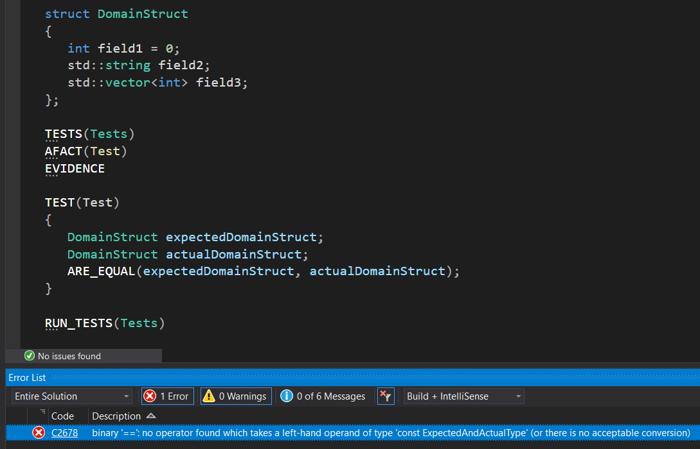
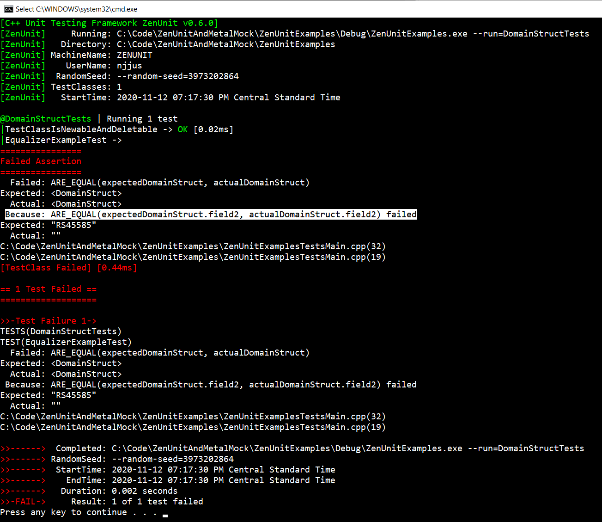
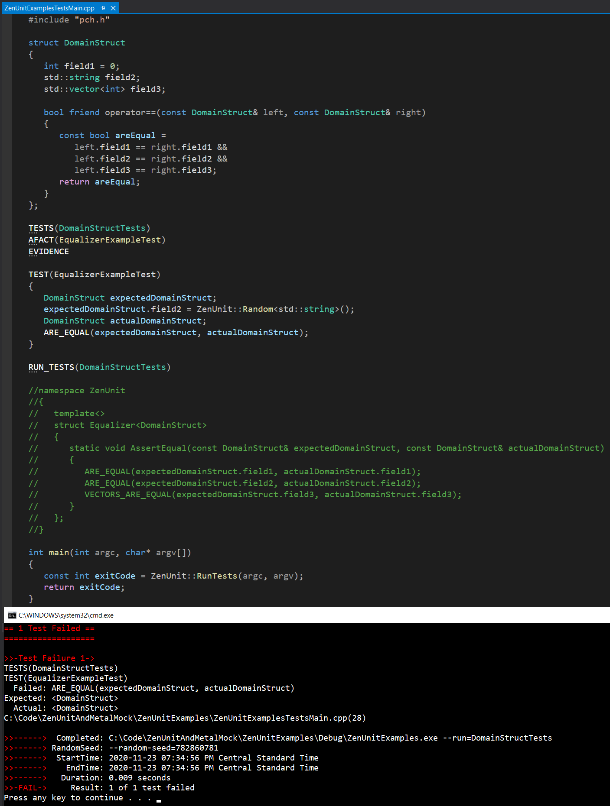

## How To Write A Custom ZenUnit::Equalizer\<T\> struct To Achieve Field-By-Field Assertion Granularity

By default, ZenUnit assertion `ARE_EQUAL(expectedObject, actualObject)` calls `expectedObject == actualObject` to determine whether `expectedObject` is equal to `actualObject`.

Here is the implementation of `ARE_EQUAL` in ZenUnit.h, which shows the default behavior of calling `expectedObject == actualObject` can be overridden for type `T` by defining a `namespace ZenUnit { Equalizer<T> }` struct with static function `static void AssertEqual(const T&, const T&)`. In the body of this custom `AssertEqual` function, field-by-field `ARE_EQUAL(expectedObject.fieldName, actualObject.fieldName)` assert statements can be written to achieve field-by-field assertion granularity.

For example struct `DomainStruct` as defined below, here is the `binary '==': no operator found` error message which appears when asserting that two instances of `DomainStruct` are equal with ZenUnit assertion `ARE_EQUAL(expectedDomainStruct, actualDomainStruct)`.

The `binary '==': no operator found` error message appears because `DomainStruct` has not defined `operator==` and a custom ZenUnit Equalizer function in the form `ZenUnit::Equalizer<DomainStruct>::AssertEqual(const DomainStruct& expectedDomainStruct, const DomainStruct& actualDomainStruct)` has not yet been defined.

Here is the syntax for how to define a custom `ZenUnit::Equalizer<T>` struct specialization to achieve field-by-field assertion granularity for type `DomainStruct`:

Here is the ZenUnit console output from running the above ZenUnit Equalizer example with `ZenUnitExamples.exe --run=DomainStructTests`, which shows field-by-field assertion granularity regarding `field2` being the specific field that differs between `expectedDomainStruct` and `actualDomainStruct`:

In contrast, here is the ZenUnit console output from running `ZenUnitExamples.exe --run=DomainStructTests` when the `DomainStruct` ZenUnit Equalizer 
is commented out and instead a `friend operator==(const DomainStruct& left, const DomainStruct& right` function is defined. Note how just `Expected: <DomainStruct>` and `Actual: <DomainStruct>` is printed instead of `field2` being printed as happens when a `ZenUnit::Equalizer<DomainStruct>` is defined.

