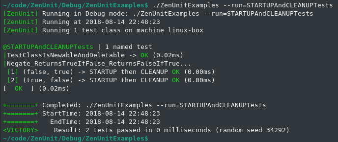

<h1 align="center">ZenUnit</h1>

<h4 align="center">ZenUnit is a header-only C++17 unit testing framework with an intuitive syntax for writing value-parameterized and type-parameterized unit tests.</h4>

|Build Type|Build Status|
|----------|------------|
|Linux (Clang 5.0.2, Clang 6.0.1, GCC 7.3.0) and macOS (AppleClang 9.1.0)|<a href="https://travis-ci.org/NeilJustice/ZenUnit"></a>|
|Windows (Visual Studio 2017 and 2017 Preview x64 and Win32)|<a href="https://ci.appveyor.com/project/NeilJustice/ZenUnitZenMock"></a>|

   * [ZenUnit design and the N-by-N value-parameterized test syntax](#zenunit-design-and-the-n-by-n-value-parameterized-test-syntax)
   * [STARTUP and CLEANUP](#startup-and-cleanup)
   * [Command Line Usage](#command-line-usage)
   * [Type-Parameterized Test Class Syntax](#type-parameterized-test-class-syntax)
   * [ZenUnit Assertions](#zenunit-assertions)
      * [Value Assertions](#value-assertions)
      * [Data Structure Assertions](#data-structure-assertions)
      * [Exception Assertions](#exception-assertions)
      * [Pointer Assertions](#pointer-assertions)
      * [Test Assertions](#test-assertions)
      * [Function Assertions](#function-assertions)
   * [Test-Defining Macros](#test-defining-macros)
   * [Maximizing Mutation Coverage With ZenUnit](#maximizing-mutation-coverage-with-zenunit)
   * [Customizing ZenUnit Equalizers and ZenUnit Random Value Generating Functions](#customizing-zenUnit-equalizer-and-zenunit-random)
   * [C++ Mocking Framework ZenMock](#c++-mocking-framework-zenmock)

ZenUnit design and the N-by-N value-parameterized test syntax
=============================================================

```cpp
#include "ZenUnit.h"

// Function to be unit tested with ZenUnit
std::string FizzBuzz(unsigned endNumber);

// TESTS defines a ZenUnit test class and begins the FACTS section.
TESTS(FizzBuzzTests)
// By way of a carefully-considered design decision,
// in ZenUnit test names are duplicated between the FACTS section and the EVIDENCE section.
// Because code is read much more often than it is written,
// always having test names up top ready to easily review for continued quality and cohesion
// instead of test names being scattered throughout test files
// is where this design yields long term code quality dividends.

// AFACT declares a non-value-parameterized test.
AFACT(FizzBuzz_EndNumber0_Throws)
// FACTS declares an N-by-N value-parameterized test.
FACTS(FizzBuzz_EndNumberGreaterThan0_ReturnsFizzBuzzSequence)
// EVIDENCE concludes the declaration of FACTS section
// and begins the presentation of EVIDENCE section,
// also known as the test class body.
EVIDENCE

// TEST defines a non-value-parameterized test.
TEST(FizzBuzz_EndNumber0_Throws)
{
   // The ZenUnit THROWS assertion asserts that an expression throws *exactly* (not a derived class of)
   // an expected exception type with *exactly* an expected exception what() text.
   // This double exactness design of THROWS renders it immune to these two code mutations:
   // mutate-exception-type and mutate-exception-message.
   THROWS(FizzBuzz(0), std::invalid_argument, "FizzBuzz() error: endNumber must be 1 or greater");
}

// TEST2X2 defines a 2-by-2 value-parameterized test
// that processes its typesafe variadic arguments list 2-by-2.
// This TEST2X2 defines 16 test cases for FizzBuzz(),
// each of which will run independently within separate instances of FizzBuzzTests.
TEST2X2(FizzBuzz_EndNumberGreaterThan0_ReturnsFizzBuzzSequence,
   unsigned endNumber, const std::string& expectedFizzBuzzSequence,
   1, "1",
   2, "1 2",
   3, "1 2 Fizz",
   4, "1 2 Fizz 4",
   5, "1 2 Fizz 4 Buzz",
   6, "1 2 Fizz 4 Buzz Fizz",
   7, "1 2 Fizz 4 Buzz Fizz 7",
   8, "1 2 Fizz 4 Buzz Fizz 7 8",
   9, "1 2 Fizz 4 Buzz Fizz 7 8 Fizz",
   10, "1 2 Fizz 4 Buzz Fizz 7 8 Fizz Buzz",
   11, "1 2 Fizz 4 Buzz Fizz 7 8 Fizz Buzz 11",
   12, "1 2 Fizz 4 Buzz Fizz 7 8 Fizz Buzz 11 Fizz",
   13, "1 2 Fizz 4 Buzz Fizz 7 8 Fizz Buzz 11 Fizz 13",
   14, "1 2 Fizz 4 Buzz Fizz 7 8 Fizz Buzz 11 Fizz 13 14",
   15, "1 2 Fizz 4 Buzz Fizz 7 8 Fizz Buzz 11 Fizz 13 14 FizzBuzz",
   16, "1 2 Fizz 4 Buzz Fizz 7 8 Fizz Buzz 11 Fizz 13 14 FizzBuzz 16")
{
   const string fizzBuzzSequence = FizzBuzz(endNumber);
   // ZenUnit's assertion names are declarative in language style (ARE_EQUAL, THROWS, IS_TRUE, etc)
   // instead of imperative in language style (ASSERT_EQUAL, ASSERT_THROWS, ASSERT_TRUE, etc)
   // to give ZenUnit a test reading experience similar to reading an executable specification document.
   ARE_EQUAL(expectedFizzBuzzSequence, fizzBuzzSequence);
}

// RUN_TESTS registers a test class to be run when ZenUnit::RunTests(argc, argv) is called.
RUN_TESTS(FizzBuzzTests)

// Function under test
std::string FizzBuzz(unsigned endNumber)
{
   if (endNumber == 0)
   {
      // An exception is thrown here instead of returning empty string
      // to demonstrate ZenUnit's THROWS assertion.
      throw std::invalid_argument("FizzBuzz() error: endNumber must be 1 or greater");
   }
   std::ostringstream oss;
   for (unsigned i = 1; i <= endNumber; ++i)
   {
      const bool divisibleBy3 = i % 3 == 0;
      const bool divisibleBy5 = i % 5 == 0;
      if (divisibleBy3)
      {
         oss << "Fizz";
      }
      if (divisibleBy5)
      {
         oss << "Buzz";
      }
      if (!divisibleBy3 && !divisibleBy5)
      {
         oss << i;
      }
      if (i < endNumber)
      {
         oss << ' ';
      }
   }
   const std::string fizzBuzzSequence(oss.str());
   return fizzBuzzSequence;
}

int main(int argc, char* argv[])
{
   const int exitCode = ZenUnit::RunTests(argc, argv);
   return exitCode;
}
```

Console Output
==============


STARTUP and CLEANUP
===================

To define a function to be called before each test, there is STARTUP. To define a function to be called after each test, there is CLEANUP.

```cpp
#include "ZenUnit.h"

TESTS(STARTUPAndCLEANUPTests)
FACTS(Negate_ReturnsTrueIfFalse_ReturnsFalseIfTrue)
EVIDENCE

STARTUP
{
   std::cout << "First STARTUP";
}

CLEANUP
{
   std::cout << " then CLEANUP ";
}

static bool Negate(bool b)
{
   return !b;
}

TEST2X2(Negate_ReturnsTrueIfFalse_ReturnsFalseIfTrue,
   bool arg, bool expectedReturnValue,
   false, true,
   true, false)
{
   ARE_EQUAL(expectedReturnValue, Negate(arg));
}

RUN_TESTS(STARTUPAndCLEANUPTests)
```

Console Output
==============



Command Line Usage
==================

```
C++ Unit Testing Framework ZenUnit - Version 0.3.0
Usage: <TestsBinaryName> [Options...]

Testing Utility Options:

--pause
   Wait for any key before running tests to allow attaching a debugger or profiler.
--exit0
   Always exit 0 regardless of test run outcome.
   Useful option for never blocking the launch of a ZenUnit tests
   console window when previously running tests in a post-build step.
--wait
   Wait for any key at the end of the test run.
--help or -help
   Display this message.

Testing Filtration Options:

--run=<TestClassName>[::TestName][/TestCaseNumber][,...]
   Run only specified case-insensitive test classes, tests, and/or test cases.
   Add a '*' character to the end of a test class name or test name
   filter string to specify name-starts-with filtration.
 Example 1: --run=WidgetTests
   Run only test class WidgetTests.
 Example 2: --run=WidgetTests::FunctionUnderTest*
   Run all tests in WidgetTests that start with "FunctionUnderTest".
 Example 3: --run=WidgetTests::FunctionUnderTest_ScenarioUnderTest_ExpectedBehavior/3
   Run the third test case of value-parameterized test
   WidgetTests::FunctionUnderTest_ScenarioUnderTest_ExpectedBehavior.
--fail-fast
   Immediately exit with exit code 1 if a test fails.

Testing Rigor Options:

--random
   Run test classes, tests, and value-parameterized test cases in a random order.
--seed=<Value>
   Set to Value the random seed used by --random and
   the ZenUnit::Random<T> family of random value generating functions.
   The default random seed is the number of seconds since 1970-01-01 00:00:00 UTC.
--test-runs=<N>
   Repeat the running of all tests N times. Use a negative number to repeat forever.
   For five random test run orderings, specify --random --test-runs=5.
--no-skips
   Exit 1 regardless of test run outcome if any tests are skipped.
```

Type-Parameterized Test Class Syntax
====================================

How could the correctness of this templatized Set\:\:Contains function be confirmed across various types of sets and elements?

```cpp
class Set
{
public:
   template<typename SetType, typename T>
   static bool Contains(const SetType& s, const T& element)
   {
      const bool setContainsElement = s.find(element) != s.end();
      return setContainsElement;
   }

   Set() = delete;
};
```

One way to do it would be to use ZenUnit's type-parameterized test class syntax:

```cpp
#include "ZenUnit.h"

template<
   template<typename...>
   class SetType, typename T>
TEMPLATE_TESTS(SetTests, SetType, T)
AFACT(Contains_ReturnsTrueIfSetContainsElement)
EVIDENCE

static_assert(!std::is_default_constructible_v<Set>);

TEST(Contains_ReturnsTrueIfSetContainsElement)
{
   SetType<T> s;
   // Random value testing for robustness to code mutations
   const T elementA = ZenUnit::Random<T>();
   const T elementB = elementA + 1;

   IS_FALSE(Set::Contains(s, elementA));
   IS_FALSE(Set::Contains(s, elementB));

   s.insert(elementA);
   IS_TRUE(Set::Contains(s, elementA));
   IS_FALSE(Set::Contains(s, elementB));

   s.insert(elementB);
   IS_TRUE(Set::Contains(s, elementA));
   IS_TRUE(Set::Contains(s, elementB));

   s.erase(elementA);
   IS_FALSE(Set::Contains(s, elementA));
   IS_TRUE(Set::Contains(s, elementB));

   s.erase(elementB);
   IS_FALSE(Set::Contains(s, elementA));
   IS_FALSE(Set::Contains(s, elementB));
}

RUN_TEMPLATE_TESTS(SetTests, std::set, int)
THEN_RUN_TEMPLATE_TESTS(SetTests, std::set, unsigned long long)
THEN_RUN_TEMPLATE_TESTS(SetTests, std::unordered_set, int)
THEN_RUN_TEMPLATE_TESTS(SetTests, std::unordered_set, unsigned long long)

int main(int argc, char* argv[])
{
   const int exitCode = ZenUnit::RunTests(argc, argv);
   return exitCode;
}
```

Console Output
==============


ZenUnit Assertions
==================

|Value Assertions|Description|
|----------------|-----------|
|`ARE_EQUAL(expectedValue, actualValue, messages...)`|By default, asserts that `expectedValue == actualValue` returns true, otherwise throws a `ZenUnit::Anomaly`, which is caught by ZenUnit to fail the current test. `messages...` are variables of any type writable with `operator<<(std::ostream&, const T&)` or `ZenUnit::Printer<T>::Print(std::ostream&, const T&)`. Custom `ARE_EQUAL` behavior can be defined for type T by way of defining a `ZenUnit::Equalizer<T>` struct specialization, detailed below.|
|`ARE_COPIES(expectedObject, actualObject, messages...)`|Asserts that `&expectedObject != &actualObject` then asserts `ARE_EQUAL(expectedObject, actualObject)`.|
|`IS_TRUE(value, messages...)`|Asserts that `value` is true.|
|`IS_FALSE(value, messages...)`|Asserts that `value` is false.|
|`IS_ZERO(value, messages...)`|Asserts that `value == ValueType{}` returns true.|
|`IS_NOT_DEFAULT(value, messages...)`|Asserts that `value == ValueType{}` returns false. Note: This assertion is vulnerable to mutate-value mutations. I only use this assertion to confirm that custom ZenUnit::Random\<T\>() functions return all non-default field values.|

|Data Structure Assertions|Description|
|-------------------------|-----------|
|`VECTORS_EQUAL(expectedVector, actualVector, messages...)`|Asserts that `expectedVector.size() == actualVector.size()` then calls `ARE_EQUAL(ithExpectedElement, ithActualElement)` on each pair of expected and actual elements.|
|`SETS_EQUAL(expectedSet, actualSet, messages...)`|Asserts that `expectedSet.size() == actualSet.size()` then calls `ARE_EQUAL(expectedElement, actualElement)` on each pair of expected and actual elements.|
|`MAPS_EQUAL(expectedMap, actualMap, messages...)`|Asserts that `expectedMap.size() == actualMap.size()` then calls `ARE_EQUAL(expectedKeyValuePair, actualKeyValuePair)` on each pair of expected and actual key-value pairs.
|`PAIRS_EQUAL(expectedPair, actualPair, messages...)`|Asserts `ARE_EQUAL(expectedPair.first, actualPair.first)` then asserts `ARE_EQUAL(expectedPair.second, actualPair.second)`.|
|`STD_ARRAYS_EQUAL(expectedStdArray, actualStdArray, messages...)`|Asserts `ARE_EQUAL` on each std::array expected and actual element.|
|`DOES_CONTAIN(expectedElement, dataStructure, messages...)`|Asserts that `dataStructure.find(expectedElement) != dataStructure.end()`.|
|`IS_EMPTY(dataStructure, messages...)`|Asserts that `dataStructure.empty()` returns true.|
|`IS_NOT_EMPTY(dataStructure, messages...)`|Asserts that `dataStructure.empty()` returns false. Note: This assertion is vulnerable to mutate-collection mutations. I only use this assertion to confirm that custom ZenUnit::Random\<T\>() functions return all non-default field values.|

|Exception Assertions|Description|
|--------------------|-----------|
|`THROWS(expression, expectedExactExceptionType, expectedExactWhatMessage, messages...)`|Asserts that `expression` throws \*exactly\* (not a derived class of) `expectedExactExceptionType` with \*exactly\* a what() message equal to `expectedWhatMessage`.|
|`DOES_NOT_THROW(expression, messages...)`|If `expression` throws, throws a `ZenUnit::Anomaly`, otherwise does nothing. Useful assertion for emphasis to the reader of a unit test.|

|Pointer Assertions|Description|
|------------------|-----------|
|`IS_NULL(pointer, messages...)`|Asserts that `pointer == nullptr`.|
|`IS_NOT_NULL(pointer, messages...)`|Asserts that `pointer != nullptr`.|
|`ARE_SAME(expectedObject, actualObject, messages...)`|Asserts that `&expectedObject == &actualObject`.|
|`ARE_NOT_SAME(notExpectedObject, actualObject, messages...)`|Asserts that `&expectedObject != &actualObject`.
|`POINTEES_EQUAL(expectedPointer, actualPointer, messages...)`|Asserts that `expectedPointer != nullptr` and `actualPointer != nullptr` then asserts `ARE_EQUAL(*expectedPointer, *actualPointer)`.|
|`POINTER_WAS_NEWED(smartOrRawPointer, messages...)`|Asserts `smartOrRawPointer != nullptr` then calls `reset()` or `operator delete` on `smartOrRawPointer` to confirm the pointer was allocated using `make_unique`, `make_shared`, or `operator new`. This is a key assertion for robustness against swap-make-unique-with-nullptr code mutations.|
|`POINTER_WAS_ARRAY_NEWED(smartOrRawArrayPointer, messages...)`|Asserts `smartOrRawArrayPointer != nullptr` then calls `reset()` or `operator delete[]` to confirm the pointer was allocated using `make_unique` or `operator new[]`. This is a key assertion for robustness against swap-make-unique-with-nullptr code mutations.|

|The Test Itself|Description|
|---------------|-----------|
|`FAIL_TEST(testFailureReason, messages...)`|Throws a `ZenUnit::Anomaly` which is caught by ZenUnit to end the current test and begin the next test.|

|Function Assertion|Description|
|------------------|-----------|
|`STD_FUNCTION_TARGETS(expectedStdFunctionTarget, stdFunction, messages...)`|First asserts `IS_TRUE(stdFunction)`, which asserts that stdFunction points to a function, then asserts `ARE_EQUAL(expectedStdFunctionTarget, *stdFunction.target<ExpectedStdFunctionTargetType*>())`. This is a key assertion to call prior to mocking out a `std::function` with a [ZenMock](https://github.com/NeilJustice/ZenMock) mock object to confirm that the `std::function` being mocked-out points to an expected static or free function.|

|Inexact Assertions Not Implemented In ZenUnit Due To Vulnerability to Code Mutations|Code Mutation Vulnerability|
|------------------------------------------------------------------------------------|---------------------------|
|`ARE_NOT_EQUAL(expectedValue, actualValue)`|mutate-value|
|`IS_GTE, IS_GT, IS_LT, IS_LTE`|mutate-value|
|`STRING_CONTAINS(expectedSubstring, actualString)`|mutate-value|
|`REGEX_MATCHES(expectedPattern, actualString)`|mutate-value|
|`THROWS_EXCEPTION(expression, expectedExceptionBaseClass)`|mutate-exception-type and mutate-exception-message|
|`THROWS_ANY(expression)`|mutate-exception-type and mutate-exception-message|

Test-Defining Macros
====================

|Test Classes|Description|
|------------|-----------|
|`TESTS(HighQualityTestClassName)`|Defines a non-templatized test class.|
|`TEMPLATE_TESTS(HighQualityTestClassName, TemplateParameterNames...)`|Defines a templatized test class. Precede with template\<parameter-list\>.|
|`AFACT(HighQualityTestName)`|Specifies a non-value-parameterized test.|
|`FACTS(HighQualityTestName)`|Specifies an N-by-N value-parameterized test.|
|`SKIPAFACT(HighQualityTestName, Reason)`|Skips a non-value-parameterized test.|
|`SKIPFACTS(HighQualityTestName, Reason)`|Skips an N-by-N value-parameterized test.|
|`EVIDENCE`|Concludes the declaration of FACTS section and begins the presentation of EVIDENCE section, also known as the test class body.|
|`STARTUP`|Defines a function to be run before each test.|
|`CLEANUP`|Defines a function to be run after each test.|
|`TEST(HighQualityTestName)`|Defines a non-value-parameterized test.|
|`TEST1X1(HighQualityTestName, Arg1Type, OneByOneTestValues...)`|Defines a 1-by-1 value-parameterized test.|
|`TEST2X2(HighQualityTestName, Arg1Type, Arg2Type, TwoByTwoTestValues...)`|Defines a 2-by-2 value-parameterized test.|
|...|...|
|`TEST10X10(HighQualityTestName, Arg1Type, Arg2Type, Arg3Type, Arg4Type, Arg5Type, Arg6Type, Arg7Type, Arg8Type, Arg9Type, Arg10Type, TenByTenTestValues...)`|Defines a 10-by-10 value-parameterized test.|
|`RUN_TESTS(HighQualityTestClassName)`|Registers a `TEST_CLASS` to be run when `ZenUnit::RunTests(argc, argv)` is called.|
|`RUN_TEMPLATE_TESTS(HighQualityTestClassName, TemplateArguments...)`|Registers a `TEMPLATE_TEST_CLASS` templatized with `TemplateArguments...` to be run when `ZenUnit::RunTests(argc, argv)` is called.|
|`THEN_RUN_TEMPLATE_TESTS(HighQualityTestClassName, TemplateArguments...)`|Registers a `TEMPLATE_TEST_CLASS` templatized with `TemplateArguments...` to be run when `ZenUnit::RunTests(argc, argv)` is called. For use after `RUN_TEMPLATE_TESTS`.|
|`SKIP_TESTS(HighQualityTestClassName, Reason)`|Skips a `TEST_CLASS` from running when `ZenUnit::RunTests(argc, argv)` is called.|
|`SKIP_TEMPLATE_TESTS(HighQualityTestClassName, Reason, TemplateArguments...)`|Skips a `TEMPLATE_TEST_CLASS` from running when `ZenUnit::RunTests(argc, argv)` is called.|
|`THEN_SKIP_TEMPLATE_TESTS(HighQualityTestClassName, Reason, TemplateArguments...)`|Skips a `TEMPLATE_TEST_CLASS` from running when `ZenUnit::RunTests(argc, argv)` is called. For use after `SKIP_TEMPLATE_TESTS`.|

Maximizing Mutation Coverage With ZenUnit
=========================================

Testing using random inputs instead of constant inputs is a central technique for maximizing mutation coverage. Mutation coverage is the percentage of program-correctness-breaking code mutations "slain" by a collection of tests. To "slay" a code mutation, a collection of tests must fail so as to not potentially pass along the correctness-compromised to production.

ZenUnit provides the following random value generating functions for writing unit tests that are robust to the swap-variable-with-constant code mutation, which is one of the most straightforward code mutations to induce manually today or automatically in the 2020s with an LLVM-powered mutation testing framework.

|Random Value Generating Function|Description|
|--------------------------------|-----------|
|`ZenUnit::Random<T>()`|Returns a random integer T value between `std::numeric_limits<T>::min()` and `std::numeric_limits<T>::max()` selected from a uniform distribution. Or, if `UserType ZenUnit::Random<UserType>()` is defined, returns the result from calling that function.|
|`ZenUnit::RandomBetween<T>(long long inclusiveLowerBound, unsigned long long inclusiveUpperBound)`|Returns a random integer T value between inclusiveLowerBound and inclusiveUpperBound selected from a uniform distribution.|
|`ZenUnit::RandomEnum<EnumType>(EnumType exclusiveEnumMaxValue)`|Returns a random EnumType value between 0 and exclusiveEnumMaxValue - 1, selected from a uniform distribution.|
|`ZenUnit::Random<float>()`|Returns a random float between `std::numeric_limits<float>::min()` and `std::numeric_limits<float>::max()` selected from a `std::uniform_real_distribution<float>`.|
|`ZenUnit::Random<double>()`|Returns a random double between `std::numeric_limits<double>::min()` and `std::numeric_limits<double>::max()` from a `std::uniform_real_distribution<double>`.|
|`ZenUnit::Random<std::string>()`|Returns `"RS" + std::to_string(ZenUnit::RandomBetween<int>(0, 10000))`.|
|`ZenUnit::RandomVector<T>()`|Returns a `std::vector<T>` with size between 1 and 3 with each element a `ZenUnit::Random<T>()` value.|
|`ZenUnit::RandomMap<KeyType, ValueType>()`|Returns a `std::map<KeyType, ValueType>` with size between 1 and 3 with each key a `ZenUnit::Random<KeyType>()` value and each value a `ZenUnit::Random<ValueType>()` value.|
|`ZenUnit::RandomUnorderedMap<T>()`|Returns a `std::unordered_map<KeyType, ValueType>` with size between 1 and 3 with each key a `ZenUnit::Random<KeyType>()` value and each value a `ZenUnit::Random<ValueType>()` value.|
|`ZenUnit::RandomSet<T>()`|Returns a `std::set<ElementType>` with size between 1 and 3 with each element a `ZenUnit::Random<ElementType>()` value.|
|`ZenUnit::RandomUnorderedSet<T>()`|Returns a `std::unordered_set<ElementType>` with size between 1 and 3 with each element a `ZenUnit::Random<ElementType>()` value.|

Customizing ZenUnit Equalizers and ZenUnit Random Value Generating Functions
============================================================================

The default behavior of `ARE_EQUAL(expectedValue, actualValue)` is to throw a `ZenUnit::Anomaly` if `expectedValue == actualValue` returns false.

For custom `ARE_EQUAL` behavior such as field-by-field assertions on the fields of type T, a `ZenUnit::Equalizer<T>` struct specialization can be defined with a `static void AssertEqual(const T& expected, const T& actual)` function.

Here is an example of how to define and test a custom ZenUnit\:\:Equalizer\<T\> and custom ZenUnit::Random\<T\> for T = FileArbArgs. FileArb is a program that creates arbitrary files for testing the performance of filesystems, networks, and version control. FileArb will eventually be open sourced to serve as a real-world example of how a program's correctness can be confirmed using ZenUnit and ZenMock.

libFileArb/FileArbArgs.h:

```cpp
#pragma once

struct FileArbArgs
{
   static const string Usage;
   string commandLine;
   size_t numberOfFilesToWrite = 0;
   size_t numberOfLinesPerFile = 0;
   size_t numberOfCharactersPerLine = 0;
   filesystem::path destinationFolderPath;
   bool parallelMode = false;
};
```

libFileArbTests/ZenUnitTesting/FileArbArgsEqualizerAndRandom.h:

```cpp
#pragma once
#include "libFileArb/ValueTypes/FileArbArgs.h"

namespace ZenUnit
{
   // Custom ZenUnit::Equalizer<T> declaration
   template<>
   struct Equalizer<FileArbArgs>
   {
      static void AssertEqual(const FileArbArgs& expectedFileArbArgs, const FileArbArgs& actualFileArbArgs);
   };

   // Custom ZenUnit::Random<T> declaration
   template<>
   FileArbArgs Random();
};
```

libFileArbTests/ZenUnitTesting/FileArbArgsEqualizerAndRandom.cpp:

```cpp
#include "pch.h"
#include "libFileArbTests/ZenUnit/FileArbArgsEqualizerAndRandom.h"

namespace ZenUnit
{
   // Custom ZenUnit::Equalizer<T> definition
   void Equalizer<FileArbArgs>::AssertEqual(
      const FileArbArgs& expectedFileArbArgs, const FileArbArgs& actualFileArbArgs)
   {
      ARE_EQUAL(expectedFileArbArgs.commandLine, actualFileArbArgs.commandLine);
      ARE_EQUAL(expectedFileArbArgs.numberOfFilesToWrite, actualFileArbArgs.numberOfFilesToWrite);
      ARE_EQUAL(expectedFileArbArgs.numberOfLinesPerFile, actualFileArbArgs.numberOfLinesPerFile);
      ARE_EQUAL(expectedFileArbArgs.numberOfCharactersPerLine, actualFileArbArgs.numberOfCharactersPerLine);
      ARE_EQUAL(expectedFileArbArgs.destinationFolderPath, actualFileArbArgs.destinationFolderPath);
      ARE_EQUAL(expectedFileArbArgs.parallelMode, actualFileArbArgs.parallelMode);
   }

   // Custom ZenUnit::Random<T> definition
   template<>
   FileArbArgs Random()
   {
      FileArbArgs randomFileArbArgs;
      randomFileArbArgs.commandLine = ZenUnit::Random<string>();
      randomFileArbArgs.numberOfFilesToWrite = ZenUnit::RandomNon0<size_t>();
      randomFileArbArgs.numberOfLinesPerFile = ZenUnit::RandomNon0<size_t>();
      randomFileArbArgs.numberOfCharactersPerLine = ZenUnit::RandomNon0<size_t>();
      randomFileArbArgs.destinationFolderPath = ZenUnit::Random<string>();
      randomFileArbArgs.parallelMode = ZenUnit::Random<bool>();
      return randomFileArbArgs;
   };
}
```

libFileArbTests/ZenUnitTesting/FileArbArgsEqualizerAndRandomTests.cpp:

```cpp
#include "pch.h"
#include "libFileArbTests/ZenUnitTesting/FileArbArgsEqualizerAndRandom.h"

TESTS(FileArbArgsEqualizerAndRandomTests)
AFACT(ZenUnitEqualizer_ThrowsIfAnyFieldsNotEqual)
AFACT(ZenUnitRandom_FileArbArgs_ReturnsAllNonDefaultFields)
EVIDENCE

TEST(ZenUnitEqualizer_ThrowsIfAnyFieldsNotEqual)
{
   SETUP_EQUALIZER_THROWS_TEST(FileArbArgs);
   // EQUALIZER_THROWS_FOR_FIELD(typeName, nonQuotedFieldName, arbitraryNonDefaultFieldValue)
   // asserts that ARE_EQUAL(expectedObject, actualObject)
   // throws a ZenUnit::Anomaly when expectedObject.field differs from actualObject.field.
   EQUALIZER_THROWS_FOR_FIELD(FileArbArgs, commandLine, "commandLine");
   EQUALIZER_THROWS_FOR_FIELD(FileArbArgs, numberOfFilesToWrite, 1);
   EQUALIZER_THROWS_FOR_FIELD(FileArbArgs, numberOfLinesPerFile, 2);
   EQUALIZER_THROWS_FOR_FIELD(FileArbArgs, numberOfCharactersPerLine, 3);
   EQUALIZER_THROWS_FOR_FIELD(FileArbArgs, destinationFolderPath, "destinationFolderPath");
   EQUALIZER_THROWS_FOR_FIELD(FileArbArgs, parallelMode, true);
}

TEST(ZenUnitRandom_FileArbArgs_ReturnsAllNonDefaultFields)
{
   const FileArbArgs randomFileArbArgs = ZenUnit::Random<FileArbArgs>();
   IS_NOT_DEFAULT(randomFileArbArgs.commandLine);
   IS_NOT_DEFAULT(randomFileArbArgs.numberOfFilesToWrite);
   IS_NOT_DEFAULT(randomFileArbArgs.numberOfLinesPerFile);
   IS_NOT_DEFAULT(randomFileArbArgs.numberOfCharactersPerLine);
   IS_NOT_DEFAULT(randomFileArbArgs.destinationFolderPath);
   IS_NOT_DEFAULT(randomFileArbArgs.parallelMode);
}

RUN_TESTS(FileArbArgsEqualizerAndRandomTests)
```

C++ Mocking Framework ZenMock
=============================
[ZenMock](https://github.com/NeilJustice/ZenMock) is a single-header C++17 mocking framework powered by ZenUnit with a high-readability arrange-act-assert syntax for confirming the correctness of calls to virtual, non-virtual, static, and free functions.
