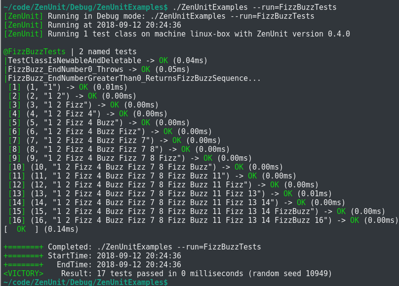
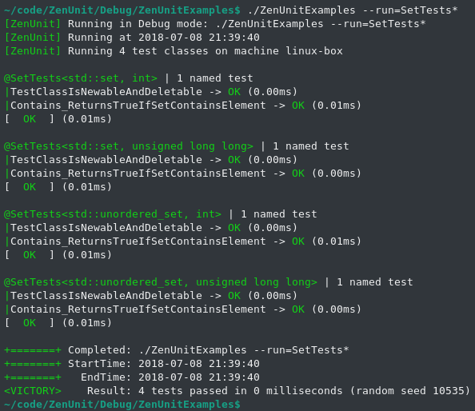

<h1 align="center">ZenUnit</h1>

<h4 align="center">ZenUnit is a single-header C++17 unit testing framework featuring an intuitive syntax for specifying value-parameterized and type-parameterized unit tests.</h4>

|Linux (Clang 6.0)|Windows (VS2017 Preview x64)|
|-----------------|----------------------------|
|<a href="https://travis-ci.org/NeilJustice/ZenUnit"></a>|<a href="https://ci.appveyor.com/project/NeilJustice/ZenUnitZenMock"></a>|

### ZenUnit Design Commentary and Value-Parameterized Test Syntax

```cpp
#include "ZenUnit.h" // Single header

// Function under test
std::string FizzBuzz(unsigned endNumber);

// TESTS defines a ZenUnit test class and begins the FACTS section.
TESTS(FizzBuzzTests)
// By design, in ZenUnit test names are purposefully
// duplicated between the FACTS section and the EVIDENCE section.
// Because code is read much more often than it is written,
// always having test names ready to review for continued quality and cohesion
// at the top of test files instead of scattered throughout test files
// is where this design yields long term code quality dividends.

// AFACT specifies a non-value-parameterized test.
AFACT(FizzBuzz_EndNumber0_Throws)
// FACTS specifies an N-by-N value-parameterized test.
FACTS(FizzBuzz_EndNumberGreaterThan0_ReturnsFizzBuzzSequence)
// EVIDENCE concludes the FACTS section and begins the EVIDENCE section.
EVIDENCE

// TEST defines a non-value-parameterized test.
TEST(FizzBuzz_EndNumber0_Throws)
{
   // The ZenUnit THROWS assertion asserts that an expression throws *exactly* (not a derived class of)
   // an expected exception type with *exactly* an expected exception what() text.
   // THROWS is immune to code mutations mutate-exception-type and mutate-exception-message.
   THROWS(FizzBuzz(0), std::invalid_argument,
      "FizzBuzz() error: endNumber must be 1 or greater");
}

// TEST2X2 defines a 2-by-2 value-parameterized test
// that processes its typesafe variadic arguments list 2-by-2.
// In this case, 16 independent unit tests are defined for function FizzBuzz().
// Each of the 16 pairs of arguments is run within a separate instance of FizzBuzzTests.
TEST2X2(FizzBuzz_EndNumberGreaterThan0_ReturnsFizzBuzzSequence,
   unsigned endNumber, const std::string& expectedFizzBuzzSequence,
   1, "1",
   2, "1 2",
   3, "1 2 Fizz",
   4, "1 2 Fizz 4",
   5, "1 2 Fizz 4 Buzz",
   6, "1 2 Fizz 4 Buzz Fizz",
   7, "1 2 Fizz 4 Buzz Fizz 7",
   8, "1 2 Fizz 4 Buzz Fizz 7 8",
   9, "1 2 Fizz 4 Buzz Fizz 7 8 Fizz",
   10, "1 2 Fizz 4 Buzz Fizz 7 8 Fizz Buzz",
   11, "1 2 Fizz 4 Buzz Fizz 7 8 Fizz Buzz 11",
   12, "1 2 Fizz 4 Buzz Fizz 7 8 Fizz Buzz 11 Fizz",
   13, "1 2 Fizz 4 Buzz Fizz 7 8 Fizz Buzz 11 Fizz 13",
   14, "1 2 Fizz 4 Buzz Fizz 7 8 Fizz Buzz 11 Fizz 13 14",
   15, "1 2 Fizz 4 Buzz Fizz 7 8 Fizz Buzz 11 Fizz 13 14 FizzBuzz",
   16, "1 2 Fizz 4 Buzz Fizz 7 8 Fizz Buzz 11 Fizz 13 14 FizzBuzz 16")
{
   ARE_EQUAL(expectedFizzBuzzSequence, FizzBuzz(endNumber));
}

// RUN_TESTS registers a test class to run when ZenUnit::RunTests(argc, argv) is called.
RUN_TESTS(FizzBuzzTests)

// Function under test
std::string FizzBuzz(unsigned endNumber)
{
   if (endNumber == 0)
   {
      // An exception here instead of returning empty string to demonstrate ZenUnit's THROWS assertion.
      throw std::invalid_argument("FizzBuzz() error: endNumber must be 1 or greater");
   }
   std::ostringstream oss;
   for (unsigned i = 1; i <= endNumber; ++i)
   {
      const bool divisibleBy3 = i % 3 == 0;
      const bool divisibleBy5 = i % 5 == 0;
      if (divisibleBy3)
      {
         oss << "Fizz";
      }
      if (divisibleBy5)
      {
         oss << "Buzz";
      }
      if (!divisibleBy3 && !divisibleBy5)
      {
         oss << i;
      }
      if (i < endNumber)
      {
         oss << ' ';
      }
   }
   const std::string fizzBuzzSequence(oss.str());
   return fizzBuzzSequence;
}

int main(int argc, char* argv[])
{
   const int exitCode = ZenUnit::RunTests(argc, argv);
   return exitCode;
}
```

### ZenUnit Console Output



### ZenUnit Command Line Usage

```
ZenUnit v0.2.2
Usage: <TestsBinaryName> [Options...]

Testing Utility Options:

-pause
   Wait for any key before running tests to allow attaching a debugger or profiler.
-exit0
   Always exit 0 regardless of test run outcome.
   Useful option for never blocking the launch of a ZenUnit tests
   console window when previously running tests in a post-build step.
-wait
   Wait for any key at the end of the test run.

Testing Filtration Options:

-run=<TestClassName>[::TestName][/TestCaseNumber][,...]
   Run only specified case-insensitive test classes, tests, and/or test cases.
   Add a '*' character to the end of a test class or test name
   filter string to specify name-starts-with filtration.
 Example 1: -run=WidgetTests
   Runs only test class WidgetTests.
 Example 2: -run=WidgetTests::FunctionUnderTest*
   Runs all tests in WidgetTests that start with 'FunctionUnderTest'.
 Example 3: -run=WidgetTests::FunctionUnderTest_ScenarioUnderTest_ExpectedBehavior/3
   Runs the third test case of value-parameterized test
   WidgetTests::FunctionUnderTest_ScenarioUnderTest_ExpectedBehavior.
-failfast
   Immediately exit with exit code 1 if a test fails.

Testing Rigor Options:

-randomorder
   Run test classes and tests in a pseudorandom order.
-randomseed=<Value>
   Set the random seed used by -randomorder
   and by the ZenUnit::Random<T> family of functions.
   The default random seed is the number of seconds since 1970.
-testruns=<NumberOfTestRuns>
   Repeat the running of all tests NumberOfTestRuns times.
   Specify -testruns=3 -randomorder for three pseudorandom test run orderings.
   Useful option for continuous integration servers to partially ensure
   that checked-in unit tests are robust with respect to ordering.
-noskips
   Exit 1 regardless of test run outcome if any tests are skipped.
   Useful option for continuous integration servers to partially ensure
   that an organizational culture of "skip it and ship it!" does not take root.
```

### ZenUnit Type-Parameterized Test Class Syntax

How would you confirm the correctness of this templatized Set\:\:Contains function across various types of sets and elements?

```cpp
class Set
{
public:
   template<typename SetType, typename T>
   static bool Contains(const SetType& s, const T& element)
   {
      const bool setContainsElement = s.find(element) != s.end();
      return setContainsElement;
   }
   
   Set() = delete;
};
```

This is how the function's correctness can be confirmed using ZenUnit's type-parameterized test class syntax:

```cpp
#include "ZenUnit.h"

template<
   template<typename...>
   class SetType, typename T>
TEMPLATE_TESTS(SetTests, SetType, T)
AFACT(Contains_ReturnsTrueIfSetContainsElement)
EVIDENCE

TEST(Contains_ReturnsTrueIfSetContainsElement)
{
   SetType<T> s;
   const T element10 = 10;
   const T element20 = 20;

   IS_FALSE(Set::Contains(s, element10));
   IS_FALSE(Set::Contains(s, element20));

   s.insert(element10);
   IS_TRUE(Set::Contains(s, element10));
   IS_FALSE(Set::Contains(s, element20));

   s.insert(element20);
   IS_TRUE(Set::Contains(s, element10));
   IS_TRUE(Set::Contains(s, element20));
}

RUN_TEMPLATE_TESTS(SetTests, std::set, int)
THEN_RUN_TEMPLATE_TESTS(SetTests, std::set, unsigned long long)
THEN_RUN_TEMPLATE_TESTS(SetTests, std::unordered_set, int)
THEN_RUN_TEMPLATE_TESTS(SetTests, std::unordered_set, unsigned long long)

int main(int argc, char* argv[])
{
   return ZenUnit::RunTests(argc, argv);
}
```

### Console Output For The Above ZenUnit Type-Parameterized Test Class



### ZenUnit Assertions

|Value Assertions|Description|
|----------------|-----------|
|`ARE_EQUAL(expectedValue, actualValue, messages...)`|By default, asserts that `expectedValue == actualValue` returns true, otherwise throws a `ZenUnit::Anomaly`, which is caught by ZenUnit to fail the current test. `messages...` are variables of any type writable with `operator<<(std::ostream&, const T&)` or `ZenUnit::Printer<T>::Print(std::ostream&, const T&)`. Custom `ARE_EQUAL` behavior can be defined for type T by way of defining a `ZenUnit::Equalizer<T>` struct specialization, detailed below.|
|`ARE_COPIES(expectedObject, actualObject, messages...)`|Asserts that `&expectedObject != &actualObject` then asserts `ARE_EQUAL(expectedObject, actualObject)`.|
|`IS_TRUE(value, messages...)`|Asserts that `value` is true.|
|`IS_FALSE(value, messages...)`|Asserts that `value` is false.|
|`IS_ZERO(value, messages...)`|Asserts that `value == ValueType{}` returns true.|

|Data Structure Assertions|Description|
|-------------------------|-----------|
|`VECTORS_EQUAL(expectedVector, actualVector, messages...)`|Asserts that `expectedVector.size() == actualVector.size()` then calls `ARE_EQUAL(ithExpectedElement, ithActualElement)` on each pair of expected and actual elements.|
|`SETS_EQUAL(expectedSet, actualSet, messages...)`|Asserts that `expectedSet.size() == actualSet.size()` then calls `ARE_EQUAL(expectedElement, actualElement)` on each pair of expected and actual elements.|
|`MAPS_EQUAL(expectedMap, actualMap, messages...)`|Asserts that `expectedMap.size() == actualMap.size()` then calls `ARE_EQUAL(expectedKeyValuePair, actualKeyValuePair)` on each pair of expected and actual key-value pairs.
|`PAIRS_EQUAL(expectedPair, actualPair, messages...)`|Asserts `ARE_EQUAL(expectedPair.first, actualPair.first)` then asserts `ARE_EQUAL(expectedPair.second, actualPair.second)`.|
|`DOES_CONTAIN(expectedElement, dataStructure, messages...)`|Asserts that `dataStructure.find(expectedElement) != dataStructure.end()`.|
|`IS_EMPTY(dataStructure, messages...)`|Asserts that `dataStructure.empty()` returns true.|

|Exception Assertions|Description|
|--------------------|-----------|
|`THROWS(expression, expectedExactExceptionType, expectedWhatMessage, messages...)`|Asserts that `expression` throws \*exactly\* (not a derived class of) `expectedExactExceptionType` with \*exactly\* a what() message equal to `expectedWhatMessage`.|
|`DOES_NOT_THROW(expression, messages...)`|If `expression` throws, throws a `ZenUnit::Anomaly`, otherwise does nothing. Useful assertion for emphasis to the reader of a unit test.|

|Pointer Assertions|Description|
|------------------|-----------|
|`IS_NULL(pointer, messages...)`|Asserts that `pointer == nullptr`.|
|`IS_NOT_NULL(pointer, messages...)`|Asserts that `pointer != nullptr`.|
|`ARE_SAME(expectedObject, actualObject, messages...)`|Asserts that `&expectedObject == &actualObject`.|
|`ARE_NOT_SAME(notExpectedObject, actualObject, messages...)`|Asserts that `&expectedObject != &actualObject`.
|`POINTEES_EQUAL(expectedPointer, actualPointer, messages...)`|Asserts that `expectedPointer != nullptr` and `actualPointer != nullptr` then asserts `ARE_EQUAL(*expectedPointer, *actualPointer)`.|
|`POINTER_WAS_NEWED(smartOrRawPointer, messages...)`|Asserts `smartOrRawPointer != nullptr` then calls `reset()` or `operator delete` on `smartOrRawPointer` to confirm the pointer was allocated using `make_unique`, `make_shared`, or `operator new`.|
|`POINTER_WAS_ARRAY_NEWED(smartOrRawArrayPointer, messages...)`|Asserts `smartOrRawArrayPointer != nullptr` then calls `reset()` or `operator delete[]` to confirm the pointer was allocated using `make_unique` or `operator new[]`.|

|The Test Itself|Description|
|---------------|-----------|
|`FAIL_TEST(testFailureReason, messages...)`|Throws a `ZenUnit::Anomaly` which is caught by ZenUnit to end the current test and begin the next test.|

|Function Assertion|Description|
|------------------|-----------|
|`STD_FUNCTION_TARGETS(expectedStdFunctionTarget, stdFunction, messages...)`|First asserts `IS_TRUE(stdFunction)`, which asserts that stdFunction points to a function, then asserts `ARE_EQUAL(expectedStdFunctionTarget, *stdFunction.target<ExpectedStdFunctionTargetType*>())`. This is a key assertion to call prior to mocking out a `std::function` with a [ZenMock](https://github.com/NeilJustice/ZenMock) mock object to confirm that the `std::function` being mocked-out points to an expected static or free function.|

|Inexact Assertions Not Implemented By Design In ZenUnit Due To Vulnerability to Code Mutations|Code Mutation Vulnerability|
|--------------------------------------------------------------------------------------|---------------------------|
|`ARE_NOT_EQUAL(expectedValue, actualValue)`|mutate-value|
|`IS_GTE, IS_GT, IS_LT, IS_LTE`|mutate-value|
|`STRING_CONTAINS(expectedSubstring, actualString)`|mutate-value|
|`REGEX_MATCHES(expectedPattern, actualString)`|mutate-value|
|`THROWS_EXCEPTION(expression, expectedExceptionBaseClass)`|mutate-exception-type and mutate-exception-message|
|`THROWS_ANY(expression)`|mutate-exception-type and mutate-exception-message|

### ZenUnit Test-Defining Macros

|Test Classes|Description|
|------------|-----------|
|`TESTS(HighQualityTestClassName)`|Defines a non-templatized test class.|
|`TEMPLATE_TESTS(HighQualityTestClassName, TemplateParameterNames...)`|Defines a templatized test class. Precede with template\<parameter-list\>.|
|`AFACT(HighQualityTestName)`|Specifies a non-value-parameterized test.|
|`FACTS(HighQualityTestName)`|Specifies an N-by-N value-parameterized test.|
|`SKIPAFACT(HighQualityTestName, Reason)`|Skips a non-value-parameterized test.|
|`SKIPFACTS(HighQualityTestName, Reason)`|Skips an N-by-N value-parameterized test.|
|`EVIDENCE`|Ends the `FACTS` section and begins the `EVIDENCE` section (also known as the test class body).|
|`STARTUP`|Defines a function to be run before each test.|
|`CLEANUP`|Defines a function to be run after each test.|
|`TEST(HighQualityTestName)`|Defines a non-value-parameterized test.|
|`TEST1X1(HighQualityTestName, Arg1Type, OneByOneTestValues...)`|Defines a 1-by-1 value-parameterized test.|
|`TEST2X2(HighQualityTestName, Arg1Type, Arg2Type, TwoByTwoTestValues...)`|Defines a 2-by-2 value-parameterized test.|
|...|...|
|`TEST10X10(HighQualityTestName, Arg1Type, Arg2Type, Arg3Type, Arg4Type, Arg5Type, Arg6Type, Arg7Type, Arg8Type, Arg9Type, Arg10Type, TenByTenTestValues...)`|Defines a 10-by-10 value-parameterized test.|
|`RUN_TESTS(HighQualityTestClassName)`|Registers a `TEST_CLASS` to be run when `ZenUnit::RunTests(argc, argv)` is called.|
|`RUN_TEMPLATE_TESTS(HighQualityTestClassName, TemplateArguments...)`|Registers a `TEMPLATE_TEST_CLASS` templatized with `TemplateArguments...` to be run when `ZenUnit::RunTests(argc, argv)` is called.|
|`THEN_RUN_TEMPLATE_TESTS(HighQualityTestClassName, TemplateArguments...)`|Registers a `TEMPLATE_TEST_CLASS` templatized with `TemplateArguments...` to be run when `ZenUnit::RunTests(argc, argv)` is called. For use after `RUN_TEMPLATE_TESTS`.|
|`SKIP_TESTS(HighQualityTestClassName, Reason)`|Skips a `TEST_CLASS` from running when `ZenUnit::RunTests(argc, argv)` is called.|
|`SKIP_TEMPLATE_TESTS(HighQualityTestClassName, Reason, TemplateArguments...)`|Skips a `TEMPLATE_TEST_CLASS` from running when `ZenUnit::RunTests(argc, argv)` is called.|
|`THEN_SKIP_TEMPLATE_TESTS(HighQualityTestClassName, Reason, TemplateArguments...)`|Skips a `TEMPLATE_TEST_CLASS` from running when `ZenUnit::RunTests(argc, argv)` is called. For use after `SKIP_TEMPLATE_TESTS`.|

### Mutation Coverage Commentary and ZenUnit Random Value Generating Functions

Testing using random inputs instead of constant inputs is a central technique for maximizing code's robustness to code mutations.

Today, code mutations can be induced manually by one's self or colleagues during code review to confirm the degree of rigorousness with which unit tests have been written.

In the 2020s, a combinatorial number of code mutations will be able to be induced programatically by LLVM-powered mutation testing frameworks.

In this near future, a programmer will be able to call upon an affordable desktop supercomputer or affordable cloud supercomputing to "attempt to slay" a compelling subset of every LLVM-inducible code mutation, resulting in a code quality metric one hundred times as potent as code coverage: mutation coverage.

Mutation coverage is the percentage of correctness-compromised program mutants "slain" / detected by a collection of tests. If a passing collection of tests fails as expected when the code that it tests is mutated to break the code's correctness, then that collection of tests can be said to have successfully "slain" that code mutation, thereby increasing mutation coverage. 100% mutation coverage is by definition 100% code coverage. "100% code coverage? Great to hear that, but how's your mutation coverage?"

ZenUnit provides the following random-value-generating functions for writing unit tests that are robust to swap-variable-with-constant code mutations.

|Random Value Generating Function|Description|
|--------------------------------|-----------|
|`ZenUnit::Random<T>()`|Returns a `ZenUnit::Random<UserType>()` value if defined or returns a random integer T value between `std::numeric_limits<T>::min()` and `std::numeric_limits<T>::max()` selected from a uniform distribution.|
|`ZenUnit::RandomBetween<T>`(long long inclusiveLowerBound, unsigned long long inclusiveUpperBound)|Returns a random integer T value between inclusiveLowerBound and inclusiveUpperBound selected from a uniform distribution.|
|`ZenUnit::RandomEnum<EnumType>(EnumType exclusiveEnumMaxValue)`|Returns a random EnumType value between 0 and exclusiveEnumMaxValue - 1, selected from a uniform distribution.|
|`ZenUnit::Random<float>()`|Returns a random float between -1234567 and +1234567 selected from a `std::uniform_real_distribution<float>`.|
|`ZenUnit::Random<double>()`|Returns a random double between `std::numeric_limits<double>::min()` and `std::numeric_limits<double>::max()` from a `std::uniform_real_distribution<double>`.|
|`ZenUnit::Random<std::string>()`|Returns `"RS" + std::to_string(ZenUnit::RandomBetween<int>(0, 10000))`.|
|`ZenUnit::RandomVector<T>()`|Returns a `std::vector<T>` with size between 0 and 2 with each element a `ZenUnit::Random<T>()` value.|
|`ZenUnit::RandomMap<KeyType, ValueType>()`|Returns a `std::map<KeyType, ValueType>` with size between 0 and 2 with each key a `ZenUnit::Random<KeyType>()` value and each value a `ZenUnit::Random<ValueType>()` value.|
|`ZenUnit::RandomUnorderedMap<T>()`|Returns a `std::unordered_map<KeyType, ValueType>` with size between 0 and 2 with each key a `ZenUnit::Random<KeyType>()` value and each value a `ZenUnit::Random<ValueType>()` value.|
|`ZenUnit::RandomSet<T>()`|Returns a `std::set<ElementType>` with size between 0 and 2 with each element a `ZenUnit::Random<ElementType>()` value.|
|`ZenUnit::RandomUnorderedSet<T>()`|Returns a `std::unordered_set<ElementType>` with size between 0 and 2 with each element a `ZenUnit::Random<ElementType>()` value.|

### ZenUnit Equalizers

The default behavior of `ARE_EQUAL(expectedValue, actualValue)` is to throw a `ZenUnit::Anomaly` if `expectedValue == actualValue` returns false.

For custom `ARE_EQUAL` behavior such as field-by-field assertions, define a `ZenUnit::Equalizer<T>` struct specialization with a `static void AssertEqual(const T& expected, const T& actual)` function.

Example of a custom `ZenUnit::Equalizer<T>` for `date::year_month_day` values:

```cpp
namespace ZenUnit
{
   template<>
   struct Equalizer<date::year_month_day>
   {
      static void AssertEqual(
         const date::year_month_day& expectedYearMonthDay,
         const date::year_month_day& actualYearMonthDay)
      {
         ARE_EQUAL(expectedYearMonthDay.year(), actualYearMonthDay.year());
         ARE_EQUAL(expectedYearMonthDay.month(), actualYearMonthDay.month());
         ARE_EQUAL(expectedYearMonthDay.day(), actualYearMonthDay.day());
      }
   };
}
```

|Assertions For Confirming The Correctness Of Custom ZenUnit Equalizers|
|----------------------------------------------------------------------|
|`SETUP_EQUALIZER_THROWS_TEST(typeName)`|
|`EQUALIZER_THROWS_FOR_FIELD(typeName, fieldName, arbitraryNonDefaultFieldValue)`|

|The Road To ZenUnit 1.0|
|-----------------------|
|Every aspect of ZenUnit documented|
|Travis CI GCC|
|100% code coverage badge|
|Travis CI clang-tidy|
|AppVeyor /analyze|
|TUPLES_EQUAL|
|ARE_WITHIN|
|ARE_CLOSE|
|-breakfast|

|The Road To ZenUnit 1.1|
|-----------------------|
|-junitxml=<FilePath>|
|-parallel|
