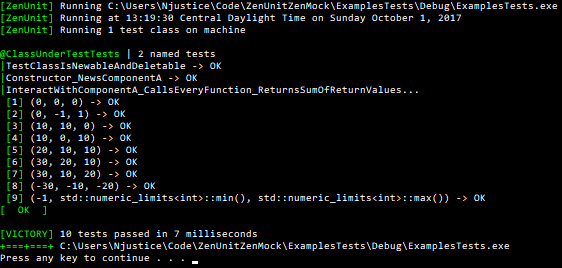

[](https://travis-ci.org/NeilJustice/ZenUnitZenMock)
[](https://ci.appveyor.com/project/NeilJustice/zenunitzenmock)

# ZenUnit
ZenUnit is a C++ unit testing framework designed for writability of value and type parameterized tests, readability of tests and test results, and for robustness to code mutations inducible by future LLVM-powered mutation testing frameworks.

# ZenMock
ZenMock is a C++ mocking framework powered by ZenUnit for confirming the correctness of software component interactions by way of template, virtual, free, and static function mocking using an arrange-act-assert syntax and a strict mocking design for robustness to code mutations inducible by future LLVM-powered mutation testing frameworks.

### ZenUnit Command Line Usage

```
ZenUnit v0.1.0
Usage: <TestsBinaryName> [Options...]

Options:

None
   Run all tests while printing detailed information.
-minimalist
   Print only preamble, any test failure details, and conclusion.
-pause
   Wait for input before running tests to allow attaching a profiler or debugger.
-wait
   Wait for input before closing console window.
-exit0
   Always exit 0 regardless of test run outcome.
   Useful option for always allowing the launch of a debugger
   when running ZenUnit tests as a post-build step.
-failskips
   Exit 1 regardless of test run outcome if any tests are skipped.
-random[=Seed]
   Run test classes in a random order and run tests in a random order.
   Useful option for increasing testing rigor.
-testruns=<N>
   Repeat the running of all tests N times.
   Useful option for increasing testing rigor, especially when used with -random.
```

### ZenUnit Syntax

```cpp
#include "ZenUnit/ZenUnit.h"
#include "Examples/FizzBuzz.h"

TESTS(FizzBuzzTests)
// ZenUnit test classes begin with a FACTS section
// that specifies all test names in one place to maximize long term
// code reviewability and to serve as an informal
// specification document for the code under test.
// This design features a by-design cost of test name duplication
// between the FACTS section and the EVIDENCE section.
// What is gained from this cost is that each test name
// addition, subtraction, or refactoring,
// of which there may be dozens over the course of a project,
// becomes an opportunity to review all test names as a whole
// for continued test name quality and cohesion - and by extension,
// an opportunity to review the code under test for continued
// quality and cohesion.
AFACT(FizzBuzz_EndNumber0_Throws)
FACTS(FizzBuzz_EndNumberGreaterThan0_ReturnsFizzBuzzSequence)
EVIDENCE

TEST(FizzBuzz_EndNumber0_Throws)
{
   THROWS(FizzBuzz(0), std::invalid_argument,
      "FizzBuzz(): endNumber must be 1 or greater");
}

// TEST2X2 is a 2-by-2 value-parameterized test that processes
// its typesafe variadic arguments list 2-by-2.
TEST2X2(FizzBuzz_EndNumberGreaterThan0_ReturnsFizzBuzzSequence,
   unsigned endNumber, const std::string& expectedFizzBuzzSequence,
   1, "1",
   2, "1 2" ,
   3, "1 2 Fizz",
   4, "1 2 Fizz 4",
   5, "1 2 Fizz 4 Buzz",
   6, "1 2 Fizz 4 Buzz Fizz",
   7, "1 2 Fizz 4 Buzz Fizz 7",
   8, "1 2 Fizz 4 Buzz Fizz 7 8",
   9, "1 2 Fizz 4 Buzz Fizz 7 8 Fizz",
   10, "1 2 Fizz 4 Buzz Fizz 7 8 Fizz Buzz",
   11, "1 2 Fizz 4 Buzz Fizz 7 8 Fizz Buzz 11",
   12, "1 2 Fizz 4 Buzz Fizz 7 8 Fizz Buzz 11 Fizz",
   13, "1 2 Fizz 4 Buzz Fizz 7 8 Fizz Buzz 11 Fizz 13",
   14, "1 2 Fizz 4 Buzz Fizz 7 8 Fizz Buzz 11 Fizz 13 14",
   15, "1 2 Fizz 4 Buzz Fizz 7 8 Fizz Buzz 11 Fizz 13 14 FizzBuzz")
{
   ARE_EQUAL(expectedFizzBuzzSequence, FizzBuzz(endNumber));
}

}; RUNTESTS(FizzBuzzTests)
```

### ZenUnit Imagery


### ZenUnit Macros

|Test Classes|
|----------------|
|`TESTCLASS(HighQualityTestClassName)`|
|`TEMPLATETESTCLASS(HighQualityTestClassName, TemplateParameterNames...)` // Precede with template\<parameter-list\>|
|`SPEC(HighQualityTestName)` // Standard-issue void test|
|`SPECX(HighQualityTestName)` // N-by-N value-parameterized test|
|`SKIPSPEC(HighQualityTestName, Reason)`|
|`SKIPSPECX(HighQualityTestName, Reason)`|
|`SPECEND` // Ends the SPEC section and begins the TEST section|
|`STARTUP` // Function run before each test|
|`CLEANUP` // Function run after each test|
|`TEST(HighQualityTestName)` // Standard-issue void test|
|`TEST1X1(HighQualityTestName, Arg1Type, ...)` // 1-by-1 value-parameterized test|
|`TEST2X2(HighQualityTestName, Arg1Type, Arg2Type, ...)` // 2-by-2 value-parameterized test|
|...|
|`TEST10X10(HighQualityTestName, Arg1Type, Arg2Type, Arg3Type, Arg4Type, Arg5Type, Arg6Type, Arg7Type, Arg8Type, Arg9Type, Arg10Type, ...)`|
|`RUNTESTS(HighQualityTestClassName)`|
|`RUNTEMPLATETESTS(HighQualityTestClassName, TemplateArguments...)`|
|`SKIPRUNTESTS(HighQualityTestClassName, Reason)`|
|`SKIPRUNTEMPLATETESTS(HighQualityTestClassName, Reason)`|

|Values|
|------|
|`ARE_EQUAL(expectedValue, actualValue, messages...)` // messages... are variables of any type writable with operator<<(ostream&, const T&) or ZenUnitPrinter\<T\>::Print(ostream&, const T&)|
|`ARE_SAME(expectedObject, actualObject, messages...)`|
|`ARE_NOT_SAME(notExpectedObject, actualObject, messages...)`|
|`ARE_COPIES(expectedObject, actualObject, messages...)` // Asserts that objects ARE_NOT_SAME and ARE_EQUAL|
|`IS_TRUE(value, messages...)`|
|`IS_FALSE(value, messages...)`|
|`IS_ZERO(value, messages...)`|

|Data Structures|
|---------------|
|`IS_EMPTY(dataStructure, messages...)`|
|`CONTAINS(expectedElement, dataStructure, messages...)`|
|`VECTORS_EQUAL(expectedVector, actualVector, messages...)`|
|`MAPS_EQUAL(expectedMap, actualMap, messages...)`|
|`PAIRS_EQUAL(expectedPair, actualPair, messages...)`|
|`SETS_EQUAL(expectedSet, actualSet, messages...)`|

|Exceptions|
|----------|
|`THROWS(expression, expectedExactExceptionType, expectedWhat, messages...)`|
|`NOTHROWS(expression, messages...)`|

|The Test Itself|
|---------------|
|`FAIL(testFailureReason, messages...)`|

|Pointers|
|------- |
|`IS_NULL(pointer, messages...)`|
|`IS_NOT_NULL(pointer, messages...)`|
|`POINTEES_EQUAL(expectedPointer, actualPointer, messages...)` // Asserts that pointers are either both nullptr or their pointees ARE_EQUAL|
|`POINTER_WAS_NEWED(smartOrRawPointer, messages...)` // Asserts not null then resets or operator deletes the pointer to confirm it was make_uniqued / make_shared / operator newed|
|`POINTER_WAS_ARRAY_NEWED(smartOrRawArrayPointer, messages...)` // Asserts not null then resets or operator array deletes the pointer to confirm it was array make_uniqued / array operator newed|

|Regular Expressions|
|-------------------|
|`REGEX_MATCHES(expectedPattern, str, messages...)`|

|Functions|
|---------|
|`STD_FUNCTION_TARGETS(expectedStdFunctionTarget, stdFunction, messages...)`|

|ZenUnitEqualizers // Allow for field-by-field equality assertions on arbitrary types|
|------------------|
|`EQUALIZER_THROWS_INIT(typeName)`|
|`EQUALIZER_THROWS(typeName, fieldName, nonDefaultFieldValue)`|

### ZenUnit Type-Parameterized Test Class Syntax

```cpp
#include "ZenUnit/ZenUnit.h"

class Set
{
public:
   template<typename SetType, typename T>
   static bool Contains(const SetType& s, const T& element)
   {
      const bool setContainsElement = s.find(element) != s.end();
      return setContainsElement;
   }
};

template<
   template<typename...>
   class SetType, typename T>
TEMPLATETESTS(SetTests, SetType, T)
AFACT(Contains_ReturnsTrueIfSetContainsElement)
EVIDENCE

TEST(Contains_ReturnsTrueIfSetContainsElement)
{
   SetType<T> s;
   const T element10 = 10;
   const T element20 = 20;

   IS_FALSE(Set::Contains(s, element10));
   IS_FALSE(Set::Contains(s, element20));

   s.insert(element10);
   IS_TRUE(Set::Contains(s, element10));
   IS_FALSE(Set::Contains(s, element20));

   s.insert(element20);
   IS_TRUE(Set::Contains(s, element10));
   IS_TRUE(Set::Contains(s, element20));
}

};
RUNTEMPLATETESTS(SetTests, std::set, int)
RUNTEMPLATETESTS(SetTests, std::set, unsigned long long)
RUNTEMPLATETESTS(SetTests, std::unordered_set, int)
RUNTEMPLATETESTS(SetTests, std::unordered_set, unsigned long long)

int main(int argc, char* argv[])
{
   return ZenUnit::RunTests(argc, argv);
}
```

### ZenUnit Type-Parameterized Test Class Imagery


### ZenMock Syntax

```Cpp
#include "ZenUnit/ZenMock.h"

class ComponentA
{
public:
   virtual void VirtualVoid() {}
   virtual void VirtualVoidConstTwoArgs(int, int) const {}
   virtual int VirtualNonVoid() { return 0; }
   virtual int VirtualNonVoidConst() const { return 0; }
};

struct ComponentAMock : public Zen::Mock<ComponentA>
{
   ZENMOCK_VOID0(VirtualVoid)
   ZENMOCK_VOID2_CONST(VirtualVoidConstTwoArgs, int, int)
   ZENMOCK_NONVOID0(int, VirtualNonVoid)
   ZENMOCK_NONVOID0_CONST(int, VirtualNonVoidConst)
};

class ClassUnderTest
{
   friend class ClassUnderTestTests;
private:
   std::unique_ptr<ComponentA> _componentA;
public:
   ClassUnderTest()
      : _componentA(new ComponentA)
   {
   }

   int InteractWithComponentA()
   {
      _componentA->VirtualVoid();
      _componentA->VirtualVoidConstTwoArgs(333, 107);
      int returnValueA = _componentA->VirtualNonVoid();
      int returnValueB = _componentA->VirtualNonVoidConst();
      int sum = returnValueA + returnValueB;
      return sum;
   }
};

#include "ZenUnit/ZenUnit.h"

TESTS(ClassUnderTestTests)
AFACT(Constructor_NewsComponentA)
FACTS(InteractWithComponentA_CallsEveryFunction_ReturnsSumOfReturnValues)
EVIDENCE

ClassUnderTest _classUnderTest;
ComponentAMock* _componentAMock;

STARTUP
{
   // Post-construction dependency injection of ZenMock object _componentAMock
   _classUnderTest._componentA.reset(_componentAMock = new ComponentAMock);
}

TEST(Constructor_NewsComponentA)
{
   ClassUnderTest classUnderTest;
   POINTER_WAS_NEWED(classUnderTest._componentA);
}

TEST3X3(InteractWithComponentA_CallsEveryFunction_ReturnsSumOfReturnValues,
   int expectedReturnValue, int returnValueA, int returnValueB,
   0, 0, 0,
   10, 10, 0,
   10, 0, 10,
   20, 10, 10,
   30, 20, 10,
   30, 10, 20,
   -30, -10, -20,
   0, -10, 10,
   -1, std::numeric_limits<int>::min(), std::numeric_limits<int>::max())
{
   // For imperviousness to extraneous-call code mutations
   // capable of being automatically introduced by future LLVM-powered
   // mutation testing frameworks, ZenMock is a strict mocking framework.
   // Because of this strict mocking design, ZenMock mock objects must be
   // explicitly expected before being called by calling
   // Expect(), ExpectAndReturn(), ExpectAndReturnValues(), or ExpectAndThrow<T>().
   _componentAMock->VirtualVoidMock.Expect();
   _componentAMock->VirtualVoidConstTwoArgsMock.Expect();
   _componentAMock->VirtualNonVoidMock.ExpectAndReturn(returnValueA);
   _componentAMock->VirtualNonVoidConstMock.ExpectAndReturn(returnValueB);
   //
   int returnValue = _classUnderTest.InteractWithComponentA();
   //
   // In the Assert section of this Arrange-Act-Assert style of unit test,
   // ZenMock function call assertions are made and are wrapped with the ZEN macro.
   // The ZEN macro provides __FILE__ and __LINE__ information in
   // error messages for the case when a ZenMocked function is called differently
   // from how it is asserted to have been called.
   ZEN(_componentAMock->VirtualVoidMock.AssertCalledOnce());
   ZEN(_componentAMock->VirtualVoidConstTwoArgsMock.AssertCalledOnceWith(333, 107));
   ZEN(_componentAMock->VirtualNonVoidMock.AssertCalledOnce());
   ZEN(_componentAMock->VirtualNonVoidConstMock.AssertCalledOnce());
   ARE_EQUAL(expectedReturnValue, returnValue);
}

}; RUNTESTS(ClassUnderTestTests)

int main(int argc, char* argv[])
{
   return ZenUnit::RunTests(argc, argv);
}
```

### ZenMock Imagery



### Building ZenUnit and ZenMock On Linux

Build and install command:

`./LinuxCMakeBuildInstall.sh <InstallDirectory>`

Build and install command example:

`./LinuxCMakeBuildInstall.sh /usr/local`

ZenUnit and ZenMock installed on Linux:


### Building ZenUnit and ZenMock On Windows

Build and install command:

`.\WindowsCMakeBuildInstall.ps1 <InstallDirectory>`

Build and install command example:

`.\WindowsCMakeBuildInstall.ps1 C:\install`

ZenUnit and ZenMock installed on Windows:


### ZenUnit To-Do List

Single header

