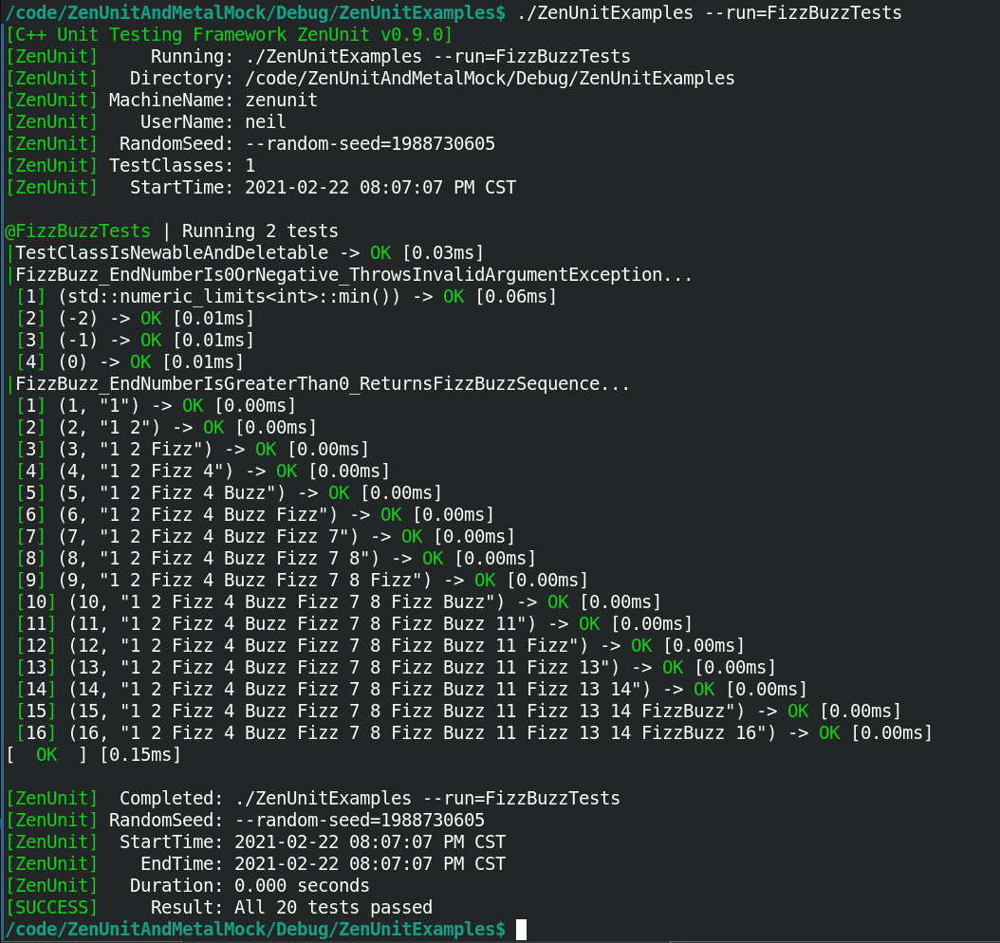
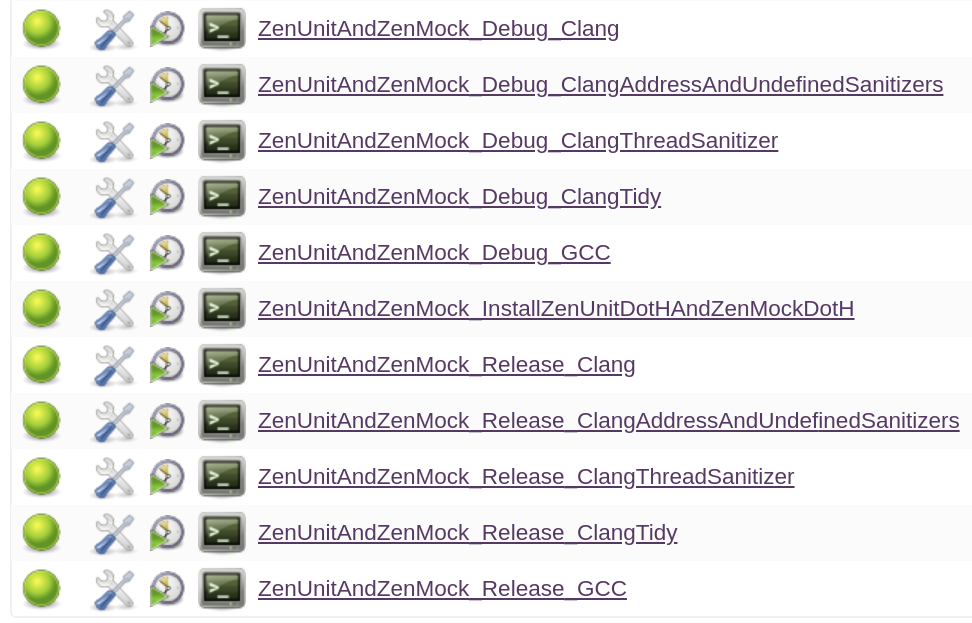

# 🧪 ZenUnit &  ZenMock ⚗️</h1>

[](https://en.wikipedia.org/wiki/C%2B%2B17) [](https://opensource.org/licenses/MIT)

ZenUnit is a single-header C++ unit testing framework designed for test readability and assertion exactness and features a convenient syntax for writing value-parameterized and type-parameterized unit tests.

ZenMock is a single-header C++ mocking framework powered by ZenUnit and features a high-readability arrange-act-assert syntax for confirming the correctness of function call arguments and return values to and from virtual, non-virtual, static, and free functions.

|Build Type|Build Status|
|----------|------------|
|Travis CI Linux Clang 6.0.0 and GCC 7.4.0 Debug And Release|<a href="https://travis-ci.org/NeilJustice/ZenUnitAndZenMock"></a>|
|AppVeyor Windows Visual Studio 2019 x64 and Win32 Debug And Release|<a href="https://ci.appveyor.com/project/NeilJustice/ZenUnitAndZenMock"></a>|
|Code Coverage Of The Travis CI GCC 7.4.0 Release Build|[](https://codecov.io/gh/NeilJustice/ZenUnitAndZenMock)|

##### ZenUnit.h single header: [](https://raw.githubusercontent.com/NeilJustice/ZenUnitAndZenMock/master/ZenUnit/ZenUnit.h) 
##### ZenMock.h single header: [](https://raw.githubusercontent.com/NeilJustice/ZenUnitAndZenMock/master/ZenMock/ZenMock.h)

   * [Unit Testing FizzBuzz With ZenUnit's Value-Parameterized Test Case Syntax](#unit-testing-fizzbuzz-with-zenunits-value-parameterized-test-case-syntax)
   * [ZenUnit Console Output Design](#zenunit-console-output-design)
   * [ZenUnit Command Line Usage](#zenunit-command-line-usage)
   * [ZenUnit Assertions](#zenunit-assertions)
      * [Value Assertions](#value-assertions)
      * [Floating Point Assertions](#floating-point-assertions)
      * [Data Structure Assertions](#data-structure-assertions)
      * [Exception Assertions](#exception-assertions)
      * [Pointer Assertions](#pointer-assertions)
      * [Test Assertions](#test-assertions)
      * [Function Assertions](#function-assertions)
   * [ZenUnit Test-Defining Macros](#zenunit-test-defining-macros)
   * [Maximize Mutation Coverage By Testing With Random Values](#maximize-mutation-coverage-by-testing-with-random-values)
   * [Linux Jenkins Jobs That Compile, clang-tidy, AddressSanitize, UndefinedBehaviorSanitize, And ThreadSanitize ZenUnit And ZenMock](#linux-jenkins-jobs-that-compile-clang-tidy-addresssanitize-undefinedbehaviorsanitize-and-threadsanitize-zenunit-and-zenmock)
   * [Windows Jenkins Jobs That Compile ZenUnit And ZenMock](#windows-jenkins-jobs-that-compile-zenunit-and-zenmock)
   * [Six Steps To Build ZenUnit And ZenMock Unit Tests, Run Them, Then Install ZenUnit.h And ZenMock.h On Linux](#six-steps-to-build-zenunit-and-zenmock-unit-tests-run-them-then-install-zenunith-and-zenmockh-on-linux)
   * [Four Steps To Build ZenUnit And ZenMock Unit Tests, Run Them, Then Install ZenUnit.h And ZenMock.h On Windows](#four-steps-to-build-zenunit-and-zenmock-unit-tests-run-them-then-install-zenunith-and-zenmockh-on-windows)
   * [Prioritized ZenUnit And ZenMock Backlog As Of 01-06-2020](#prioritized-zenunit-and-zenmock-backlog-as-of-01-06-2020)

### Unit Testing FizzBuzz With ZenUnit's Value-Parameterized Test Case Syntax

```cpp
#include "ZenUnit.h" // ZenUnit's single header file

// Function whose correctness is to be confirmed using ZenUnit
std::string FizzBuzz(int endNumber);

// TESTS defines a ZenUnit test class and begins the FACTS section.
TESTS(FizzBuzzTests)
// FACTS declares an N-by-N value-parameterized test, the signature feature of ZenUnit.
FACTS(FizzBuzz_EndNumberIs0OrNegative_ThrowsInvalidArgument)
FACTS(FizzBuzz_EndNumberIsGreaterThan0_ReturnsFizzBuzzSequence)
// EVIDENCE concludes the declaration of facts section
// and begins the presentation of evidence section - also known as the test class body.
EVIDENCE

// In ZenUnit test names are duplicated between the FACTS section and the EVIDENCE section
// by way of a carefully-considered design decision to maximize long-term readability of safety-critical test code.
// This design of test names always up top instead of scattered throughout potentially large test files
// makes it straightforward to quickly confirm that a test class tests
// a cohesive set of functionality using a consistent test naming convention.

// TEST1X1 defines a 1-by-1 value-parameterized test
// that processes its typesafe variadic arguments list 1-by-1.
// This TEST1X1 defines 4 independent unit tests for FizzBuzz(),
// each of which will run within separate instances of test class FizzBuzzTests.
TEST1X1(FizzBuzz_EndNumberIs0OrNegative_ThrowsInvalidArgument,
   int invalidFizzBuzzEndNumber,
   std::numeric_limits<int>::min(),
   -2,
   -1,
   0)
{
   // The ZenUnit THROWS_EXCEPTION assertion asserts that an expression throws *exactly* (not a derived class of)
   // an expected exception type with *exactly* an expected exception what() text.

   // This double-exactness design of THROWS_EXCEPTION works to maximize mutation coverage,
   // the next frontier of software quality metrics,
   // by rendering the THROWS_EXCEPTION assertion immune to these two code mutations:
   // mutate-exception-type and mutate-exception-message.

   THROWS_EXCEPTION(FizzBuzz(invalidFizzBuzzEndNumber), std::invalid_argument,
      "Invalid FizzBuzz(int endNumber) argument: endNumber must be 1 or greater. endNumber="
         + std::to_string(invalidFizzBuzzEndNumber));
}

// TEST2X2 defines a 2-by-2 value-parameterized test
// that processes its typesafe variadic arguments list 2-by-2.
// This TEST2X2 defines 16 independent unit tests for FizzBuzz(),
// each of which will run within separate instances of test class FizzBuzzTests.
TEST2X2(FizzBuzz_EndNumberIsGreaterThan0_ReturnsFizzBuzzSequence,
   int endNumber, std::string_view expectedFizzBuzzSequence,
   1, "1",
   2, "1 2",
   3, "1 2 Fizz",
   4, "1 2 Fizz 4",
   5, "1 2 Fizz 4 Buzz",
   6, "1 2 Fizz 4 Buzz Fizz",
   7, "1 2 Fizz 4 Buzz Fizz 7",
   8, "1 2 Fizz 4 Buzz Fizz 7 8",
   9, "1 2 Fizz 4 Buzz Fizz 7 8 Fizz",
   10, "1 2 Fizz 4 Buzz Fizz 7 8 Fizz Buzz",
   11, "1 2 Fizz 4 Buzz Fizz 7 8 Fizz Buzz 11",
   12, "1 2 Fizz 4 Buzz Fizz 7 8 Fizz Buzz 11 Fizz",
   13, "1 2 Fizz 4 Buzz Fizz 7 8 Fizz Buzz 11 Fizz 13",
   14, "1 2 Fizz 4 Buzz Fizz 7 8 Fizz Buzz 11 Fizz 13 14",
   15, "1 2 Fizz 4 Buzz Fizz 7 8 Fizz Buzz 11 Fizz 13 14 FizzBuzz",
   16, "1 2 Fizz 4 Buzz Fizz 7 8 Fizz Buzz 11 Fizz 13 14 FizzBuzz 16")
{
   const std::string fizzBuzzSequence = FizzBuzz(endNumber);
   // ZenUnit assertion names are declarative in language style (ARE_EQUAL, THROWS_EXCEPTION, etc)
   // instead of procedural in language style (ASSERT_EQUAL, ASSERT_THROWS, etc)
   // to give ZenUnit a test reading experience similar to reading an executable specification document.
   ARE_EQUAL(expectedFizzBuzzSequence, fizzBuzzSequence);
}

// Function to be unit tested with ZenUnit
std::string FizzBuzz(int endNumber)
{
   if (endNumber <= 0)
   {
      throw std::invalid_argument(
         "Invalid FizzBuzz(int endNumber) argument: endNumber must be 1 or greater. endNumber=" + std::to_string(endNumber));
   }
   std::ostringstream fizzBuzzSequenceBuilder;
   for (int i = 1; i <= endNumber; ++i)
   {
      const bool divisibleBy3 = i % 3 == 0;
      const bool divisibleBy5 = i % 5 == 0;
      if (divisibleBy3)
      {
         fizzBuzzSequenceBuilder << "Fizz";
      }
      if (divisibleBy5)
      {
         fizzBuzzSequenceBuilder << "Buzz";
      }
      if (!divisibleBy3 && !divisibleBy5)
      {
         fizzBuzzSequenceBuilder << i;
      }
      if (i < endNumber)
      {
         fizzBuzzSequenceBuilder << ' ';
      }
   }
   const std::string fizzBuzzSequence(fizzBuzzSequenceBuilder.str());
   return fizzBuzzSequence;
}

// RUN_TESTS registers a ZenUnit test class to be run when ZenUnit::RunTests(argc, argv) is called.
RUN_TESTS(FizzBuzzTests)

int main(int argc, char* argv[])
{
   const int exitCode = ZenUnit::RunTests(argc, argv);
   return exitCode;
}
```

### ZenUnit Console Output Design



### ZenUnit Command Line Usage

```
C++ Unit Testing Framework ZenUnit 0.5.0
Usage: <ZenUnitTestsBinaryName> [Options...]

Testing Rigor Options:

--random
   Run test classes, tests, and value-parameterized test cases in a random order.
--seed=<Value>
   Set to Value the random seed used by --random and
   the ZenUnit::Random<T> family of random value generating functions.
   The default random seed is the number of seconds since 1970-01-01 00:00:00 UTC.
--test-runs=<N>
   Repeat the running of all tests N times. Use a negative number to repeat forever.
   For five random test run orderings on a CI/CD server to exercise the robustness of commits
   with respect to test run ordering, specify --random --test-runs=5.
--no-skips
   Exit with code 1 after running all tests if any tests are skipped. Useful option for CI/CD servers.

Testing Filtration Options:

--run=<TestClassName>[::TestName][/TestCaseNumber][,...]
   Run only specified case-insensitive test classes, tests, and/or test cases.
   Add a '*' character to the end of a test class name or test name
   filter string to specify name-starts-with filtration.
 Example 1: --run=WidgetTests
   Run only test class WidgetTests.
 Example 2: --run=WidgetTests::FunctionUnderTest*
   Run all tests in WidgetTests that start with "FunctionUnderTest".
 Example 3: --run=WidgetTests::FunctionUnderTest_ScenarioUnderTest_ExpectedBehavior/3
   Run the third test case of value-parameterized test
   WidgetTests::FunctionUnderTest_ScenarioUnderTest_ExpectedBehavior.
--fail-fast
   Immediately call exit(1) if a test fails.

Testing Utility Options:

--help or -help
   Print this help message.
--version or -version
	Print the ZenUnit version number.
--pause
   Wait for any key before running tests to allow attaching a debugger or profiler.
--exit-zero
   Always exit with code 0.
--wait
   Wait for any key at the end of the test run.
```

## ZenUnit Assertions

#### Value Assertions
|Assertion|Behavior|
|---------|--------|
|`ARE_EQUAL(expectedValue, actualValue, messages...)`|By default, asserts that `expectedValue == actualValue` returns true, otherwise throws a `ZenUnit::Anomaly`, which is caught by ZenUnit to fail the current test. `messages...` are variables of any type writable with `operator<<(std::ostream&, const T&)` or `ZenUnit::Printer<T>::Print(std::ostream&, const T&)`.|
|`ARE_NOT_EQUAL(notExpectedValue, actualValue, messages...)`|By default, asserts that `!(expectedValue == actualValue)` returns true, otherwise throws a `ZenUnit::Anomaly`.|
|`ARE_COPIES(expectedObject, actualObject, messages...)`|Asserts that `&expectedObject != &actualObject` then asserts `ARE_EQUAL(expectedObject, actualObject)`.|
|`IS_TRUE(value, messages...)`|Asserts that `value` is true.|
|`IS_FALSE(value, messages...)`|Asserts that `value` is false.|
|`IS_ZERO(value, messages...)`|Asserts that `value == 0` is true.|
|`IS_DEFAULT_VALUE(value, messages...)`|Asserts that `value == ValueType{}` is true.|
|`IS_NOT_DEFAULT_VALUE(value, messages...)`|Asserts that `value == ValueType{}` is false.|

#### Floating Point Assertions
|Assertion|Behavior|
|---------|--------|
|`ARE_WITHIN(expectedFloatingPointValue, actualFloatingPointValue, expectedAbsoluteMaxDifference, messages...)`|Asserts that `std::abs(expectedFloatingPointValue - actualFloatingPointValue) <= expectedAbsoluteMaxDifference`.|

#### Data Structure Assertions
|Assertion|Behavior|
|---------|--------|
|`VECTORS_EQUAL(expectedVector, actualVector, messages...)`|Asserts that `expectedVector.size() == actualVector.size()` then calls `ARE_EQUAL(ithExpectedElement, ithActualElement)` on each pair of expected and actual elements.|
|`SETS_EQUAL(expectedSet, actualSet, messages...)`|Asserts that `expectedSet.size() == actualSet.size()` then calls `ARE_EQUAL(expectedElement, actualElement)` on each pair of expected and actual elements.|
|`MAPS_EQUAL(expectedMap, actualMap, messages...)`|Asserts that `expectedMap.size() == actualMap.size()` then calls `ARE_EQUAL(expectedKeyValuePair, actualKeyValuePair)` on each pair of expected and actual key-value pairs.
|`PAIRS_EQUAL(expectedPair, actualPair, messages...)`|Asserts `ARE_EQUAL(expectedPair.first, actualPair.first)` then asserts `ARE_EQUAL(expectedPair.second, actualPair.second)`.|
|`ARRAYS_EQUAL(expectedArray, actualArray, numberOfElementsToCompare, messages...)`|Asserts `ARE_EQUAL` on each expected and actual array element up to numberOfElementsToCompare elements.|
|`STD_ARRAYS_EQUAL(expectedStdArray, actualStdArray, messages...)`|Asserts `ARE_EQUAL` on each expected and actual `std::array` element.|
|`CONTAINS_ELEMENT(expectedElement, dataStructure, messages...)`|Asserts that `dataStructure.find(expectedElement) != dataStructure.end()`.|
|`IS_EMPTY(dataStructure, messages...)`|Asserts that `dataStructure.empty()` equals true.|
|`IS_NOT_EMPTY(dataStructure, messages...)`|Asserts that `dataStructure.empty()` equals false.|

#### Exception Assertions
|Assertion|Behavior|
|---------|--------|
|`THROWS_EXCEPTION(expression, expectedExactExceptionType, expectedExactWhatMessage, messages...)`|Asserts that `expression` throws \*exactly\* (not a derived class of) `expectedExactExceptionType` with \*exactly\* a what() message equal to `expectedWhatMessage`.|
|`DOES_NOT_THROW(expression, messages...)`|If `expression` throws, throws a `ZenUnit::Anomaly`, otherwise does nothing. Useful assertion for emphasis to the reader of a unit test.|

#### Pointer Assertions
|Assertion|Behavior|
|---------|--------|
|`POINTER_IS_NULL(pointer, messages...)`|Asserts that `pointer == nullptr`.|
|`POINTER_IS_NOT_NULL(pointer, messages...)`|Asserts that `pointer != nullptr`.|
|`POINTEES_ARE_EQUAL(expectedPointer, actualPointer, messages...)`|Asserts that `expectedPointer != nullptr` and `actualPointer != nullptr` then asserts `ARE_EQUAL(*expectedPointer, *actualPointer)`.|
|`POINTEE_IS_EXACT_TYPE(expectedPolymorphicPointeeType, actualPointer, messages...)`|First `static_assert(std::is_polymorphic_v<expectedPolymorphicPointeeType>`, then asserts `actualPointer != nullptr`, then asserts `typeid(expectedPolymorphicPointeeType) == typeid(*actualPointer)`. This is a useful assertion for confirming that factory functions returning base class pointers to polymorphic strategy objects return expected exact types.|
|`ARE_SAME(expectedObject, actualObject, messages...)`|Asserts that `&expectedObject == &actualObject`.|
|`ARE_NOT_SAME(notExpectedObject, actualObject, messages...)`|Asserts that `&expectedObject != &actualObject`.
|`DELETE_TO_ASSERT_NEWED(smartOrRawPointer, messages...)`|Asserts `smartOrRawPointer != nullptr` then calls `reset()` or `operator delete` on `smartOrRawPointer` to confirm the pointer was allocated using `make_unique`, `make_shared`, or `operator new`. This is a key assertion for robustness against the swap-new-with-null code mutation.|
|`DELETE_TO_ASSERT_ARRAY_NEWED(smartOrRawArrayPointer, messages...)`|Asserts `smartOrRawArrayPointer != nullptr` then calls `reset()` or `operator delete[]` to confirm the pointer was allocated using `make_unique` or `operator new[]`. This is a key assertion for robustness against the swap-new-with-null code mutation.|

#### Test Assertions
|Assertion|Behavior|
|---------|--------|
|`FAIL_TEST(testFailureReason, messages...)`|Throws a `ZenUnit::Anomaly` which is caught by ZenUnit to end the current test and begin the next test.|

#### Function Assertions
|Assertion|Behavior|
|---------|--------|
|`STD_FUNCTION_TARGETS(expectedStaticOrFreeFunction, stdFunction, messages...)`|First asserts `IS_TRUE(stdFunction)`, which asserts that stdFunction points to a function, then asserts `ARE_EQUAL(expectedStaticOrFreeFunction, *stdFunction.target<decltype(expectedStaticOrFreeFunction)*>())`. This is a key assertion to call prior to overwriting a `std::function` with a [ZenMock](https://github.com/NeilJustice/ZenMock) mock object.|
|`STD_FUNCTION_TARGETS_OVERLOAD(expectedOverloadTypeInTheFormOfAUsing, expectedStaticOrFreeFunction, stdFunction, messages...)`|Same as above but with `static_cast<expectedOverloadTypeInTheFormOfAUsing>(expectedStaticOrFreeFunction)`.|

### ZenUnit Test-Defining Macros

|Test Classes|Behavior|
|------------|--------|
|`TESTS(HighQualityTestClassName)`|Defines a non-templatized test class.|
|`TEMPLATE_TESTS(HighQualityTestClassName, TemplateParameterNames...)`|Defines a templatized test class. Precede with template\<parameter-list\>.|
|`AFACT(HighQualityTestName)`|Declares a non-value-parameterized test.|
|`FACTS(HighQualityTestName)`|Declares an N-by-N value-parameterized test.|
|`SKIPAFACT(HighQualityTestName, Reason)`|Skips a non-value-parameterized test.|
|`SKIPFACTS(HighQualityTestName, Reason)`|Skips an N-by-N value-parameterized test.|
|`EVIDENCE`|Concludes the declaration of FACTS section and begins the presentation of EVIDENCE section, also known as the test class body.|
|`STARTUP`|Defines a function to be run before each test.|
|`CLEANUP`|Defines a function to be run after each test.|
|`TEST(HighQualityTestName)`|Defines a non-value-parameterized test.|
|`TEST1X1(HighQualityTestName, Arg1Type, 1By1CommaSeparatedTestCaseValueLiterals...)`|Defines a 1-by-1 value-parameterized test.|
|`TEST2X2(HighQualityTestName, Arg1Type, Arg2Type, 2By2CommaSeparatedTestCaseValueLiterals...)`|Defines a 2-by-2 value-parameterized test.|
|`TEST3X3(HighQualityTestName, Arg1Type, Arg2Type, Arg3Type, 3By3CommaSeparatedTestCaseValueLiterals...)`|Defines a 3-by-3 value-parameterized test.|
|`TEST4X4(HighQualityTestName, Arg1Type, Arg2Type, Arg3Type, Arg4Type, 4By4CommaSeparatedTestCaseValueLiterals...)`|Defines a 4-by-4 value-parameterized test.|
|`TEST5X5(HighQualityTestName, Arg1Type, Arg2Type, Arg3Type, Arg4Type, Arg5Type, 5By5CommaSeparatedTestCaseValueLiterals...)`|Defines a 5-by-5 value-parameterized test.|
|`TEST6X6(HighQualityTestName, Arg1Type, Arg2Type, Arg3Type, Arg4Type, Arg5Type, Arg6Type, 6By6CommaSeparatedTestCaseValueLiterals...)`|Defines a 6-by-6 value-parameterized test.|
|`TEST7X7(HighQualityTestName, Arg1Type, Arg2Type, Arg3Type, Arg4Type, Arg5Type, Arg6Type, Arg7Type, 7By7CommaSeparatedTestCaseValueLiterals...)`|Defines a 7-by-7 value-parameterized test.|
|`TEST8X8(HighQualityTestName, Arg1Type, Arg2Type, Arg3Type, Arg4Type, Arg5Type, Arg6Type, Arg7Type, Arg8Type, 8By8CommaSeparatedTestCaseValueLiterals...)`|Defines an 8-by-8 value-parameterized test.|
|`TEST9X9(HighQualityTestName, Arg1Type, Arg2Type, Arg3Type, Arg4Type, Arg5Type, Arg6Type, Arg7Type, Arg8Type, Arg9Type, 9By9CommaSeparatedTestCaseValueLiterals...)`|Defines a 9-by-9 value-parameterized test.|
|`TEST10X10(HighQualityTestName, Arg1Type, Arg2Type, Arg3Type, Arg4Type, Arg5Type, Arg6Type, Arg7Type, Arg8Type, Arg9Type, Arg10Type, 10By10CommaSeparatedTestCaseValueLiterals...)`|Defines a 10-by-10 value-parameterized test.|
|`RUN_TESTS(HighQualityTestClassName)`|Registers a `TEST_CLASS` to be run when `ZenUnit::RunTests(argc, argv)` is called.|
|`SKIP_TESTS(HighQualityTestClassName, Reason)`|Prevents a `TEST_CLASS` from running when `ZenUnit::RunTests(argc, argv)` is called.|
|`RUN_TEMPLATE_TESTS(HighQualityTestClassName, TemplateArguments...)`|Registers a `TEMPLATE_TEST_CLASS` templatized with `TemplateArguments...` to be run when `ZenUnit::RunTests(argc, argv)` is called.|
|`THEN_RUN_TEMPLATE_TESTS(HighQualityTestClassName, TemplateArguments...)`|Registers a `TEMPLATE_TEST_CLASS` templatized with `TemplateArguments...` to be run when `ZenUnit::RunTests(argc, argv)` is called. For use after `RUN_TEMPLATE_TESTS`.|
|`SKIP_TEMPLATE_TESTS(HighQualityTestClassName, Reason, TemplateArguments...)`|Prevents a `TEMPLATE_TEST_CLASS` from running when `ZenUnit::RunTests(argc, argv)` is called.|
|`THEN_SKIP_TEMPLATE_TESTS(HighQualityTestClassName, Reason, TemplateArguments...)`|Prevents a `TEMPLATE_TEST_CLASS` from running when `ZenUnit::RunTests(argc, argv)` is called. For use after `SKIP_TEMPLATE_TESTS`.|

### Maximize Mutation Coverage By Testing With Random Values

ZenUnit provides the following random-value-generating functions for maximizing [mutation coverage](https://en.wikipedia.org/wiki/Mutation_testing), the next frontier in software quality metrics. Testing using random values instead of constant values renders test code immune to the swap-variable-with-constant code mutation, which is one of the most straightforward code mutations to induce manually today during code review time or automatically in the 2020s at CI/CD time by running an LLVM-powered mutation testing framework such as [Mull](https://github.com/mull-project/mull).

|Random Value Generating Function|Behavior|
|--------------------------------|--------|
|`ZenUnit::Random<T>()`|By default returns a random integer of type T between `std::numeric_limits<T>::min()` and `std::numeric_limits<T>::max()` selected from a uniform distribution. If `UserType ZenUnit::Random<UserType>()` is defined, returns the result from calling that function.|
|`ZenUnit::RandomNon0<T>()`|Returns a random non-0 integer of type T between `std::numeric_limits<T>::min()` and `std::numeric_limits<T>::max()` selected from a uniform distribution.|
|`ZenUnit::RandomBetween<T>(long long inclusiveMinValue, unsigned long long inclusiveMaxValue)`|Returns a random integer of type T between inclusiveMinValue and inclusiveMaxValue selected from a uniform distribution.|
|`ZenUnit::RandomEnum<EnumType>()`|Returns a random EnumType value between 0 and EnumType::MaxValue - 1, selected from a uniform distribution.|
|`ZenUnit::Random<float>()`|Returns a random float between `std::numeric_limits<float>::min()` and `std::numeric_limits<float>::max()` selected from a `std::uniform_real_distribution<float>`.|
|`ZenUnit::Random<double>()`|Returns a random double between `std::numeric_limits<double>::min()` and `std::numeric_limits<double>::max()` from a `std::uniform_real_distribution<double>`.|
|`ZenUnit::Random<std::string>()`|Returns `"RS" + std::to_string(ZenUnit::RandomBetween<int>(0, 100000))`.|
|`ZenUnit::RandomVector<T>()`|Returns a `std::vector<T>` with size between 0 and 3 with each element a `ZenUnit::Random<T>()` value.|
|`ZenUnit::RandomMap<KeyType, ValueType>()`|Returns a `std::map<KeyType, ValueType>` with size between 0 and 3 with each key a `ZenUnit::Random<KeyType>()` value and each value a `ZenUnit::Random<ValueType>()` value.|
|`ZenUnit::RandomUnorderedMap<T>()`|Returns a `std::unordered_map<KeyType, ValueType>` with size between 0 and 3 with each key a `ZenUnit::Random<KeyType>()` value and each value a `ZenUnit::Random<ValueType>()` value.|
|`ZenUnit::RandomSet<T>()`|Returns a `std::set<T>` with size between 0 and 3 with each element a `ZenUnit::Random<T>()` value.|
|`ZenUnit::RandomUnorderedSet<T>()`|Returns a `std::unordered_set<T>` with size between 0 and 3 with each element a `ZenUnit::Random<T>()` value.|

### Linux Jenkins Jobs That Compile, clang-tidy, AddressSanitize, UndefinedBehaviorSanitize, And ThreadSanitize ZenUnit And ZenMock

A Jenkins Blue Ocean build pipeline builds the following ZenUnit and ZenMock Jenkins jobs on Fedora 31:



### Windows Jenkins Jobs That Compile ZenUnit And ZenMock

A Jenkins Blue Ocean build pipeline builds the following ZenUnit and ZenMock Jenkins jobs on Windows:


### Six Steps To Build ZenUnit And ZenMock Unit Tests, Run Them, Then Install ZenUnit.h And ZenMock.h On Linux

```
git clone https://github.com/NeilJustice/ZenUnitAndZenMock --depth 1

cd ZenUnitAndZenMock && mkdir Debug && cd Debug

CXX=clang++ cmake .. -GNinja -DCMAKE_BUILD_TYPE=Debug

# Builds ZenUnit and ZenMock Debug unit test binaries then copies
# ZenUnit.h to /usr/local/include/ZenUnit/ZenUnit.h and
# ZenMock.h to /usr/local/include/ZenMock/ZenMock.h
sudo cmake --build . --target install

cd ..

# Runs these Debug unit test binaries:
# Debug/ZenMockTests/ZenMockTests
# Debug/ZenMockExamples/ZenMockExamples
# Debug/ZenUnitLibraryTests/ZenUnitLibraryTests
# Debug/ZenUnitUtilsAndAssertionTests/ZenUnitUtilsAndAssertionTests
# Debug/ZenUnitExamples/ZenUnitExamples
./TestScripts/RunAllDebugTests.sh
```

### Four Steps To Build ZenUnit And ZenMock Unit Tests, Run Them, Then Install ZenUnit.h And ZenMock.h On Windows

```
git clone https://github.com/NeilJustice/ZenUnitAndZenMock --depth 1

cd ZenUnitAndZenMock

# Substitute C:\usr_local with the folder path where you install C++ header files
cmake . -G"Visual Studio 16 2019" -A x64 -DCMAKE_INSTALL_PREFIX=C:\usr_local

# Builds and runs Debug unit test binaries then copies
# ZenUnit.h to C:\usr_local\include\ZenUnit\ZenUnit.h and
# ZenMock.h to C:\usr_local\include\ZenMock\ZenMock.h
cmake --build . --target install
```

### Prioritized ZenUnit And ZenMock Backlog As Of 01-06-2020

1. Document the syntax for ZenUnit templatized test classes and provide a screenshot of console output.
2. Document how to define a custom ZenUnit::Equalizer<T>.
3. Document how to define a custom ZenUnit::Printer<T>.
4. Rewrite ZenMock's documentation from scratch.
5. Add ZenUnit command line argument --informal-spec for printing a list of all test names contained with a ZenUnit binary, which is effectively an informal specification document for the program under test.
6. Modify ZenUnit console output when --test-runs=N is specified to print the test run number currently being run.
7. Add to ZenMock the ability to assert the expected order of function calls, which can of course be critical to software correctness.
