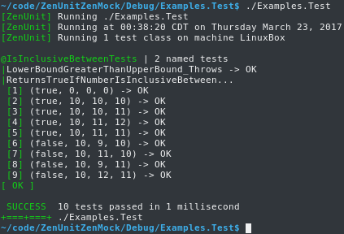
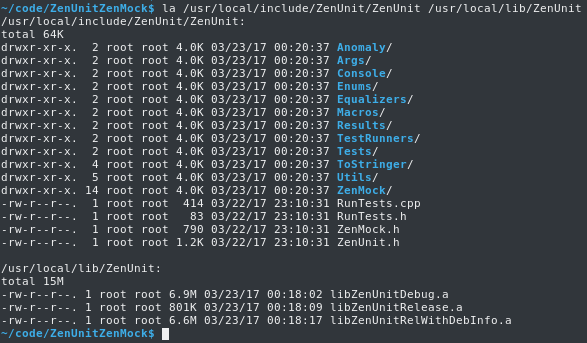
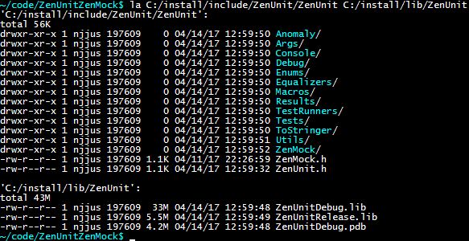
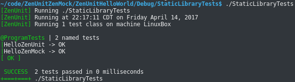
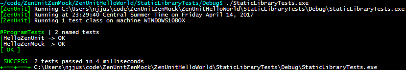

# ZenUnit
ZenUnit is a cross-platform C++ unit testing framework designed for specifying program behavior exactly, writability of type and value parameterized tests, and readability of tests and test results.

# ZenMock
ZenMock is a cross-platform C++ mocking framework powered by ZenUnit for isolating software components for targeted unit testing by way of virtual, template, static, and free function mocking using an arrange-act-assert syntax.

### ZenUnit syntax and design commentary

```Cpp
#include "ZenUnit/ZenUnit.h"

// Function to be unit tested
bool IsInclusiveBetween(unsigned lowerBound, unsigned number, unsigned upperBound);

TESTS(IsInclusiveBetweenTests)
// ZenUnit test classes start with the SPEC section
// that specifies the test names defined in the TEST section.
// By making all test names immediately readable in a list
// at the top of often-large test files (instead of scattering
// test names throughout often-large test files),
// this design makes it a breeze to quickly review
// test classes for what they test, their test name quality and cohesion,
// and by extension easily review classes under test 
// for continued quality and cohesion of responsibilities.

// The SPEC macro specifies a standard-issue void test:
SPEC(LowerBoundGreaterThanUpperBound_Throws)
// The SPECX macro specifies an N-by-N value-parameterized test such as a TEST4X4:
SPECX(ReturnsTrueIfNumberIsInclusiveBetween)
SPECEND

TEST(LowerBoundGreaterThanUpperBound_Throws)
{
   // ZenUnit is in part designed for writing tests that are impervious
   // to the breaking code mutations that will be automatically induced by
   // future LLVM-powered mutation testing frameworks.

   // Because of this defend-against-code-mutants design philosophy,
   // ZenUnit assertion THROWS asserts that an expression throws
   // exactly an expected exception type (not a derived class),
   // with exactly an expected what() text.

   // Because of this double exactness, code mutations
   // mutate-exception-type and mutate-exception-what-text,
   // manually inducible today and automatically inducible tomorrow by LLVM,
   // are slain by THROWS, ensuring the rigorousness of the test base.

   THROWS(IsInclusiveBetween(21, 20, 20), std::invalid_argument,
      "IsInclusiveBetween(): lowerBound must be <= upperBound.\n"
      "lowerBound=21\n"
      "upperBound=20");
}

// ZenUnit N-by-N value-parameterized tests process
// their type-safe variadic test case arguments list N-by-N.
// This TEST4X4 processes the list 4-by-4, forming 9 test cases
// for function IsInclusiveBetween(), each of which will be run
// using a fresh instance of test class IsInclusiveBetweenTests.
TEST4X4(ReturnsTrueIfNumberIsInclusiveBetween,
   bool expectedReturnValue, unsigned lowerBound, unsigned number, unsigned upperBound,
   true, 0, 0, 0,
   true, 10, 10, 10,
   true, 10, 10, 11,
   true, 10, 11, 12,
   true, 10, 11, 11,
   false, 10, 9, 10,
   false, 10, 11, 10,
   false, 10, 9, 11,
   false, 10, 12, 11)
{
   ARE_EQUAL(expectedReturnValue, IsInclusiveBetween(lowerBound, number, upperBound));
   // ZenUnit uses declarative-style instead of procedural-style assertion names
   // such as ARE_EQUAL and IS_TRUE instead of ASSERT_EQUAL and ASSERT_TRUE
   // to give ZenUnit a reading experience similar to
   // reading an executable specification document.
}

}; RUN(IsInclusiveBetweenTests)

// Function under test
bool IsInclusiveBetween(unsigned lowerBound, unsigned number, unsigned upperBound)
{
   if (lowerBound > upperBound)
   {
      std::string what =
         "IsInclusiveBetween(): lowerBound must be <= upperBound.\n"
         "lowerBound=" + std::to_string(lowerBound) + "\n" +
         "upperBound=" + std::to_string(upperBound);
      throw std::invalid_argument(what);
   }
   bool isInclusiveBetween = number >= lowerBound && number <= upperBound;
   return isInclusiveBetween;
}

int main(int argc, char* argv[]
{
   return ZenUnit::RunTests(argc, argv);
}

```
#### Test Run Output



### Building and Installing ZenUnit and ZenMock On Linux

Step 1 of 1:

Run `./LinuxCMakeBuildInstall.sh <InstallDirectory>` to CMake with Ninja, build with the default C++ compiler, and install with Linux the ZenUnit include tree and Debug and Release static libraries.

`LinuxCMakeBuildInstall.sh` performs these CMake, build, and install actions:

```bash
#!/bin/bash
set -eu

if [ $# -ne 1 ]; then
   echo "Usage: ./LinuxCMakeBuildInstall.sh <InstallDirectory>"
   exit 1
fi

function cmake_build_install
{
   local buildType="$1"
   local cmakeInstallPrefix
   cmakeInstallPrefix=$(realpath "$2")
   cmake -H. -B"$buildType" -GNinja \
      -DCMAKE_BUILD_TYPE="$buildType" \
      -DCMAKE_INSTALL_PREFIX="$cmakeInstallPrefix"
   cmake --build "$buildType" --target ZenUnit
   cmake --build "$buildType" --target install
}

cmakeInstallPrefix="$1"
cmake_build_install Debug "$cmakeInstallPrefix"
cmake_build_install Release "$cmakeInstallPrefix"
```

To build ZenUnit with Clang instead of the default C++ compiler (usually GCC), prepend CXX=<clang++Path>.

Abridged output from running `sudo CXX=/usr/bin/clang++ ./LinuxCMakeBuildInstall.sh /usr/local`:

```
~/code/ZenUnitAndZenMock$ sudo CXX=/usr/bin/clang++ ./LinuxCMakeBuildInstall.sh /usr/local
<...CMake Output...>
<...Include Tree Copying...>
-- Installing: /usr/local/include/ZenUnit/ZenUnit/./ZenMock.h
-- Installing: /usr/local/include/ZenUnit/ZenUnit/./ZenUnit.h
-- Installing: /usr/local/lib/ZenUnit/libZenUnitDebug.a
<...CMake Output...>
<...Build Output...>
-- Installing: /usr/local/lib/ZenUnit/libZenUnitRelease.a
~/code/ZenUnitAndZenMock$
```

ZenUnit installed on Linux:



### Building and Installing ZenUnit and ZenMock On Windows

Step 1 of 1: 

Run with PowerShell `WindowsCMakeBuildInstall.ps1 <InstallDirectory>` to CMake with Visual Studio 14 2015 Win64, build with MSBuild, and install with Windows the ZenUnit include tree and Debug and Release static libraries.

`WindowsCMakeBuildInstall.ps1` performs these CMake, build, and install actions:

```powershell
if ($Args.Count -ne 1)
{
   Write-Host "Usage: .\WindowsCMakeBuildInstallZenUnit.ps1 <InstallDirectory>"
   Exit 1
}

cmake . -G"Visual Studio 14 2015 Win64" -DCMAKE_INSTALL_PREFIX="$($Args[0])"
cmake --build . --target ZenUnit --config Debug
cmake --build . --target install --config Debug
cmake --build . --target ZenUnit --config Release
cmake --build . --target install --config Release
```

Abridged output from running `powershell -file WindowsCMakeBuildInstall.ps1 C:/install` from a Git Bash prompt:

```
~/code/ZenUnitAndZenMock$ powershell -file WindowsCMakeBuildInstall.ps1 C:/install
<...CMake Output...>
<...Build Output...>
<...Include Tree Copying...>
  -- Installing: C:/install/include/ZenUnit/ZenUnit/./ZenUnit.h
  -- Installing: C:/install/include/ZenUnit/ZenUnit/./ZenMock.h
  -- Installing: C:/install/lib/ZenUnit/ZenUnitDebug.lib
  -- Installing: C:/install/lib/ZenUnit/ZenUnitDebug.pdb
<...Build Output...>
  -- Installing: C:/install/lib/ZenUnit/ZenUnitRelease.lib
Build succeeded.
```

ZenUnit installed on Windows:



Editor's note: ZenUnit and ZenMock as header-only would of course be much more convenient than the current building and linking against a static library, which is why ZenUnit and ZenMock will be made header-only following further laying down of their foundations.

## ZenUnitHelloWorld

ZenUnitHelloWorld is a folder contained in this repo that contains CMakeLists.txt files for example projects Executable, StaticLibrary, and StaticLibraryTests - with StaticLibraryTests configured to confirm the correctness of StaticLibrary using ZenUnit and ZenMock.

## Building and Running ZenUnitHelloWorld's StaticLibraryTests on Linux

```bash
~/code/ZenUnitZenMock$ cd ZenUnitHelloWorld
~/code/ZenUnitZenMock/ZenUnitHelloWorld$ CXX=/usr/bin/clang++ cmake -H. -BDebug -GNinja
~/code/ZenUnitZenMock/ZenUnitHelloWorld$ cmake --build Debug
~/code/ZenUnitZenMock/ZenUnitHelloWorld$ cd Debug/StaticLibraryTests
~/code/ZenUnitZenMock/ZenUnitHelloWorld/Debug/StaticLibraryTests$ ./StaticLibraryTests
```



## Building and Running ZenUnitHelloWorld's StaticLibraryTests on Windows

```bash
~/code/ZenUnitZenMock$ cd ZenUnitHelloWorld
~/code/ZenUnitZenMock/ZenUnitHelloWorld$ cmake . -G"Visual Studio 14 2015 Win64"
~/code/ZenUnitZenMock/ZenUnitHelloWorld$ cmake --build .
~/code/ZenUnitZenMock/ZenUnitHelloWorld$ cd StaticLibraryTests/Debug
~/code/ZenUnitZenMock/ZenUnitHelloWorld/StaticLibraryTests/Debug$ ./StaticLibraryTests.exe
```



## Test Matrix

|Operating System|Compilers|
|----------------|--------|
|Fedora 25       |Clang 3.9.1, Clang 5.0.0, and GCC 6.3.1|
|Ubuntu 17.04    |Clang 4.0.0, Clang 5.0.0, and GCC 6.3.0|
|Windows 10      |Visual Studio 2015 Update 3 x64 (MSVC 14.0)|

Test Matrix road map: Travis CI Linux and macOS, AppVeyor, Arch Linux, and Visual Studio 2017.

### [Work In Progress Guide to ZenUnit](Docs/ZenUnit.md)
### [Work In Progress Guide to ZenMock](Docs/ZenMock.md)

### Version History

|Version|Date|Features|
|-------|----|--------|
|0.2.0|Approaching|Numerous|
|0.1.1|February 14, 2017|Fixes, refactorings, design improvements|
|0.1.0|January 1, 2017|Launch|

### License

ZenUnit and ZenMock are free and open source public domain software.
