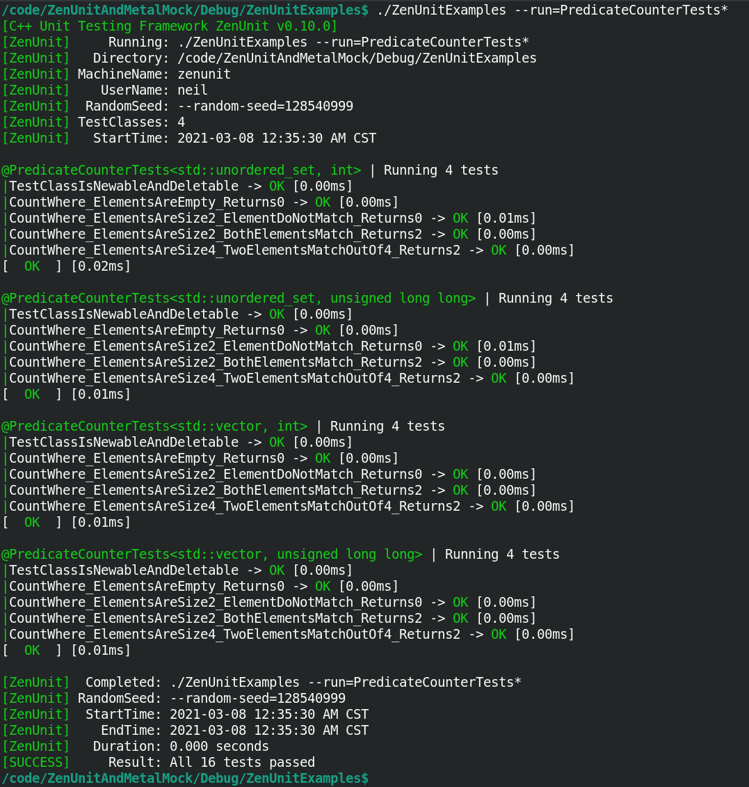

# 🧪 ZenUnit & MetalMock ⚗️

[](https://en.wikipedia.org/wiki/C%2B%2B20)  

ZenUnit is a C++ single-header unit testing framework designed for assertion exactness, error message clarity, long-term test code readability, and supports testing with randomized values to maximize [mutation coverage](https://en.wikipedia.org/wiki/Mutation_testing), the next frontier in software quality metrics beyond code coverage. ZenUnit's key feature is its convenient syntax for writing value-parameterized and type-parameterized unit tests.

MetalMock is a C++ single-header mocking framework powered by ZenUnit assertions and features a convenient arrange-act-assert syntax for specifying function return values and expected function call arguments from and to virtual functions, non-virtual functions, static functions, and free functions. MetalMock is a "double strict" mocking framework so as to be suitable for rigorously confirming the correctness of safety-critical and financially-critical C++ software - meaning that all MetalMocked function calls must be first explicitly expected and then explicitly asserted as having been called with exact expected arguments.

|Build Type|Build Status|
|----------|------------|
|Travis CI Linux Clang 9.0.1 and Linux GCC 9.3.0 Debug and Release|[](https://travis-ci.com/NeilJustice/ZenUnitAndMetalMock)|
|AppVeyor Windows Visual Studio 2019 x64 Debug and Release|<a href="https://ci.appveyor.com/project/NeilJustice/ZenUnitAndMetalMock"></a>|
|Code Coverage For The Travis CI Linux GCC 9.3.0 Release Build|[](https://codecov.io/gh/NeilJustice/ZenUnitAndMetalMock)|

##### ZenUnit.h: [](https://raw.githubusercontent.com/NeilJustice/ZenUnitAndMetalMock/master/ZenUnitAndMetalMock/ZenUnit.h)
##### MetalMock.h: [](https://raw.githubusercontent.com/NeilJustice/ZenUnitAndMetalMock/master/ZenUnitAndMetalMock/MetalMock.h)

   * [ZenUnit Command Line Usage](#zenunit-command-line-usage)
   * [How To Unit Test FizzBuzz With ZenUnit's Value-Parameterized Test Syntax](#how-to-unit-test-fizzbuzz-with-zenunits-value-parameterized-test-syntax)
      * [Console Output When Running ZenUnit Value-Parameterized Tests](#console-output-when-running-zenunit-value-parameterized-tests)
   * [How To Unit Test Templated Class PredicateCounter's CountWhere() Function With ZenUnit's Type-Parameterized Test Syntax](#how-to-unit-test-templated-class-predicatecounters-countwhere-function-with-zenunits-type-parameterized-test-syntax)
      * [Console Output When Running ZenUnit Type-Parameterized Tests](#console-output-when-running-zenunit-type-parameterized-tests)
   * [ZenUnit Assertions](#zenunit-assertions)
      * [Value Assertions](#value-assertions)
      * [Pointer Assertions](#pointer-assertions)
      * [Data Structure Assertions](#data-structure-assertions)
      * [Floating Point Assertions](#floating-point-assertions)
      * [Exception Assertions](#exception-assertions)
      * [Function Assertions](#function-assertions)
      * [Memory Allocation Assertions](#memory-allocation-assertions)
      * [The FAIL_TEST Assertion](#the-fail_test-assertion)
      * [ZenUnit Equalizer Assertions](#zenunit-equalizer-assertions)
   * [ZenUnit Test-Defining Macros](#zenunit-test-defining-macros)
   * [How To Write A Custom ZenUnit::Equalizer\<T\> struct To Achieve Field-By-Field Assertion Granularity](Documentation/HowToWriteACustomZenUnitEqualizer.md)
   * [Guide To MetalMock](Documentation/GuideToMetalMock.md)
   * [Mutation Coverage Can Be Maximized By Testing With Random Values](#mutation-coverage-can-be-maximized-by-testing-with-random-values)
   * [Linux Jenkins Jobs Which Build, Unit Test, clang-tidy, AddressSanitize, UndefinedBehaviorSanitize, And ThreadSanitize ZenUnit And MetalMock](#linux-jenkins-jobs-which-build-unit-test-clang-tidy-addresssanitize-undefinedbehaviorsanitize-and-threadsanitize-zenunit-and-metalmock)
   * [Windows Jenkins Jobs Which Build And Unit Test ZenUnit And MetalMock](#windows-jenkins-jobs-which-build-and-unit-test-zenunit-and-metalmock)
   * [ZenUnit And MetalMock Code Structure As It Appears In Visual Studio Code](#zenunit-and-metalmock-code-structure-as-it-appears-in-visual-studio-code)
   * [ZenUnit And MetalMock Code Structure As It Appears In Visual Studio 2019](#zenunit-and-metalmock-code-structure-as-it-appears-in-visual-studio-2019)
   * [How To Build And Run ZenUnit And MetalMock Unit Tests On Linux And Then Install ZenUnit.h And MetalMock.h](#how-to-build-and-run-zenunit-and-metalmock-unit-tests-on-linux-and-then-install-zenunith-and-metalmockh)
   * [How To Build And Run ZenUnit And MetalMock Unit Tests On Windows And Then Install ZenUnit.h And MetalMock.h](#how-to-build-and-run-zenunit-and-metalmock-unit-tests-on-windows-and-then-install-zenunith-and-metalmockh)
   * [ZenUnit Features Roadmap](#zenunit-features-roadmap)
   * [MetalMock Features Roadmap](#metalmock-features-roadmap)
   * [Acknowledgments](#acknowledgments)

### ZenUnit Command Line Usage

```
C++ Unit Testing Framework ZenUnit v0.10.0
https://github.com/NeilJustice/ZenUnitAndMetalMock
Usage: <ZenUnitTestsBinaryName> [Options...]

Testing Utility Options:

--pause-before
   Wait for any key before running tests to allow for attaching a debugger or performance profiler.
--pause-after
   Wait for any key after running tests.
--always-exit-0
   Always exit with code 0.
--help
   Print this command line usage message.
--version
   Print the ZenUnit version number.

Testing Filtration Options:

--run=<TestClassName>[::TestName][/TestCaseNumber][,...]
   Run only specified case-insensitive test classes, tests, and/or test case numbers.
   Add a '*' character to the end of a test class name or test name to indicate name-starts-with.
 Example 1: --run=APITests
   Run only test class APITests.
 Example 2: --run=APITests::FunctionUnderTest*
   Run only tests in APITests that start with "FunctionUnderTest".
 Example 3: --run=APITests::FunctionUnderTest_ArgumentsUnderTest_ExpectedReturnValue/3
   Run only the third test case of the value-parameterized test named
   APITests::FunctionUnderTest_ArgumentsUnderTest_ExpectedReturnValue
--fail-fast
   Call exit(1) if a test fails.

Testing Rigorousness Options:

--test-runs=<N>
   Repeat N times the running of all tests.
   Specify -1 to repeat forever the running of all tests.
--random
   Run test classes, tests, and value-parameterized test cases in a random order.
--random-seed=<32BitUnsignedInteger>
   Sets the random seed which sets the test ordering for --random and
   sets the sequence of values returned by the ZenUnit::Random<T>
   family of random-value-generating functions.
   The default random seed is the number of seconds since 1970-01-01 00:00:00 UTC.
--exit-1-if-tests-skipped
   After having run all tests, exit with code 1 if any tests were skipped.

Example ZenUnit command line arguments:

./SafetyCriticalUnitTests --test-runs=5 --random --exit-1-if-tests-skipped
./FinanciallyCriticalUnitTests --run=MarketDataDispatcherTests --fail-fast
```

### How To Unit Test FizzBuzz With ZenUnit's Value-Parameterized Test Syntax

```cpp
// Single header
#include "ZenUnitAndMetalMock/ZenUnit.h"

// FizzBuzz function to be unit tested with ZenUnit
std::string FizzBuzz(int endNumber);

// TESTS defines a ZenUnit test class and begins the FACTS section
TESTS(FizzBuzzTests)
// FACTS declares an N-by-N value-parameterized test, the signature syntatical feature of ZenUnit
FACTS(FizzBuzz_EndNumberIs0OrNegative_ThrowsInvalidArgumentException)
FACTS(FizzBuzz_EndNumberIsGreaterThan0_ReturnsFizzBuzzSequence)
// EVIDENCE concludes the declaration of FACTS section and begins the presentation of EVIDENCE section
EVIDENCE

// In ZenUnit test names are by-design duplicated between the FACTS section and the EVIDENCE section.
// This carefully-considered design decision is to maximize long-term test code readability
// by always presenting test names at the top of test files instead of scattered throughout test files.

// TEST1X1 defines a 1-by-1 value-parameterized test
// which processes its typesafe variadic arguments list 1-by-1.
// This TEST1X1 defines 4 independent unit tests for FizzBuzz(),
// each of which will run sequentially within separate instances of test class FizzBuzzTests.
// Adding support for parallel test case execution appears prominently on ZenUnit's Azure DevOps backlog.
TEST1X1(FizzBuzz_EndNumberIs0OrNegative_ThrowsInvalidArgumentException,
   int invalidFizzBuzzEndNumber,
   std::numeric_limits<int>::min(),
   -2,
   -1,
   0)
{
   // The ZenUnit THROWS_EXCEPTION assertion asserts that an expression throws
   // *exactly* (not a derived class of) an expected exception type with
   // *exactly* an expected exception what() text.

   // This double-exactness design of THROWS_EXCEPTION serves to maximizes mutation coverage,
   // the next frontier in software quality metrics beyond code coverage.
   // Throw statements tested with THROWS_EXCEPTION are immune to these two mutation testing operators:
   // mutate-exception-type and mutate-exception-message.

   const std::string expectedExceptionMessage =
      "Invalid FizzBuzz(int endNumber) argument: endNumber [" + std::to_string(invalidFizzBuzzEndNumber) + "] must be >= 1";
   THROWS_EXCEPTION(FizzBuzz(invalidFizzBuzzEndNumber),
      std::invalid_argument, expectedExceptionMessage);
}

// TEST2X2 defines a 2-by-2 value-parameterized test
// which processes its typesafe variadic arguments list 2-by-2.
// This TEST2X2 defines 16 independent unit tests for FizzBuzz(),
// each of which will run sequentially within separate instances of test class FizzBuzzTests.
TEST2X2(FizzBuzz_EndNumberIsGreaterThan0_ReturnsFizzBuzzSequence,
   int endNumber, std::string_view expectedFizzBuzzSequence,
   1, "1",
   2, "1 2",
   3, "1 2 Fizz",
   4, "1 2 Fizz 4",
   5, "1 2 Fizz 4 Buzz",
   6, "1 2 Fizz 4 Buzz Fizz",
   7, "1 2 Fizz 4 Buzz Fizz 7",
   8, "1 2 Fizz 4 Buzz Fizz 7 8",
   9, "1 2 Fizz 4 Buzz Fizz 7 8 Fizz",
   10, "1 2 Fizz 4 Buzz Fizz 7 8 Fizz Buzz",
   11, "1 2 Fizz 4 Buzz Fizz 7 8 Fizz Buzz 11",
   12, "1 2 Fizz 4 Buzz Fizz 7 8 Fizz Buzz 11 Fizz",
   13, "1 2 Fizz 4 Buzz Fizz 7 8 Fizz Buzz 11 Fizz 13",
   14, "1 2 Fizz 4 Buzz Fizz 7 8 Fizz Buzz 11 Fizz 13 14",
   15, "1 2 Fizz 4 Buzz Fizz 7 8 Fizz Buzz 11 Fizz 13 14 FizzBuzz",
   16, "1 2 Fizz 4 Buzz Fizz 7 8 Fizz Buzz 11 Fizz 13 14 FizzBuzz 16")
{
   const std::string fizzBuzzSequence = FizzBuzz(endNumber);
   // ZenUnit assertion names are declarative in language style (ARE_EQUAL, THROWS_EXCEPTION, et al)
   // instead of procedural in language style (ASSERT_EQUAL, ASSERT_THROWS, et al)
   // to give ZenUnit a test reading experience akin to reading an executable specification document.
   ARE_EQUAL(expectedFizzBuzzSequence, fizzBuzzSequence);
}

// Function under test
std::string FizzBuzz(int endNumber)
{
   if (endNumber <= 0)
   {
      const std::string exceptionMessage =
         "Invalid FizzBuzz(int endNumber) argument: endNumber [" + std::to_string(endNumber) + "] must be >= 1";
      throw std::invalid_argument(exceptionMessage);
   }
   std::ostringstream fizzBuzzSequenceBuilder;
   for (int i = 1; i <= endNumber; ++i)
   {
      if (i % 15 == 0)
      {
         fizzBuzzSequenceBuilder << "FizzBuzz";
      }
      else if (i % 3 == 0)
      {
         fizzBuzzSequenceBuilder << "Fizz";
      }
      else if (i % 5 == 0)
      {
         fizzBuzzSequenceBuilder << "Buzz";
      }
      else
      {
         fizzBuzzSequenceBuilder << i;
      }
      if (i < endNumber)
      {
         fizzBuzzSequenceBuilder << ' ';
      }
   }
   std::string fizzBuzzSequence(fizzBuzzSequenceBuilder.str());
   return fizzBuzzSequence;
}

// RUN_TESTS registers a ZenUnit test class to be run when ZenUnit::RunTests(argc, argv) is called
RUN_TESTS(FizzBuzzTests)

int main(int argc, char* argv[])
{
   const int exitCode = ZenUnit::RunTests(argc, argv);
   return exitCode;
}
```

### Console Output When Running ZenUnit Value-Parameterized Tests


### How To Unit Test Templated Class PredicateCounter's CountWhere() Function With ZenUnit's Type-Parameterized Test Syntax

How could the correctness of this templated class `PredicateCounter` with its `CountWhere` function be confirmed across various types of `ContainerType` and `T`?

(`std::count_if` is of course the standard way of counting elements matching a given predicate. class `PredicateCounter` provides mockability by way of its `CountWhere` function being virtual.)

```cpp
template<
   template<typename...>
   typename ContainerType, typename T>
class PredicateCounter
{
public:
   virtual size_t CountWhere(const ContainerType<T>& elements, bool(*elementPredicate)(const T&)) const
   {
      size_t numberOfMatchingElements = 0;
      for (const T& element : elements)
      {
         const bool elementMatchesPredicate = elementPredicate(element);
         if (elementMatchesPredicate)
         {
            ++numberOfMatchingElements;
         }
      }
      return numberOfMatchingElements;
   }

   virtual ~PredicateCounter() = default;
};
```

Here is how the correctness of `CountWhere` can be confirmed across multiple `ContainerType` and `T` types by using ZenUnit's type-parameterized test class syntax:

```cpp
#include "ZenUnitAndMetalMock/ZenUnit.h"

template<
   template<typename...>
   typename ContainerType, typename T>
TEMPLATE_TESTS(PredicateCounterTests, ContainerType, T)
AFACT(CountWhere_ElementsAreEmpty_Returns0)
AFACT(CountWhere_ElementsAreSize2_ElementDoNotMatch_Returns0)
AFACT(CountWhere_ElementsAreSize2_BothElementsMatch_Returns2)
AFACT(CountWhere_ElementsAreSize4_TwoElementsMatchOutOf4_Returns2)
EVIDENCE

PredicateCounter<ContainerType, T> _predicateCounter;

static bool IsEven(const T& element)
{
   const bool elementIsEven = element % 2 == 0;
   return elementIsEven;
}

static bool AlwaysMatchingPredicate(const T&)
{
   return true;
}

static bool NeverMatchingPredicate(const T&)
{
   return false;
}

TEST(CountWhere_ElementsAreEmpty_Returns0)
{
   const ContainerType<T> emptyElements;
   //
   const size_t numberOfMatchingElements =
      _predicateCounter.CountWhere(emptyElements, NeverMatchingPredicate);
   //
   ARE_EQUAL(0, numberOfMatchingElements);
}

TEST(CountWhere_ElementsAreSize2_ElementDoNotMatch_Returns0)
{
   const ContainerType<T> elements{ ZenUnit::Random<T>(), ZenUnit::Random<T>() };
   //
   const size_t numberOfMatchingElements =
      _predicateCounter.CountWhere(elements, NeverMatchingPredicate);
   //
   ARE_EQUAL(0, numberOfMatchingElements);
}

TEST(CountWhere_ElementsAreSize2_BothElementsMatch_Returns2)
{
   const ContainerType<T> elements{ ZenUnit::Random<T>(), ZenUnit::Random<T>() };
   //
   const size_t numberOfMatchingElements =
      _predicateCounter.CountWhere(elements, AlwaysMatchingPredicate);
   //
   ARE_EQUAL(2, numberOfMatchingElements);
}

TEST(CountWhere_ElementsAreSize4_TwoElementsMatchOutOf4_Returns2)
{
   const ContainerType<T> elements{ T{1}, T{2}, T{3}, T{4} };
   //
   const size_t numberOfEvenElements = _predicateCounter.CountWhere(elements, IsEven);
   //
   ARE_EQUAL(2, numberOfEvenElements);
}

RUN_TEMPLATE_TESTS(PredicateCounterTests, vector, int)
THEN_RUN_TEMPLATE_TESTS(PredicateCounterTests, vector, unsigned long long)
THEN_RUN_TEMPLATE_TESTS(PredicateCounterTests, unordered_set, int)
THEN_RUN_TEMPLATE_TESTS(PredicateCounterTests, unordered_set, unsigned long long)
```

### Console Output When Running ZenUnit Type-Parameterized Tests



## ZenUnit Assertions

#### Value Assertions
|Assertion|Behavior|
|---------|--------|
|`ARE_EQUAL(expectedValue, actualValue, messages...)`|By default asserts `expectedValue == actualValue`, otherwise throws a `ZenUnit::Anomaly`, which is caught by ZenUnit to fail the current test.<br><br>`messages...` are variables of any type writable with `operator<<(std::ostream&, const T&)` or `ZenUnit::Printer<T>::Print(std::ostream&, const T&)`.<br><br>If `expectedValue` and `actualValue` are `const char*` or `const wchar_t*`, `ARE_EQUAL` determines equality by calling `strcmp` or `wcscmp`.|
|`ARE_NOT_EQUAL(notExpectedValue, actualValue, messages...)`|By default asserts `!(expectedValue == actualValue)`, otherwise throws a `ZenUnit::Anomaly`.|
|`FIELDS_ARE_EQUAL(expectedObject, actualObject, fieldName, messages...)`|Asserts `ARE_EQUAL(expectedObject.fieldName, actualObject.fieldName, messages...)`.|
|`ENUM_EQUALS_INT(expectedInteger, actualEnumClass)`|Asserts `static_cast<typename std::underlying_type<T>::type>(actualEnumClass) == expectedInteger`.|
|`ARE_COPIES(expectedObject, actualObject, messages...)`|Asserts `&expectedObject != &actualObject` then asserts `ARE_EQUAL(expectedObject, actualObject)`.|
|`IS_LT(actualValue, comparisonValue, messages...)`|Asserts `actualValue < comparisonValue`.|
|`IS_LTE(actualValue, comparisonValue, messages...)`|Asserts `actualValue <= comparisonValue`.|
|`IS_GTE(actualValue, comparisonValue, messages...)`|Asserts `actualValue >= comparisonValue`.|
|`IS_GT(actualValue, comparisonValue, messages...)`|Asserts `actualValue > comparisonValue`.|
|`IS_TRUE(value, messages...)`|Asserts that `value` is true.|
|`IS_FALSE(value, messages...)`|Asserts that `value` is false.|
|`IS_ZERO(value, messages...)`|Asserts that `value == 0` is true.|
|`IS_EMPTY_STRING(str, messages...)`|Asserts that `str.empty()` is true.|
|`IS_EMPTY_PATH(stdFilesystemPath, messages...`|Asserts that `stdFilesystemPath == std::filesystem::path()`.|
|`IS_DEFAULT_VALUE(value, messages...)`|Asserts that `ZenUnit::Equalizer<T>::AssertEqual(T{}, value)` does not throw a ZenUnit::Anomaly exception.|
|`IS_NOT_DEFAULT_VALUE(value, messages...)`|Asserts that `ZenUnit::Equalizer<T>::AssertEqual(T{}, value)` throws a ZenUnit::Anomaly exception.|

#### Pointer Assertions
|Assertion|Behavior|
|---------|--------|
|`IS_NULLPTR(pointer, messages...)`|Asserts `pointer == nullptr`.|
|`IS_NOT_NULLPTR(pointer, messages...)`|Asserts `pointer != nullptr`.|
|`ARE_SAME(expectedObject, actualObject, messages...)`|Asserts `&expectedObject == &actualObject`.|
|`ARE_NOT_SAME(notExpectedObject, actualObject, messages...)`|Asserts `&expectedObject != &actualObject`.
|`POINTEES_ARE_EQUAL(expectedPointer, actualPointer, messages...)`|1. Asserts `expectedPointer != nullptr`.<br>2. Asserts `actualPointer != nullptr`.<br>3. Asserts `ARE_EQUAL(*expectedPointer, *actualPointer)`.|
|`POINTEE_IS_EXACT_TYPE(expectedPolymorphicPointeeType, actualPointer, messages...)`|1. Statically asserts `static_assert(std::is_polymorphic_v<expectedPolymorphicPointeeType>)`.<br>2. Asserts `actualPointer != nullptr`.<br>3. Asserts `typeid(expectedPolymorphicPointeeType) == typeid(*actualPointer)`.<br>This is a useful assertion for confirming the correctness of factory functions that return `make_unique`/`make_shared` instances of subclasses as base class pointers.|

#### Data Structure Assertions
|Assertion|Behavior|
|---------|--------|
|`VECTORS_ARE_EQUAL(expectedVector, actualVector, messages...)`|Calls `INDEXABLES_ARE_EQUAL(expectedVector, actualVector, messages...)`|
|`INDEXABLES_ARE_EQUAL(expectedIndexableDataStructure, actualIndexableDataStructure, messages...)`|Asserts that `expectedIndexableDataStructure.size() == actualIndexableDataStructure.size()` then calls `ARE_EQUAL(ithExpectedElement, ithActualElement)` on each pair of expected and actual elements.|
|`SETS_ARE_EQUAL(expectedSet, actualSet, messages...)`|Asserts that `expectedSet.size() == actualSet.size()` then calls `ARE_EQUAL(expectedElement, actualElement)` on each pair of expected and actual elements.|
|`MAPS_ARE_EQUAL(expectedMap, actualMap, messages...)`|Asserts that `expectedMap.size() == actualMap.size()` then calls `ARE_EQUAL(expectedKeyValuePair, actualKeyValuePair)` on each pair of expected and actual key-value pairs.
|`PAIRS_ARE_EQUAL(expectedPair, actualPair, messages...)`|Asserts `ARE_EQUAL(expectedPair.first, actualPair.first)` then asserts `ARE_EQUAL(expectedPair.second, actualPair.second)`.|
|`TUPLES_ARE_EQUAL(expectedTuple, actualTuple, messages...)`|Asserts `ARE_EQUAL(expectedTupleElement, actualTupleElement)` for each tuple element.|
|`ARRAYS_ARE_EQUAL(expectedArray, actualArray, numberOfElementsToCompare, messages...)`|Asserts `ARE_EQUAL` on each expected and actual array element up to numberOfElementsToCompare elements.|
|`STD_ARRAYS_ARE_EQUAL(expectedStdArray, actualStdArray, messages...)`|Asserts `ARE_EQUAL` on each expected and actual `std::array` element.|
|`CONTAINS_ELEMENT(expectedElement, dataStructure, messages...)`|Asserts that `dataStructure.find(expectedElement) != dataStructure.end()`.|
|`IS_EMPTY(dataStructure, messages...)`|Asserts that `dataStructure.empty()` equals true.|
|`IS_NOT_EMPTY(dataStructure, messages...)`|Asserts that `dataStructure.empty()` equals false.|

#### Floating Point Assertions
|Assertion|Behavior|
|---------|--------|
|`ARE_WITHIN(expectedFloatingPointValue, actualFloatingPointValue, expectedAbsoluteMaxDifference, messages...)`|Asserts that `std::abs(expectedFloatingPointValue - actualFloatingPointValue) <= expectedAbsoluteMaxDifference`.|

#### Exception Assertions
|Assertion|Behavior|
|---------|--------|
|`THROWS_EXCEPTION(expression, expectedExactExceptionType, expectedExactExceptionWhatText, messages...)`|Asserts that `expression` throws \*exactly\* (not a derived class of) `expectedExactExceptionType` as determined by RTTI with \*exactly\* a what() message equal to `expectedExactExceptionWhatText`.|
|`DOES_NOT_THROW(expression, messages...)`|If `expression` throws an exception, throws a `ZenUnit::Anomaly`, otherwise does nothing. Useful assertion for emphasis to the reader of a unit test.|

#### Function Assertions
|Assertion|Behavior|
|---------|--------|
|`STD_FUNCTION_TARGETS(expectedStaticOrFreeFunction, stdFunction, messages...)`|First asserts `IS_TRUE(stdFunction)`, which asserts that stdFunction points to a function, then asserts `ARE_EQUAL(expectedStaticOrFreeFunction, *stdFunction.target<decltype(expectedStaticOrFreeFunction)*>())`. This is a key assertion to call prior to overwriting a `std::function` with a MetalMock mock object.|
|`STD_FUNCTION_TARGETS_OVERLOAD(expectedFunctionOverloadAsAUsing, expectedStaticOrFreeFunction, stdFunction, messages...)`|Same as above but with `static_cast<expectedFunctionOverloadAsAUsing>(expectedStaticOrFreeFunction)`.|

#### Memory Allocation Assertions
|Assertion|Behavior|
|---------|--------|
|`DELETE_TO_ASSERT_NEWED(smartOrRawPointer, messages...)`|Asserts `smartOrRawPointer != nullptr` then calls `reset()` or `operator delete` on `smartOrRawPointer` to confirm the pointer was allocated using `make_unique`, `make_shared`, or `operator new`. This is a key assertion for robustness against the `swap-new-with-nullptr` mutation testing operator.|
|`DELETE_TO_ASSERT_ARRAY_NEWED(smartOrRawArrayPointer, messages...)`|Asserts `smartOrRawArrayPointer != nullptr` then calls `reset()` or `operator delete[]` to confirm the pointer was allocated using `make_unique` or `operator new[]`. This is a key assertion for robustness against the `swap-new-with-nullptr` mutation testing operator.|

#### The FAIL_TEST Assertion
|Assertion|Behavior|
|---------|--------|
|`FAIL_TEST(testFailureReason, messages...)`|Throws a `ZenUnit::Anomaly` which is caught by ZenUnit to end the current test and begin the next test.|

#### ZenUnit Equalizer Assertions
|Assertion|Behavior|
|---------|--------|
|`ZENUNIT_EQUALIZER_TEST_SETUP(typeName)`|Defines local variables `typeName expectedZenUnitEqualizerTestObject{};` and `typeName actualZenUnitEqualizerTestObject{};` and then calls `DOES_NOT_THROW(ARE_EQUAL(expectedZenUnitEqualizerTestObject, actualZenUnitEqualizerTestObject));`|
|`ZENUNIT_EQUALIZER_THROWS_WHEN_FIELD_NOT_EQUAL(typeName, nonQuotedFieldName, randomNonDefaultFieldValue)`|Sets `expectedZenUnitEqualizerTestObject.nonQuotedFieldName = randomNonDefaultFieldValue` and then asserts that `ARE_EQUAL(expectedZenUnitEqualizerTestObject, actualZenUnitEqualizerTestObject)` throws a `ZenUnit::Anomaly` with `anomaly.what()` text satisfying assertion `IS_TRUE(String::Contains(anomaly.what(), fieldName)).`|

### ZenUnit Test-Defining Macros

|Test Classes|Behavior|
|------------|--------|
|`TESTS(testClassName)`|Defines a non-templatized test class.|
|`TEMPLATE_TESTS(testClassName, templateParameterNames...)`|Defines a templatized test class. Precede with template\<parameter-list\>.|
|`AFACT(testName)`|Declares a non-value-parameterized test.|
|`FACTS(testName)`|Declares an N-by-N value-parameterized test.|
|`SKIPAFACT(testName, Reason)`|Skips a non-value-parameterized test.|
|`SKIPFACTS(testName, Reason)`|Skips an N-by-N value-parameterized test.|
|`EVIDENCE`|Concludes the declaration of FACTS section and begins the presentation of EVIDENCE section, also known as the test class body.|
|`STARTUP`|Defines a function to be run before each test.|
|`CLEANUP`|Defines a function to be run after each test.|
|`TEST(testName)`|Defines a non-value-parameterized test.|
|`TEST1X1(testName, Arg1Type, 1By1CommaSeparatedTestCaseValueLiterals...)`|Defines a 1-by-1 value-parameterized test.|
|`TEST2X2(testName, Arg1Type, Arg2Type, 2By2CommaSeparatedTestCaseValueLiterals...)`|Defines a 2-by-2 value-parameterized test.|
|`TEST3X3(testName, Arg1Type, Arg2Type, Arg3Type, 3By3CommaSeparatedTestCaseValueLiterals...)`|Defines a 3-by-3 value-parameterized test.|
|`TEST4X4(testName, Arg1Type, Arg2Type, Arg3Type, Arg4Type, 4By4CommaSeparatedTestCaseValueLiterals...)`|Defines a 4-by-4 value-parameterized test.|
|`TEST5X5(testName, Arg1Type, Arg2Type, Arg3Type, Arg4Type, Arg5Type, 5By5CommaSeparatedTestCaseValueLiterals...)`|Defines a 5-by-5 value-parameterized test.|
|`TEST6X6(testName, Arg1Type, Arg2Type, Arg3Type, Arg4Type, Arg5Type, Arg6Type, 6By6CommaSeparatedTestCaseValueLiterals...)`|Defines a 6-by-6 value-parameterized test.|
|`TEST7X7(testName, Arg1Type, Arg2Type, Arg3Type, Arg4Type, Arg5Type, Arg6Type, Arg7Type, 7By7CommaSeparatedTestCaseValueLiterals...)`|Defines a 7-by-7 value-parameterized test.|
|`TEST8X8(testName, Arg1Type, Arg2Type, Arg3Type, Arg4Type, Arg5Type, Arg6Type, Arg7Type, Arg8Type, 8By8CommaSeparatedTestCaseValueLiterals...)`|Defines an 8-by-8 value-parameterized test.|
|`TEST9X9(testName, Arg1Type, Arg2Type, Arg3Type, Arg4Type, Arg5Type, Arg6Type, Arg7Type, Arg8Type, Arg9Type, 9By9CommaSeparatedTestCaseValueLiterals...)`|Defines a 9-by-9 value-parameterized test.|
|`TEST10X10(testName, Arg1Type, Arg2Type, Arg3Type, Arg4Type, Arg5Type, Arg6Type, Arg7Type, Arg8Type, Arg9Type, Arg10Type, 10By10CommaSeparatedTestCaseValueLiterals...)`|Defines a 10-by-10 value-parameterized test.|
|`RUN_TESTS(testClassName)`|Registers a `TEST_CLASS` to be run when `ZenUnit::RunTests(argc, argv)` is called.|
|`SKIP_TESTS(testClassName, Reason)`|Prevents a `TEST_CLASS` from running when `ZenUnit::RunTests(argc, argv)` is called.|
|`RUN_TEMPLATE_TESTS(testClassName, TemplateArguments...)`|Registers a `TEMPLATE_TEST_CLASS` templatized with `TemplateArguments...` to be run when `ZenUnit::RunTests(argc, argv)` is called.|
|`THEN_RUN_TEMPLATE_TESTS(testClassName, TemplateArguments...)`|Registers a `TEMPLATE_TEST_CLASS` templatized with `TemplateArguments...` to be run when `ZenUnit::RunTests(argc, argv)` is called. For use after `RUN_TEMPLATE_TESTS`.|
|`SKIP_TEMPLATE_TESTS(testClassName, Reason, TemplateArguments...)`|Prevents a `TEMPLATE_TEST_CLASS` from running when `ZenUnit::RunTests(argc, argv)` is called.|
|`THEN_SKIP_TEMPLATE_TESTS(testClassName, Reason, TemplateArguments...)`|Prevents a `TEMPLATE_TEST_CLASS` from running when `ZenUnit::RunTests(argc, argv)` is called. For use after `SKIP_TEMPLATE_TESTS`.|

### Mutation Coverage Can Be Maximized By Testing With Random Values

ZenUnit provides the following random-value-generating functions for maximizing [mutation coverage](https://en.wikipedia.org/wiki/Mutation_testing), the next frontier in software quality metrics beyond code coverage.

Testing using random values instead of constant values renders test code immune to the `swap-variable-with-constant` code mutation, which is a straightforward code mutation to induce manually today during code review time or automatically in the mid-2020s during CI/CD time by running the exceptionally promising LLVM-powered mutation testing framework [Mull](https://github.com/mull-project/mull).

|Random Number-Generating Functions|Behavior|
|----------------------------------|--------|
|`ZenUnit::Random<T>()`|If `T` is an integer type, returns a random integer of type `T` between `std::numeric_limits<T>::min()` and `std::numeric_limits<T>::max()` selected from a `std::uniform_int_distribution<long long>`.<br><br>If `T` is a `std::vector<T>`, returns the result from calling `ZenUnit::RandomVector<T>()`.<br><br>If `T` is a `std::pair<T1, T2>`, returns the result of calling `ZenUnit::RandomPair<typename T::first_type, typename T::second_type>()`.<br><br>If `T` is a `std::unordered_map<KeyType, ValueType`, returns the result of calling `ZenUnit::RandomUnorderedMap<typename T::key_type, typename T::mapped_type>()`.<br><br>If `T` is `unsigned long long`, returns the result of calling `ZenUnit::RandomUnsignedLongLong()`.<br><br>If function `UserType ZenUnit::Random<UserType>()` is defined, returns a `UserType` from calling that custom random function.|
|`ZenUnit::RandomNon0<T>()`|Returns a random non-0 integer of type `T` between `std::numeric_limits<T>::min()` and `std::numeric_limits<T>::max()` selected from a `std::uniform_int_distribution<long long>`.|
|`ZenUnit::RandomNon0NotEqualToValue<T>(T notEqualValue)`|Returns a random non-0 integer of type `T` between `std::numeric_limits<T>::min()` and `std::numeric_limits<T>::max()` selected from a `std::uniform_int_distribution<long long>` not equal to `notEqualValue`.|
|`ZenUnit::RandomNotEqualToValue<T>(T notEqualValue)`|Returns a random integer of type `T` not equal to `notEqualValue` between `std::numeric_limits<T>::min()` and `std::numeric_limits<T>::max()` selected from a `std::uniform_int_distribution<long long>`.|
|`ZenUnit::RandomBetween<T>(long long inclusiveMinValue, long long inclusiveMaxValue)`|Returns a random integer of type `T` between `inclusiveMinValue` and `inclusiveMaxValue` selected from a `std::uniform_int_distribution<long long>` according to the following probabilities.<br><br>1/10 probability: `inclusiveMinValue`<br>1/10 probability: `inclusiveMinValue + 1`<br>6/10 probability: value between `inclusiveMinValue + 2` and `inclusiveMaxValue - 2`<br>1/10 probability: `inclusiveMaxValue - 1`<br>1/10 probability: `inclusiveMaxValue`<br><br>Returns `inclusiveMinValue` if `inclusiveMinValue == inclusiveMaxValue`.|
|`ZenUnit::RandomSizeTBetween(size_t inclusiveMinValue, size_t inclusiveMaxValue)`|Returns a random `size_t` between `inclusiveMinValue` and `inclusiveMaxValue` selected from a `std::uniform_int_distribution<size_t>` according to the same above probabilities.|
|`ZenUnit::RandomLessThan<T>(T exclusiveMaxValue)`|Returns a random integer of type `T` between `std::numeric_limits<T>::min()` and `exclusiveMaxValue - T{1}`.|
|`ZenUnit::RandomLessThanOrEqualTo<T>(T inclusiveMaxValue)`|Returns a random integer of type `T` between `std::numeric_limits<T>::min()` and `inclusiveMaxValue`.|
|`ZenUnit::RandomGreaterThan<T>(T exclusiveMinValue)`|Returns a random integer of type `T` between `exclusiveMinValue + T{1}` and `std::numeric_limits<T>::max()`.|
|`ZenUnit::RandomGreaterThanOrEqualTo<T>(T inclusiveMinValue)`|Returns a random integer of type `T` between `inclusiveMinValue` and `std::numeric_limits<T>::max()`.|
|`ZenUnit::RandomUnsignedLongLong()`|Returns a random `unsigned long long` selected from a `std::uniform_int_distribution<unsigned long long>`.|
|`ZenUnit::RandomUnsignedLongLongBetween0AndValue(unsigned long long inclusiveMaxValue)`|Returns a random `unsigned long long` selected from a `std::uniform_int_distribution<unsigned long long>` between `0` and `inclusiveMaxValue`.|
|`ZenUnit::RandomEnum<EnumType>()`|Returns a random `EnumType` value between `0` and `EnumType::MaxValue - 1`, selected from a `std::uniform_int_distribution<long long>`.|
|`ZenUnit::Random<float>()`|Returns a random float between `std::numeric_limits<float>::lowest()` and `std::numeric_limits<float>::max()` selected from a `std::uniform_real_distribution<float>` with the following probabilities:<br><br>1/10 probability: `std::numeric_limits<float>::lowest()`<br>1/10 probability: `std::nextafterf(std::numeric_limits<float>::lowest(), 0.0f)`<br>1/10 probability: `0.0f`<br>5/10 probability: `float` value between `std::numeric_limits<float>::lowest()` and `std::numeric_limits<float>::max()` inclusive<br>1/10 probability: `std::nextafterf(std::numeric_limits<float>::max(), 0.0f)`<br>1/10 probability: `std::numeric_limits<float>::max()`|
|`ZenUnit::Random<double>()`|Returns a random double between `std::numeric_limits<double>::lowest()` and `std::numeric_limits<double>::max()` selected from a `std::uniform_real_distribution<double>`  with the following probabilities:<br><br>1/10 probability: `std::numeric_limits<double>::lowest()`<br>1/10 probability: `std::nextafter(std::numeric_limits<double>::lowest(), 0.0)`<br>1/10 probability: `0.0`<br>5/10 probability: `double` value between `std::numeric_limits<double>::lowest()` and `std::numeric_limits<double>::max()` inclusive<br>1/10 probability: `std::nextafter(std::numeric_limits<double>::max(), 0.0)`<br>1/10 probability: `std::numeric_limits<double>::max()`|
|`ZenUnit::RandomFloatBetween(float inclusiveMinValue, float inclusiveMaxValue)`|Returns a random `float` between `inclusiveMinValue` and `inclusiveMaxValue` selected from a `std::uniform_real_distribution<float>(inclusiveLowerBound, inclusiveUpperBound)`.|
|`ZenUnit::RandomDoubleBetween(double inclusiveMinValue, double inclusiveMaxValue)`|Returns a random `double` between `inclusiveMinValue` and `inclusiveMaxValue` selected from a `std::uniform_real_distribution<double>(inclusiveLowerBound, inclusiveUpperBound)`.|

|Random String-Generating Functions|Behavior|
|----------------------------------|--------|
|`ZenUnit::Random<const char*>()`|Returns `"RandomConstCharPointer1"` with 10% probability, `"RandomConstCharPointer2"` with 10% probability, ..., `"RandomConstCharPointer10"` with 10% probability.|
|`ZenUnit::Random<const wchar_t*>()`|Returns `L"RandomWideConstCharPointer1"` with 10% probability, `L"RandomWideConstCharPointer2"` with 10% probability, ..., `L"RandomWideConstCharPointer10"` with 10% probability.|
|`ZenUnit::Random<std::string>()`|Returns `"RandomString1"` with 10% probability, `"RandomString2"` with 10% probability, ..., `"RandomString10"` with 10% probability.|
|`ZenUnit::Random<std::wstring>()`|Returns `L"RandomWString1"` with 10% probability, `L"RandomWString2"` with 10% probability, ..., `L"RandomWString10"` with 10% probability.|
|`ZenUnit::RandomStringWithLength(size_t length)`|Returns a `std::string` with length `length` with each character a `ZenUnit::RandomLetter()`.|
|`ZenUnit::RandomWideStringWithLength(size_t length)`|Returns a `std::wstring` with length `length` with each character a `ZenUnit::RandomWideLetter()`.|

|Random Character-Generating Functions|Behavior|
|-------------------------------------|--------|
|`ZenUnit::RandomLetter()`|Returns an `'A-Z'` letter with 50% probabilitiy or an `'a-z'` letter with 50% probability.|
|`ZenUnit::RandomWideLetter()`|Returns an `L'A-Z'` letter with 50% probabilitiy or an `L'a-z'` letter with 50% probability.|

|Random Tuple-Generating Functions|Behavior|
|---------------------------------|--------|
|`ZenUnit::RandomPair<FirstType, SecondType>`|Returns a random `std::pair<FirstType, SecondType>` with `pair.first` generated with `ZenUnit::Random<FirstType>()` and `pair.second` generated with `ZenUnit::Random<SecondType>()`.
|`ZenUnit::RandomTuple<ElementTypes...>`|Returns a random `std::tuple<ElementTypes...>` with each tuple element generated with `ZenUnit::Random<TupleElementType>()`.|

|Random Vector-Generating Functions|Behavior|
|----------------------------------|--------|
|`ZenUnit::RandomVector<T>()`|Returns a `std::vector<T>` with size between 0 and 3 with each element a `ZenUnit::Random<T>()` value.|
|`ZenUnit::RandomNonEmptyVector<T>()`|Returns a `std::vector<T>` with size between 1 and 3 with each element a `ZenUnit::Random<T>()` value.|
|`ZenUnit::RandomVectorWithSize<T>(size_t size)`|Returns a `std::vector<T>` with size `size` with each element a `ZenUnit::Random<T>()` value.|

|Random Map-Generating Functions|Behavior|
|-------------------------------|--------|
|`ZenUnit::RandomOrderedMap<KeyType, ValueType>()`|Returns a `std::map<KeyType, ValueType>` with size between 0 and 3 with each key a `ZenUnit::Random<KeyType>()` value and each value a `ZenUnit::Random<ValueType>()` value.|
|`ZenUnit::RandomNonEmptyOrderedMap<KeyType, ValueType>()`|Returns a `std::map<KeyType, ValueType>` with size between 1 and 3 with each key a `ZenUnit::Random<KeyType>()` value and each value a `ZenUnit::Random<ValueType>()` value.|
|`ZenUnit::RandomOrderedMapWithSize<KeyType, ValueType>(size_t size)`|Returns a `std::map<KeyType, ValueType>` with size `size` with each key a `ZenUnit::Random<KeyType>()` value and each value a `ZenUnit::Random<ValueType>()` value.|
|`ZenUnit::RandomUnorderedMap<T>()`|Returns a `std::unordered_map<KeyType, ValueType>` with size between 0 and 3 with each key a `ZenUnit::Random<KeyType>()` value and each value a `ZenUnit::Random<ValueType>()` value.|
|`ZenUnit::RandomNonEmptyUnorderedMap<T>()`|Returns a `std::unordered_map<KeyType, ValueType>` with size between 1 and 3 with each key a `ZenUnit::Random<KeyType>()` value and each value a `ZenUnit::Random<ValueType>()` value.|
|`ZenUnit::RandomUnorderedMapWithSize<KeyType, ValueType>(size_t size)`|Returns a `std::unordered_map<KeyType, ValueType>` with size `size` with each key a `ZenUnit::Random<KeyType>()` value and each value a `ZenUnit::Random<ValueType>()` value.|

|Random Set-Generating Functions|Behavior|
|-------------------------------|--------|
|`ZenUnit::RandomSet<T>()`|Returns a `std::set<T>` with size between 0 and 3 with each element a `ZenUnit::Random<T>()` value.|
|`ZenUnit::RandomNonEmptySet<T>()`|Returns a `std::set<T>` with size between 1 and 3 with each element a `ZenUnit::Random<T>()` value.|
|`ZenUnit::RandomSetWithSize<T>(size_t size)`|Returns a `std::set<T>` with size `size` with each element a `ZenUnit::Random<T>()` value.|
|`ZenUnit::RandomUnorderedSet<T>()`|Returns a `std::unordered_set<T>` with size between 0 and 3 with each element a `ZenUnit::Random<T>()` value.|
|`ZenUnit::RandomNonEmptyUnorderedSet<T>()`|Returns a a `std::unordered_set<T>` with size between 1 and 3 with each element a `ZenUnit::Random<T>()` value.|
|`ZenUnit::RandomUnorderedSetWithSize<T>()`|Returns a a `std::unordered_set<T>` with size `size` with each element a `ZenUnit::Random<T>()` value.|

### Linux Jenkins Jobs Which Build, Unit Test, clang-tidy, AddressSanitize, UndefinedBehaviorSanitize, And ThreadSanitize ZenUnit And MetalMock


### Windows Jenkins Jobs Which Build And Unit Test ZenUnit And MetalMock


### ZenUnit And MetalMock Code Structure As It Appears In Visual Studio Code


### ZenUnit And MetalMock Code Structure As It Appears In Visual Studio 2019


### How To Build And Run ZenUnit And MetalMock Unit Tests On Linux And Then Install ZenUnit.h And MetalMock.h

```bash
git clone https://github.com/NeilJustice/ZenUnitAndMetalMock
cd ZenUnitAndMetalMock && mkdir Debug && cd Debug
CXX=clang++ cmake .. -GNinja -DCMAKE_BUILD_TYPE=Debug
sudo cmake --build . --target install
cd ..
./TestScripts/RunAllDebugTests.sh
```
ZenUnit.h and MetalMock.h installed on Linux:


### How To Build And Run ZenUnit And MetalMock Unit Tests On Windows And Then Install ZenUnit.h And MetalMock.h

```bash
git clone https://github.com/NeilJustice/ZenUnitAndMetalMock
cd ZenUnitAndMetalMock
cmake . -G"Visual Studio 16 2019" -A x64 -DCMAKE_INSTALL_PREFIX=C:\
cmake --build . --target install
```

ZenUnit.h and MetalMock.h installed on Windows:


### ZenUnit Roadmap

|Future ZenUnit Feature|Implementation Status As Of 2/12/2021|
|----------------------|-------------------------------------|
|`TUPLES_ARE_EQUAL`|Implemented|
|SonarCloud badge for ZenUnitPyUtils Python|In progress|
|ctest support|Awaiting implementation|
|GitHub Actions build|Awaiting implementation|
|SonarCloud badge for ZenUnit and MetalMock C++|Awaiting implementation|
|SonarQube Jenkins pipelines on Linux And Windows with pipeline screenshots added to this readme file|Awaiting implementation|
|Coverity badge|Awaiting implementation|
|`main` and `dev` branches|Awaiting implementation|
|`ARE_NEAR` floating point assertion|Awaiting implementation|
|`--parallel` for parallel running of tests|Awaiting implementation|

### MetalMock Roadmap

|Future MetalMock Feature|Implementation Status As Of 2/12/2021|
|------------------------|-------------------------------------|
|Ordered function call assertions because the ordering of function calls is of course extremely important to program correctness.|Awaiting implementation|

### Acknowledgments

* [Jason Turner, host of C++ Weekly and co-host of CppCast](https://www.youtube.com/user/lefticus1/videos)
* [Rob Irving, co-host of CppCast](https://cppcast.com)
* [Martin Moene, author of lest and much more](https://github.com/martinmoene/lest)
* [Viktor Kirilov and the contributors to doctest](https://github.com/onqtam/doctest)
* [Phil Nash, Martin Horenovský, and the contributors to Catch2](https://github.com/catchorg/Catch2)
* [Blair Conrad, Thomas Levesque, and the contributors to FakeItEasy](https://github.com/FakeItEasy/FakeItEasy)
* [Roy Osherove, author of The Art of Unit Testing, a book which early on influenced my thinking on unit testing and mocking](https://osherove.com/)
* [The many authors of Typemock Isolator and Typemock Isolator++](https://www.typemock.com)
* [The many authors of Google Test and Google Mock](https://github.com/google/googletest)
* [My colleagues at Quantlab](https://www.quantlab.com)
* [My colleagues at Emerson](https://www.emerson.com/en-us/automation/deltav)
